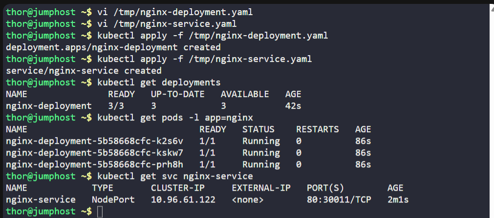
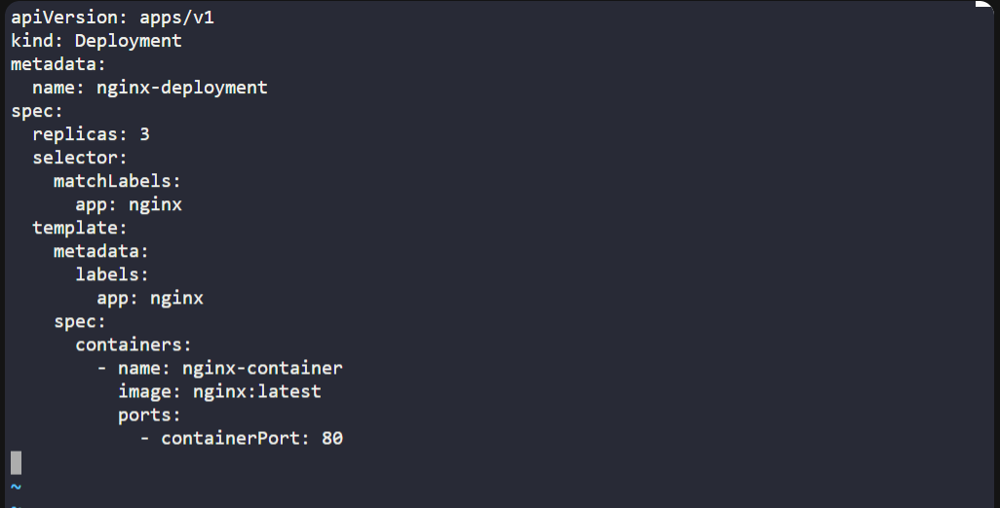
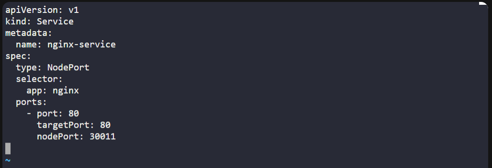

# ☸️ 100 Days of DevOps – Day 56
✅ Task: Deploy Nginx Web Server on Kubernetes Cluster

```text
Some of the Nautilus team developers are developing a static website and they want to deploy it on Kubernetes cluster. 
They want it to be highly available and scalable. Therefore, based on the requirements, the DevOps team has decided to 
create a deployment for it with multiple replicas. Below you can find more details about it:

1. Create a deployment using nginx image with latest tag only and remember to mention the tag i.e nginx:latest. Name it as nginx-deployment. The container should be named as nginx-container, also make sure replica counts are 3.

2. Create a NodePort type service named nginx-service. The nodePort should be 30011.

Note: The kubectl utility on jump_host has been configured to work with the kubernetes cluster.
```

---

📝 Task List

- Create a deployment named nginx-deployment.
- Use image nginx:latest.
- Container name: nginx-container.
- Replica count: 3.
- Expose it with a NodePort service nginx-service.
- NodePort must be 30011.

---

### 🔁 Step 1: Create Deployment Manifest
```bash
vi /tmp/nginx-deployment.yaml
```

Insert:
```yaml
apiVersion: apps/v1
kind: Deployment
metadata:
  name: nginx-deployment
spec:
  replicas: 3
  selector:
    matchLabels:
      app: nginx
  template:
    metadata:
      labels:
        app: nginx
    spec:
      containers:
        - name: nginx-container
          image: nginx:latest
          ports:
            - containerPort: 80
```
Save & exit. (:wq!)

---

### 🔁 Step 2: Create Service Manifest

```bash
vi /tmp/nginx-service.yaml
```

insert:
```yaml
apiVersion: v1
kind: Service
metadata:
  name: nginx-service
spec:
  type: NodePort
  selector:
    app: nginx
  ports:
    - port: 80
      targetPort: 80
      nodePort: 30011
```
Save & exit. (:wq!)

---

### 🔁 Step 3: Apply Resources
```bash
kubectl apply -f /tmp/nginx-deployment.yaml
kubectl apply -f /tmp/nginx-service.yaml
```

---

### 🔁 Step 4: Verify Deployment & Service

Check deployment:
```bash
kubectl get deployments
```
> `nginx-deployment` is present

check pods:
```bash
kubectl get pods -l app=nginx
```
> 3 `nginx-deployment` are running

Check service:
```bash
kubectl get svc nginx-service
```

output:
```nginx
NAME            TYPE       CLUSTER-IP     EXTERNAL-IP   PORT(S)        AGE
nginx-service   NodePort   10.96.61.122   <none>        80:30011/TCP   2m1s
```

---





---

## 🗝️ Key Commands – Deployment + NodePort
| Command                            | Description                          |
| ---------------------------------- | ------------------------------------ |
| `kubectl apply -f deployment.yaml` | Creates the deployment with replicas |
| `kubectl apply -f service.yaml`    | Exposes deployment with NodePort     |
| `kubectl get deployments`          | Shows deployment status              |
| `kubectl get pods -l app=nginx`    | Checks that 3 nginx pods are running |
| `kubectl get svc nginx-service`    | Verifies NodePort exposure           |

---

## ✅ Task Completed

- nginx-deployment created with 3 replicas.
- nginx-service NodePort created at 30011.
- Static website is now highly available and externally accessible.
