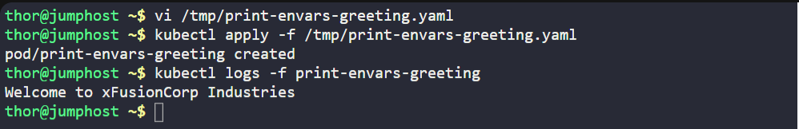
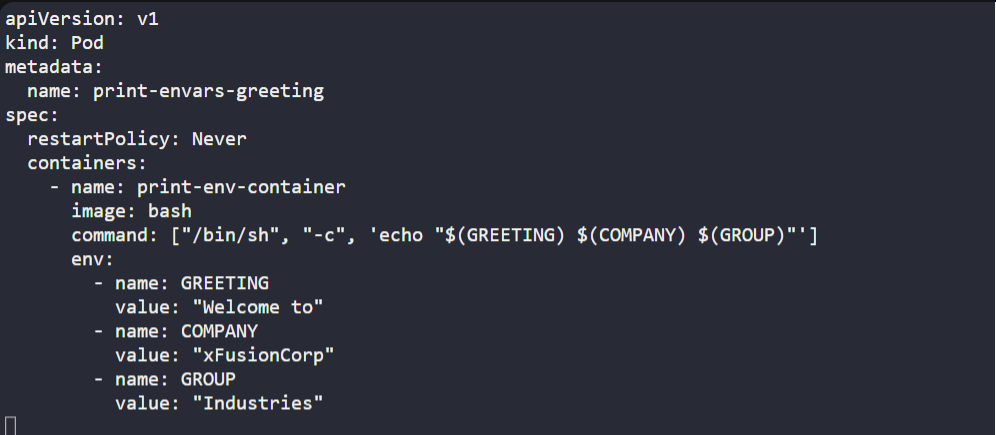

# ☸️ 100 Days of DevOps – Day 57
## ✅ Task: Print Environment Variables

```text
The Nautilus DevOps team is working on to setup some pre-requisites for an application that will send the greetings to different users.
There is a sample deployment, that needs to be tested. Below is a scenario which needs to be configured on Kubernetes cluster.
Please find below more details about it.

  1. Create a pod named print-envars-greeting.

  2. Configure spec as, the container name should be print-env-container and use bash image.

  3. Create three environment variables:

    a. GREETING and its value should be Welcome to

    b. COMPANY and its value should be xFusionCorp

    c. GROUP and its value should be Industries

  4. Use command ["/bin/sh", "-c", 'echo "$(GREETING) $(COMPANY) $(GROUP)"'] (please use this exact command),
      also set its restartPolicy policy to Never to avoid crash loop back.

  5. You can check the output using kubectl logs -f print-envars-greeting command.

Note: The kubectl utility on jump_host has been configured to work with the kubernetes cluster.
```

---

📝 Task List

- Create a pod print-envars-greeting.
- Container name: print-env-container.
- Image: bash.
- Define environment variables:
  - GREETING=Welcome to
  - COMPANY=xFusionCorp
  - GROUP=Industries
- Run command:
```bash
["/bin/sh", "-c", 'echo "$(GREETING) $(COMPANY) $(GROUP)"']
```
- Set restartPolicy: Never.
- Verify using kubectl logs.

---

### 🔁 Step 1: Create Pod Manifest

```bash
vi /tmp/print-envars-greeting.yaml
```

Insert:
```yaml
apiVersion: v1
kind: Pod
metadata:
  name: print-envars-greeting
spec:
  restartPolicy: Never
  containers:
    - name: print-env-container
      image: bash
      command: ["/bin/sh", "-c", 'echo "$(GREETING) $(COMPANY) $(GROUP)"']
      env:
        - name: GREETING
          value: "Welcome to"
        - name: COMPANY
          value: "xFusionCorp"
        - name: GROUP
          value: "Industries"
```
Save & exit. (:wq!)

---

### 🔁 Step 2: Apply Manifest

```bash
kubectl apply -f /tmp/print-envars-greeting.yaml
```

---

### 🔁 Step 3: Verify Logs

```bash
kubectl logs -f print-envars-greeting
```

Output:
```nginx
Welcome to xFusionCorp Industries
```

---




---

## 🗝️ Key Commands – Environment Variables
| Command                                 | Description                            |
| --------------------------------------- | -------------------------------------- |
| `kubectl apply -f pod.yaml`             | Creates pod with environment variables |
| `kubectl logs -f print-envars-greeting` | Shows output of the echo command       |
| `restartPolicy: Never`                  | Ensures pod does not restart on exit   |

---

## ✅ Task Completed
- Pod created successfully.
- Environment variables configured.
- Verified output: Welcome to xFusionCorp Industries.
