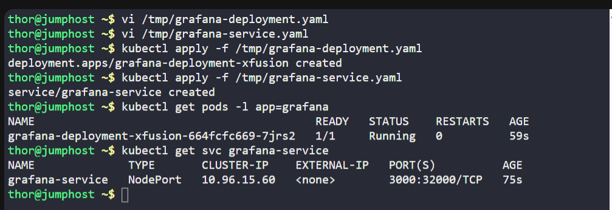
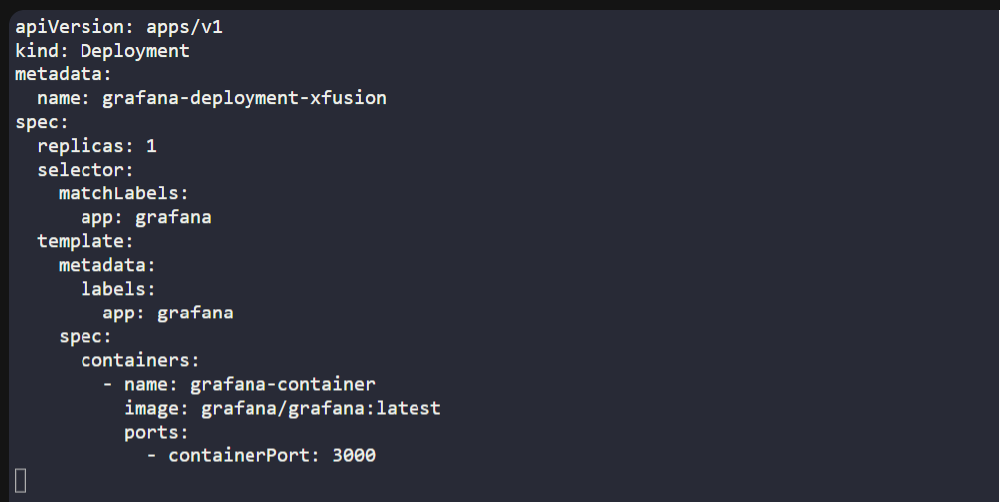
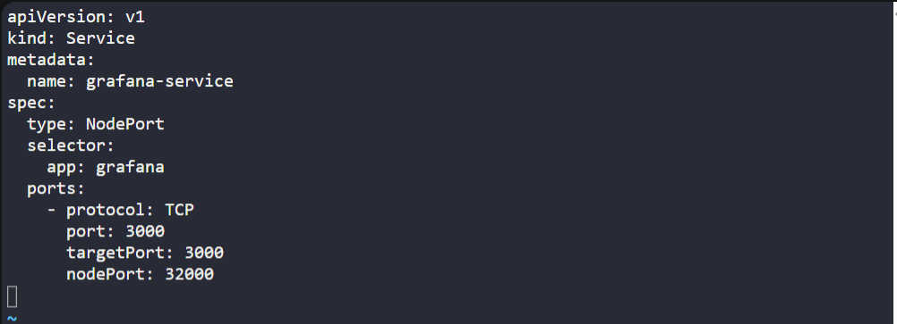

# ☸️ 100 Days of DevOps – Day 57
## ✅ Task: Deploy Grafana on Kubernetes

```text
The Nautilus DevOps teams is planning to set up a Grafana tool to collect and analyze analytics from some applications.
They are planning to deploy it on Kubernetes cluster. Below you can find more details.

1.) Create a deployment named grafana-deployment-xfusion using any grafana image for Grafana app. Set other parameters as per your choice.
2.) Create NodePort type service with nodePort 32000 to expose the app.

You need not to make any configuration changes inside the Grafana app once deployed, just make sure you are able to access the Grafana login page.

Note: The kubectl on jump_host has been configured to work with kubernetes cluster.
```

---

📝 Task List

- Create a Deployment named `grafana-deployment-xfusion`.
- Use any Grafana image (example: `grafana/grafana:latest`).
- Expose the deployment with a NodePort Service named `grafana-service`.
- NodePort must be `32000`.
- Verify Grafana login page is accessible via `<NodeIP>:32000`.

---

### 🔁 Step 1: Create Deployment YAML

```bash
vi /tmp/grafana-deployment.yaml
```

insert:
```yaml
apiVersion: apps/v1
kind: Deployment
metadata:
  name: grafana-deployment-xfusion
spec:
  replicas: 1
  selector:
    matchLabels:
      app: grafana
  template:
    metadata:
      labels:
        app: grafana
    spec:
      containers:
        - name: grafana-container
          image: grafana/grafana:latest
          ports:
            - containerPort: 3000
```
Save & exit. (:wq!)

---

### 
🔁 Step 2: Create Service YAML
```bash
vi /tmp/grafana-service.yaml
```

insert:
```yaml
apiVersion: v1
kind: Service
metadata:
  name: grafana-service
spec:
  type: NodePort
  selector:
    app: grafana
  ports:
    - protocol: TCP
      port: 3000
      targetPort: 3000
      nodePort: 32000
```

---

### 🔁 Step 3: Apply Resources
```bash
kubectl apply -f /tmp/grafana-deployment.yaml
kubectl apply -f /tmp/grafana-service.yaml
```

---

### 🔁 Step 4: Verify

Check pods:
```bash
kubectl get pods -l app=grafana
```
> `grafana-deployment-xfusion-664fcfc669-7jrs2` is running

Check service:
```bash
kubectl get svc grafana-service
```

output:
```nginx
NAME              TYPE       CLUSTER-IP    EXTERNAL-IP   PORT(S)          AGE
grafana-service   NodePort   10.96.15.60   <none>        3000:32000/TCP   75s
```

---





---

## 🗝️ Key Commands – Grafana Deployment
| Command                                    | Description                                  |
| ------------------------------------------ | -------------------------------------------- |
| `kubectl apply -f grafana-deployment.yaml` | Creates Grafana Deployment.                  |
| `kubectl apply -f grafana-service.yaml`    | Exposes Grafana using NodePort.              |
| `kubectl get pods -l app=grafana`          | Verifies Grafana pods are running.           |
| `kubectl get svc grafana-service`          | Confirms NodePort service with port `32000`. |

---

## ✅ Task Completed
- Grafana deployed successfully.
- Service exposed on NodePort 32000.
- Grafana login accessible via <NodeIP>:32000.
