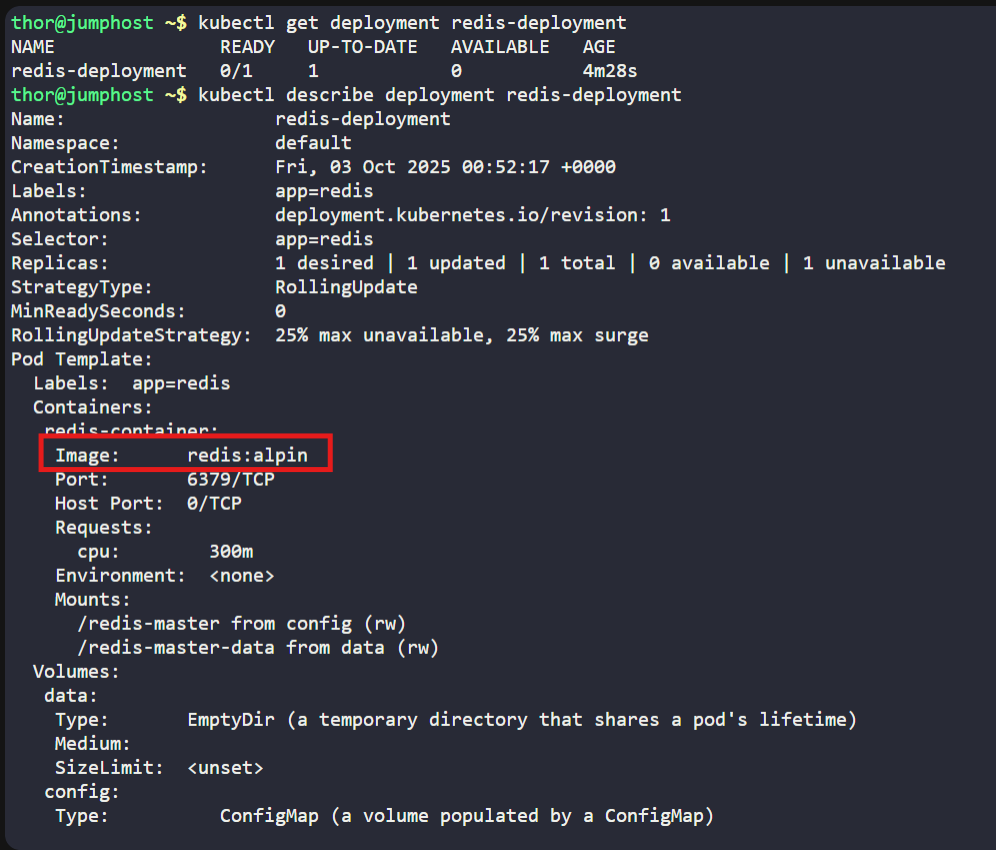
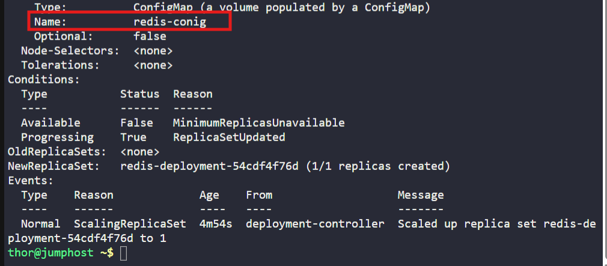
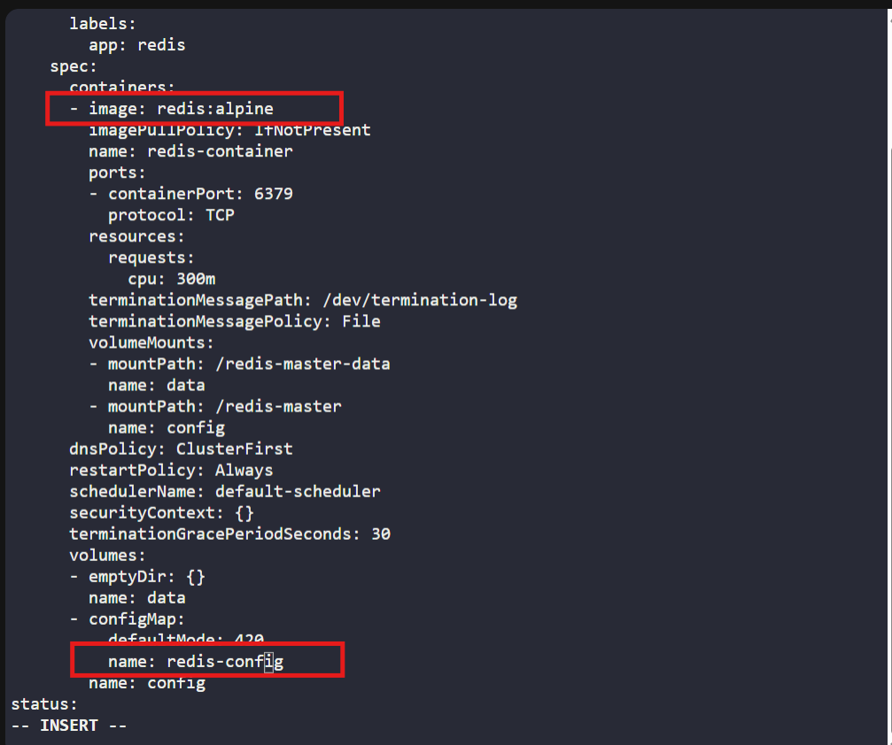
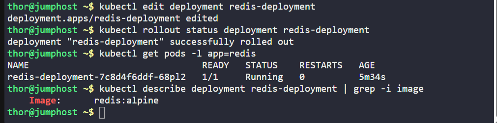

# ☸️ 100 Days of DevOps – Day 58
## ✅ Task: Troubleshoot Deployment issues in Kubernetes

```text
Last week, the Nautilus DevOps team deployed a redis app on Kubernetes cluster, which was working fine so far.
This morning one of the team members was making some changes in this existing setup, but he made some mistakes and the app went down.
We need to fix this as soon as possible. Please take a look.


1. The deployment name is redis-deployment. The pods are not in running state right now, so please look into the issue and fix the same.

Note: The kubectl utility on jump_host has been configured to work with the kubernetes cluster.
```

---

📝 Task List
- Inspect the Redis deployment and pods.
- Identify the misconfiguration (wrong image, ports, env vars, etc).
- Fix the deployment configuration.
- Verify pods are running properly.

---

### 🔁 Step 1: Check Deployment

```bash
kubectl get deployment redis-deployment
```
> Output: Not running

Check Deployment Specs
```bash
kubectl describe deployment redis-deployment
```

Issue Found:

- Wrong image name:
  `image: redis:alpin`
→ Should be redis:alpine (missing e).

- Wrong ConfigMap reference
  `name: redis-conig`
→ Typo, should be redis-config.





---

### 🔁 Step 2: Fix The Deployment
```bash
kubectl edit deployment redis-deployment
```




---

### 🔁 Step 3: Verify the Fix
```bash
kubectl rollout status deployment redis-deployment
```

Check pods:
```bash
kubectl get pods -l app=redis
```

output:
```nginx
NAME                                READY   STATUS    RESTARTS   AGE
redis-deployment-7c8d4f6ddf-68pl2   1/1     Running   0          5m34s
```

Check container details:
```bash
kubectl describe deployment redis-deployment | grep -i image
```
> Output: `Image: redis:alpine`



---

## 🗝️ Key Commands – Redis Fix
| Command                                              | Description                      |
| ---------------------------------------------------- | -------------------------------- |
| `kubectl describe deployment redis-deployment`       | Shows current config + errors.   |
| `kubectl logs <pod-name>`                            | Check Redis container logs.      |
| `kubectl edit deployment redis-deployment`           | Fix misconfiguration in place.   |
| `kubectl rollout status deployment redis-deployment` | Monitors pod creation after fix. |

---

## ✅ Task Completed
- Redis deployment fixed.
- Pods now running with redis:latest.
- Redis app is available on port 6379.
