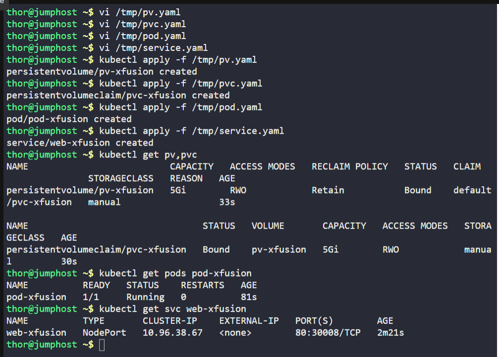
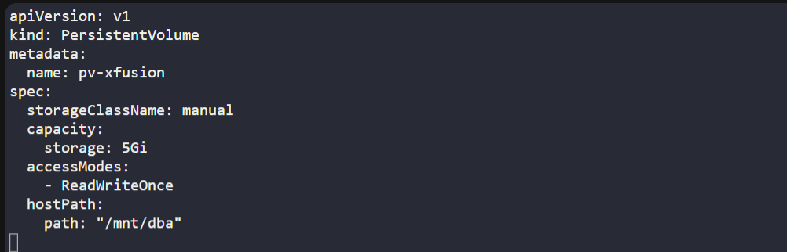
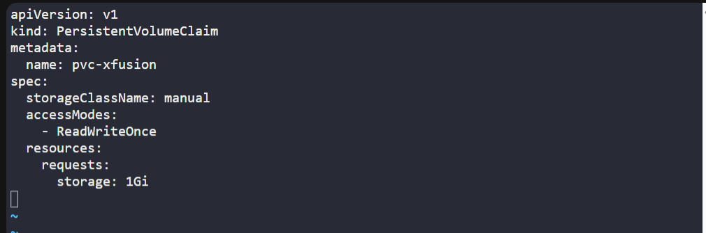
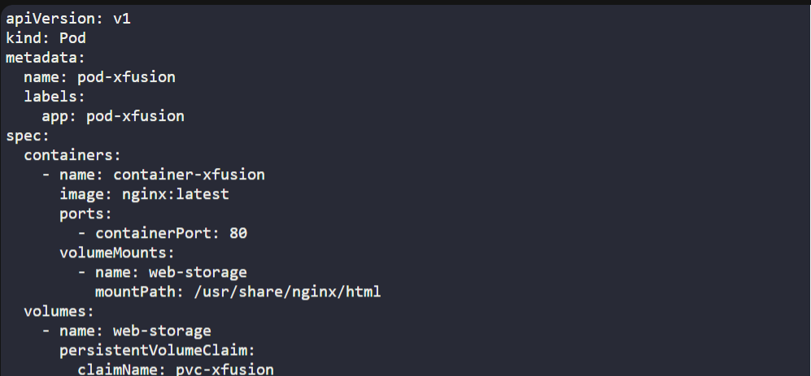
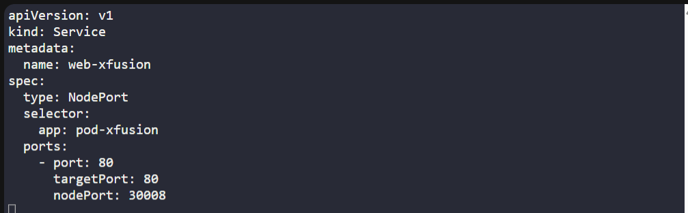

# ☸️ 100 Days of DevOps – Day 60
## ✅ Task: Troubleshoot Deployment issues in Kubernetes

```text
The Nautilus DevOps team is working on a Kubernetes template to deploy a web application on the cluster.
There are some requirements to create/use persistent volumes to store the application code,
and the template needs to be designed accordingly. Please find more details below:

  1. Create a PersistentVolume named as pv-xfusion. Configure the spec as storage class should be manual,
    set capacity to 5Gi, set access mode to ReadWriteOnce, volume type should be hostPath and
    set path to /mnt/dba (this directory is already created, you might not be able to access it directly, so you need not to worry about it).
  2. Create a PersistentVolumeClaim named as pvc-xfusion. Configure the spec as storage class should be manual, request 1Gi of the storage, set access mode to ReadWriteOnce.
  3. Create a pod named as pod-xfusion, mount the persistent volume you created with claim name pvc-xfusion at document root of the web server,
    the container within the pod should be named as container-xfusion using image nginx with latest tag only (remember to mention the tag i.e nginx:latest).
  4. Create a node port type service named web-xfusion using node port 30008 to expose the web server running within the pod.

Note: The kubectl utility on jump_host has been configured to work with the kubernetes cluster.
```

---

📝 Task List

- Create PersistentVolume pv-xfusion.
- Create PersistentVolumeClaim pvc-xfusion.
- Create Pod pod-xfusion with volume mounted at Nginx document root.
- Expose Pod via NodePort service web-xfusion on 30008.
- Verify service works by accessing <NodeIP>:30008.

---

### 🔁 Step 1: Create PersistentVolume

```bash
vi /tmp/pv.yaml
```

insert:
```yaml
apiVersion: v1
kind: PersistentVolume
metadata:
  name: pv-xfusion
spec:
  storageClassName: manual
  capacity:
    storage: 5Gi
  accessModes:
    - ReadWriteOnce
  hostPath:
    path: "/mnt/dba"
```
save and exit (:wq!)

---

### 🔁 Step 2: Create PersistentVolumeClaim
```bash
vi /tmp/pvc.yaml
```

insert:
```yaml
apiVersion: v1
kind: PersistentVolumeClaim
metadata:
  name: pvc-xfusion
spec:
  storageClassName: manual
  accessModes:
    - ReadWriteOnce
  resources:
    requests:
      storage: 1Gi
```
save and exit (:wq!)

---

### 🔁 Step 3: Create Pod
```bash
vi /tmp/pod.yaml
```

insert:
```yaml
apiVersion: v1
kind: Pod
metadata:
  name: pod-xfusion
  labels:
    app: pod-xfusion
spec:
  containers:
    - name: container-xfusion
      image: nginx:latest
      ports:
        - containerPort: 80
      volumeMounts:
        - name: web-storage
          mountPath: /usr/share/nginx/html
  volumes:
    - name: web-storage
      persistentVolumeClaim:
        claimName: pvc-xfusion
```
save and exit (:wq!)

---

### 🔁 Step 4: Create Service
```bash
vi /tmp/service.yaml
```

insert:
```yaml
apiVersion: v1
kind: Service
metadata:
  name: web-xfusion
spec:
  type: NodePort
  selector:
    app: pod-xfusion
  ports:
    - port: 80
      targetPort: 80
      nodePort: 30008
```
save and exit (:wq!)

---

### 🔁 Step 5: Apply Resources
```bash
kubectl apply -f /tmp/pv.yaml
kubectl apply -f /tmp/pvc.yaml
kubectl apply -f /tmp/pod.yaml
kubectl apply -f /tmp/service.yaml
```

---

### 🔁 Step 6: Verify
Check PV/PVC binding:
```bash
kubectl get pv,pvc
```

output:
```nginx
NAME                          CAPACITY   ACCESS MODES   RECLAIM POLICY   STATUS   CLAIM                 STORAGECLASS   REASON   AGE
persistentvolume/pv-xfusion   5Gi        RWO            Retain           Bound    default/pvc-xfusion   manual                  33s

NAME                                STATUS   VOLUME       CAPACITY   ACCESS MODES   STORAGECLASS   AGE
persistentvolumeclaim/pvc-xfusion   Bound    pv-xfusion   5Gi        RWO            manual         30s
```

---

Check pod:
```bash
kubectl get pods pod-xfusion
```
> `pod-xfusion` is running

Check service:
```bash
kubectl get svc web-xfusion
```

output:
```nginx
NAME          TYPE       CLUSTER-IP    EXTERNAL-IP   PORT(S)        AGE
web-xfusion   NodePort   10.96.38.67   <none>        80:30008/TCP   2m21s
```

---








---

# 🗝️ Key Commands – Web Server with PV
| Command                         | Description                         |
| ------------------------------- | ----------------------------------- |
| `kubectl apply -f pv.yaml`      | Creates PersistentVolume.           |
| `kubectl apply -f pvc.yaml`     | Creates PersistentVolumeClaim.      |
| `kubectl apply -f pod.yaml`     | Deploys Nginx Pod using the PVC.    |
| `kubectl apply -f service.yaml` | Exposes Pod with NodePort service.  |
| `kubectl get pv,pvc`            | Verifies PV/PVC are bound.          |
| `kubectl get pods`              | Confirms Pod is running.            |
| `kubectl get svc web-xfusion`   | Shows service and NodePort mapping. |

---

✅ Task Completed
- PersistentVolume and PersistentVolumeClaim created.
- Pod pod-xfusion deployed using nginx:latest.
- NodePort Service web-xfusion exposed on port 30008.
- Web server accessible successfully via <NodeIP>:30008.
