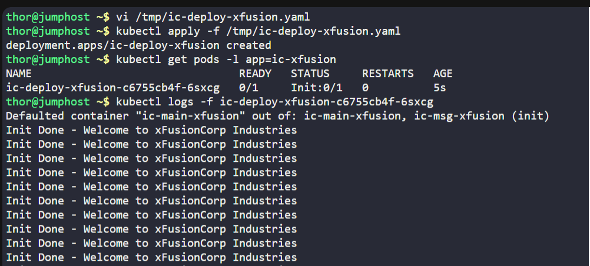
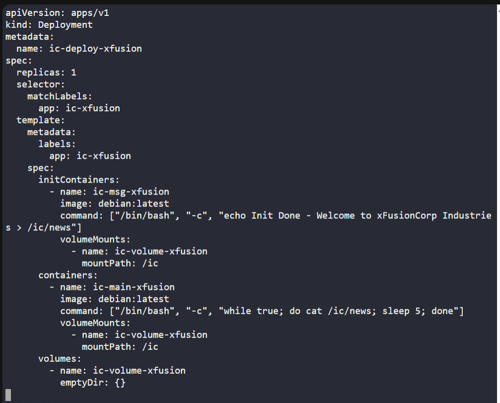

# ☸️ 100 Days of DevOps – Day 61
## ✅ Task: Init Containers in Kubernetes

```text
There are some applications that need to be deployed on Kubernetes cluster and these apps have some pre-requisites
where some configurations need to be changed before deploying the app container. Some of these changes cannot be made
inside the images so the DevOps team has come up with a solution to use init containers to perform these tasks during deployment.
Below is a sample scenario that the team is going to test first.

1. Create a Deployment named as ic-deploy-xfusion.
2. Configure spec as replicas should be 1, labels app should be ic-xfusion, template's metadata lables app should be the same ic-xfusion.
3. The initContainers should be named as ic-msg-xfusion, use image debian with latest tag and use command '/bin/bash', '-c'
and 'echo Init Done - Welcome to xFusionCorp Industries > /ic/news'. The volume mount should be named as ic-volume-xfusion and mount path should be /ic.
4. Main container should be named as ic-main-xfusion, use image debian with latest tag and use command '/bin/bash', '-c' and 'while true; do cat /ic/news;
sleep 5; done'. The volume mount should be named as ic-volume-xfusion and mount path should be /ic.
5. Volume to be named as ic-volume-xfusion and it should be an emptyDir type.

Note: The kubectl utility on jump_host has been configured to work with the kubernetes cluster.
```

---

📝 Task List

- Create deployment ic-deploy-xfusion.
- Add initContainer to write a message to /ic/news.
- Add main container to read /ic/news in loop.
- Share emptyDir volume between both containers.
- Verify output using pod logs.

---

### 🔁 Step 1: Create Deployment YAML
```bash
vi /tmp/ic-deploy-xfusion.yaml
```

Insert:
```yaml
apiVersion: apps/v1
kind: Deployment
metadata:
  name: ic-deploy-xfusion
spec:
  replicas: 1
  selector:
    matchLabels:
      app: ic-xfusion
  template:
    metadata:
      labels:
        app: ic-xfusion
    spec:
      initContainers:
        - name: ic-msg-xfusion
          image: debian:latest
          command: ["/bin/bash", "-c", "echo Init Done - Welcome to xFusionCorp Industries > /ic/news"]
          volumeMounts:
            - name: ic-volume-xfusion
              mountPath: /ic
      containers:
        - name: ic-main-xfusion
          image: debian:latest
          command: ["/bin/bash", "-c", "while true; do cat /ic/news; sleep 5; done"]
          volumeMounts:
            - name: ic-volume-xfusion
              mountPath: /ic
      volumes:
        - name: ic-volume-xfusion
          emptyDir: {}
```

save & exit (:wq!)

---

### 🔁 Step 2: Apply Deployment
```bash
kubectl apply -f /tmp/ic-deploy-xfusion.yaml
```

---

### 🔁 Step 3: Verify Pod
```bash
kubectl get pods -l app=ic-xfusion
```
> pod name: ic-deploy-xfusion-c6755cb4f-6sxcg


Check logs:

kubectl logs -f <pod-name>

```bash
kubectl logs -f ic-deploy-xfusion-c6755cb4f-6sxcg
```

Output:
```nginx
Defaulted container "ic-main-xfusion" out of: ic-main-xfusion, ic-msg-xfusion (init)
Init Done - Welcome to xFusionCorp Industries
Init Done - Welcome to xFusionCorp Industries
Init Done - Welcome to xFusionCorp Industries
Init Done - Welcome to xFusionCorp Industries
Init Done - Welcome to xFusionCorp Industries
Init Done - Welcome to xFusionCorp Industries
Init Done - Welcome to xFusionCorp Industries
Init Done - Welcome to xFusionCorp Industries
Init Done - Welcome to xFusionCorp Industries
Init Done - Welcome to xFusionCorp Industries
Init Done - Welcome to xFusionCorp Industries
```

---




---

## 🗝️ Key Commands – Init Containers
| Command                                   | Description                                 |
| ----------------------------------------- | ------------------------------------------- |
| `kubectl apply -f ic-deploy-xfusion.yaml` | Creates deployment with initContainer.      |
| `kubectl logs <pod> -c ic-msg-xfusion`    | Shows logs from initContainer.              |
| `kubectl logs -f <pod>`                   | Shows logs from main container.             |
| `kubectl describe pod <pod>`              | Verify initContainer finished successfully. |

---

## ✅ Task Completed
- Init container wrote config message to /ic/news.
- Main container successfully read from shared volume.
- Verified logs confirm init + main workflow.
