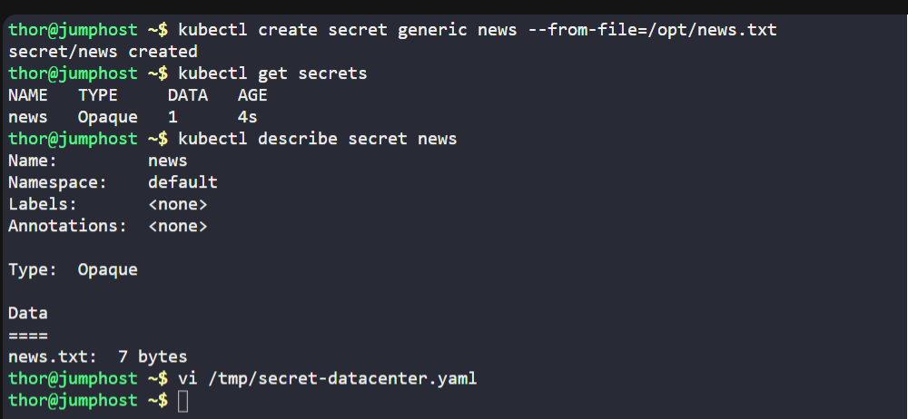
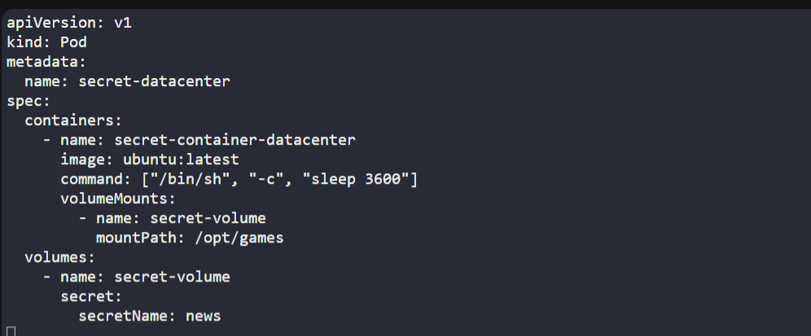
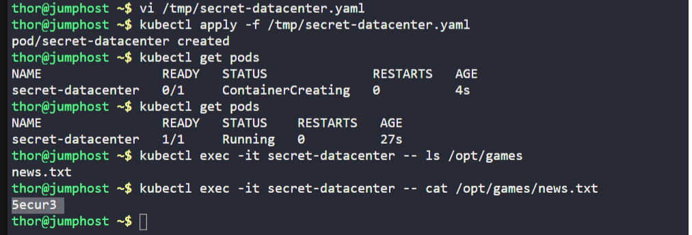

# ☸️ 100 Days of DevOps – Day 62
## ✅ Task: Manage Secrets in Kubernetes

```text
The Nautilus DevOps team is working to deploy some tools in Kubernetes cluster.
Some of the tools are licence based so that licence information needs to be stored securely within Kubernetes cluster.
Therefore, the team wants to utilize Kubernetes secrets to store those secrets. Below you can find more details about the requirements:

1. We already have a secret key file news.txt under /opt location on jump host. Create a generic secret named news, it should contain the password/license-number present in news.txt file.
2. Also create a pod named secret-datacenter.
3. Configure pod's spec as container name should be secret-container-datacenter, image should be ubuntu with latest tag (remember to mention the tag with image).
Use sleep command for container so that it remains in running state. Consume the created secret and mount it under /opt/games within the container.
4. To verify you can exec into the container secret-container-datacenter, to check the secret key under the mounted path /opt/games.
Before hitting the Check button please make sure pod/pods are in running state, also validation can take some time to complete so keep patience.

Note: The kubectl utility on jump_host has been configured to work with the kubernetes cluster.
```

---

📝 Task List

- Create secret news from file /opt/news.txt.
- Create pod secret-datacenter with container secret-container-datacenter.
- Use ubuntu:latest image.
- Mount secret news at /opt/games.
- Verify secret inside container.

---

### 🔁 Step 1: Create Secret

```bash
kubectl create secret generic news --from-file=/opt/news.txt
```

Check:
```bash
kubectl get secrets
kubectl describe secret news
```
> secret news successfully created

---

🔁 Step 2: Create Pod YAML

```bash
vi /tmp/secret-datacenter.yaml
```

insert:
```yaml
apiVersion: v1
kind: Pod
metadata:
  name: secret-datacenter
spec:
  containers:
    - name: secret-container-datacenter
      image: ubuntu:latest
      command: ["/bin/sh", "-c", "sleep 3600"]
      volumeMounts:
        - name: secret-volume
          mountPath: /opt/games
  volumes:
    - name: secret-volume
      secret:
        secretName: news
```

save and exit (:wq!)

---

### 🔁 Step 3: Apply Pod
```bash
kubectl apply -f /tmp/secret-datacenter.yaml
```

---

🔁 Step 4: Verify Pod
```bash
kubectl get pods
```
> wait until it is ready

then:
```bash
kubectl exec -it secret-datacenter -- ls /opt/games
```

> news.text are now mounted in the container /opt/games

check contents:
```bash
kubectl exec -it secret-datacenter -- cat /opt/games/news.txt
```
> It displayed the license/password stored in the secret: `5ecur3`


---





---

## 🗝️ Key Commands – Kubernetes Secrets
| Command                                                         | Description                  |
| --------------------------------------------------------------- | ---------------------------- |
| `kubectl create secret generic news --from-file=/opt/news.txt`  | Creates secret from file     |
| `kubectl get secrets`                                           | List secrets                 |
| `kubectl describe secret news`                                  | Show secret details          |
| `kubectl exec -it secret-datacenter -- ls /opt/games`           | Verify mounted secret        |
| `kubectl exec -it secret-datacenter -- cat /opt/games/news.txt` | Read secret value inside pod |

---

## ✅ Task Completed

- Secret news created from file.
- Pod secret-datacenter deployed.
- Secret mounted at /opt/games.
- Verified license file is accessible inside container.
