# ☸️ 100 Days of DevOps – Day 63
## ✅ Task:Deploy Iron Gallery App on Kubernetes

```text
There is an iron gallery app that the Nautilus DevOps team was developing. They have recently customized the app and are going to deploy the same on the Kubernetes cluster.
Below you can find more details:

1. Create a namespace iron-namespace-datacenter

2. Create a deployment iron-gallery-deployment-datacenter for iron gallery under the same namespace you created.

    :- Labels run should be iron-gallery.
    :- Replicas count should be 1.
    :- Selector's matchLabels run should be iron-gallery.
    :- Template labels run should be iron-gallery under metadata.
    :- The container should be named as iron-gallery-container-datacenter, use kodekloud/irongallery:2.0 image ( use exact image name / tag ).
    :- Resources limits for memory should be 100Mi and for CPU should be 50m.
    :- First volumeMount name should be config, its mountPath should be /usr/share/nginx/html/data.
    :- Second volumeMount name should be images, its mountPath should be /usr/share/nginx/html/uploads.
    :- First volume name should be config and give it emptyDir and second volume name should be images, also give it emptyDir.

3. Create a deployment iron-db-deployment-datacenter for iron db under the same namespace.

    :- Labels db should be mariadb.
    :- Replicas count should be 1.
    :- Selector's matchLabels db should be mariadb.
    :- Template labels db should be mariadb under metadata.
    :- The container name should be iron-db-container-datacenter, use kodekloud/irondb:2.0 image ( use exact image name / tag ).
    :- Define environment, set MYSQL_DATABASE its value should be database_host, set MYSQL_ROOT_PASSWORD and MYSQL_PASSWORD value should be with some complex passwords for DB connections,
      and MYSQL_USER value should be any custom user ( except root ).
    :- Volume mount name should be db and its mountPath should be /var/lib/mysql. Volume name should be db and give it an emptyDir.

4. Create a service for iron db which should be named iron-db-service-datacenter under the same namespace. Configure spec as selector's db should be mariadb.
Protocol should be TCP, port and targetPort should be 3306 and its type should be ClusterIP.

5. Create a service for iron gallery which should be named iron-gallery-service-datacenter under the same namespace. Configure spec as selector's run should be iron-gallery.
Protocol should be TCP, port and targetPort should be 80, nodePort should be 32678 and its type should be NodePort.


Note:

1. We don't need to make connection b/w database and front-end now, if the installation page is coming up it should be enough for now.

2. The kubectl on jump_host has been configured to work with the kubernetes cluster.
```

---

📝 Task List
- Create namespace iron-namespace-datacenter.
- Deploy iron-gallery-deployment-datacenter with kodekloud/irongallery:2.0.
- Use resources (100Mi memory, 50m CPU).
- Mount emptyDir volumes (config, images).
- Deploy iron-db-deployment-datacenter with kodekloud/irondb:2.0.
- Set required environment variables for MariaDB.
- Mount emptyDir volume (db).
- Expose database with ClusterIP service on port 3306.
- Expose gallery with NodePort service on port 32678.

---

### 🔁 Step 1: Create Namespace
```bash
kubectl create namespace iron-namespace-datacenter
```

---

### 🔁 Step 2: Create Iron Gallery Deployment
```bash
vi /tmp/iron-gallery.yaml
```

insert:
```yaml
apiVersion: apps/v1
kind: Deployment
metadata:
  name: iron-gallery-deployment-datacenter
  namespace: iron-namespace-datacenter
spec:
  replicas: 1
  selector:
    matchLabels:
      run: iron-gallery
  template:
    metadata:
      labels:
        run: iron-gallery
    spec:
      containers:
        - name: iron-gallery-container-datacenter
          image: kodekloud/irongallery:2.0
          resources:
            limits:
              memory: "100Mi"
              cpu: "50m"
          volumeMounts:
            - name: config
              mountPath: /usr/share/nginx/html/data
            - name: images
              mountPath: /usr/share/nginx/html/uploads
      volumes:
        - name: config
          emptyDir: {}
        - name: images
          emptyDir: {}
```

save and exit (:wq!)

then Apply
```bash
kubectl apply -f /tmp/iron-gallery.yaml
```

---

### 🔁 Step 3: Create Iron DB Deployment
```bash
vi /tmp/iron-db.yaml
```

insert:
```yaml
apiVersion: apps/v1
kind: Deployment
metadata:
  name: iron-db-deployment-datacenter
  namespace: iron-namespace-datacenter
spec:
  replicas: 1
  selector:
    matchLabels:
      db: mariadb
  template:
    metadata:
      labels:
        db: mariadb
    spec:
      containers:
        - name: iron-db-container-datacenter
          image: kodekloud/irondb:2.0
          env:
            - name: MYSQL_DATABASE
              value: "database_host"
            - name: MYSQL_ROOT_PASSWORD
              value: "RootP@ssw0rd!"
            - name: MYSQL_PASSWORD
              value: "UserP@ssw0rd!"
            - name: MYSQL_USER
              value: "ironuser"
          volumeMounts:
            - name: db
              mountPath: /var/lib/mysql
      volumes:
        - name: db
          emptyDir: {}
```

save and exit (:wq!)


then Apply
```bash
kubectl apply -f /tmp/iron-db.yaml
```

---

### 🔁 Step 4: Create Services

First for Iron DB
```bash
vi /tmp/iron-services.yaml
```

insert:
```yaml
apiVersion: v1
kind: Service
metadata:
  name: iron-db-service-datacenter
  namespace: iron-namespace-datacenter
spec:
  selector:
    db: mariadb
  ports:
    - protocol: TCP
      port: 3306
      targetPort: 3306
  type: ClusterIP
```

save and exit (:wq!)

then apply:
```bash
kubectl apply -f /tmp/iron-services.yaml
```

Second for Iron Gallery
```bash
vi /tmp/iron-gallery-svc.yaml
```

insert:
```yaml
apiVersion: v1
kind: Service
metadata:
  name: iron-gallery-service-datacenter
  namespace: iron-namespace-datacenter
spec:
  selector:
    run: iron-gallery
  ports:
    - protocol: TCP
      port: 80
      targetPort: 80
      nodePort: 32678
  type: NodePort
```

save and exit (:wq!)

then apply:
```bash
kubectl apply -f /tmp/iron-gallery-svc.yaml
```

----

### 🔁 Step 5: Verify
```bash
kubectl get all -n iron-namespace-datacenter
```

Check NodePort:
```bash
kubectl get svc -n iron-namespace-datacenter
```

then Access the App

---

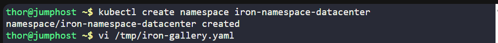
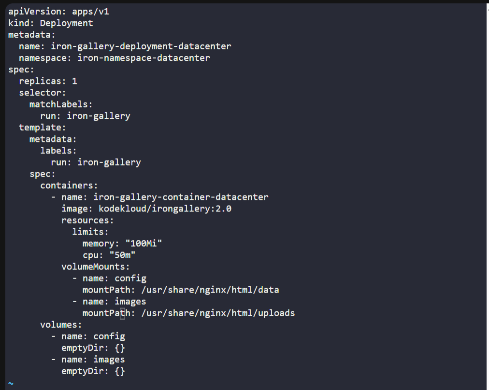
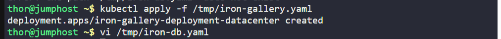
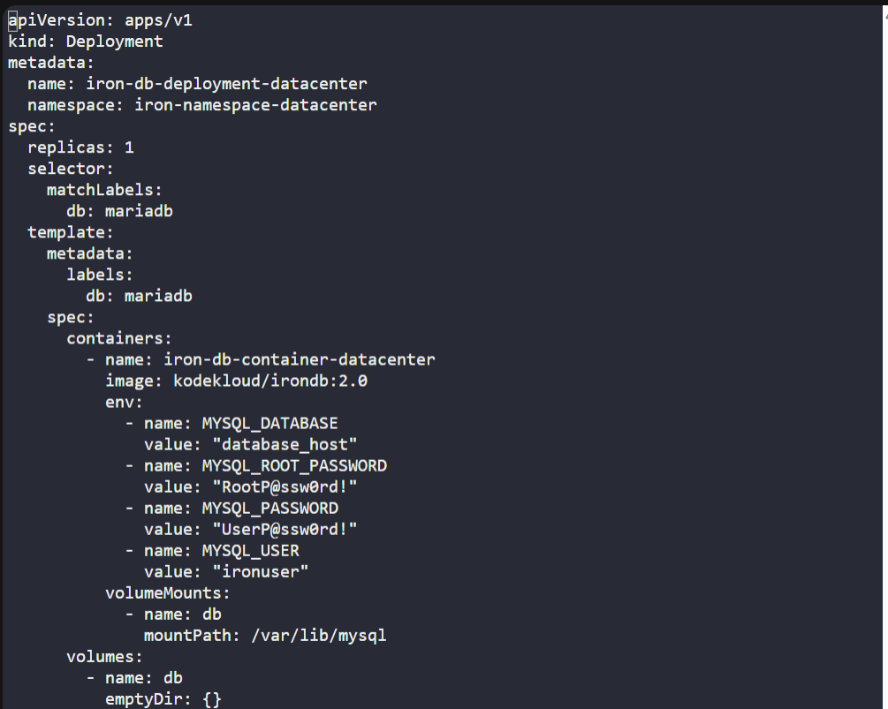
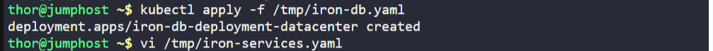
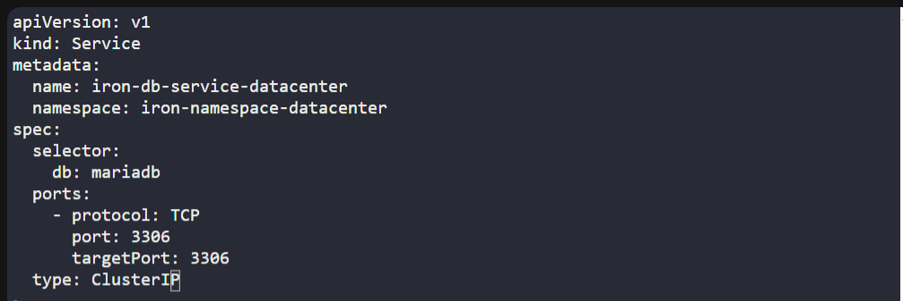
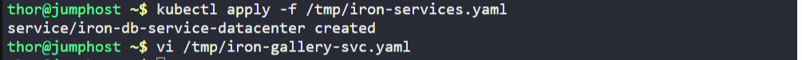
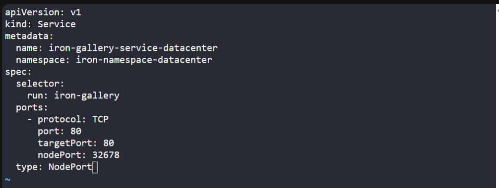
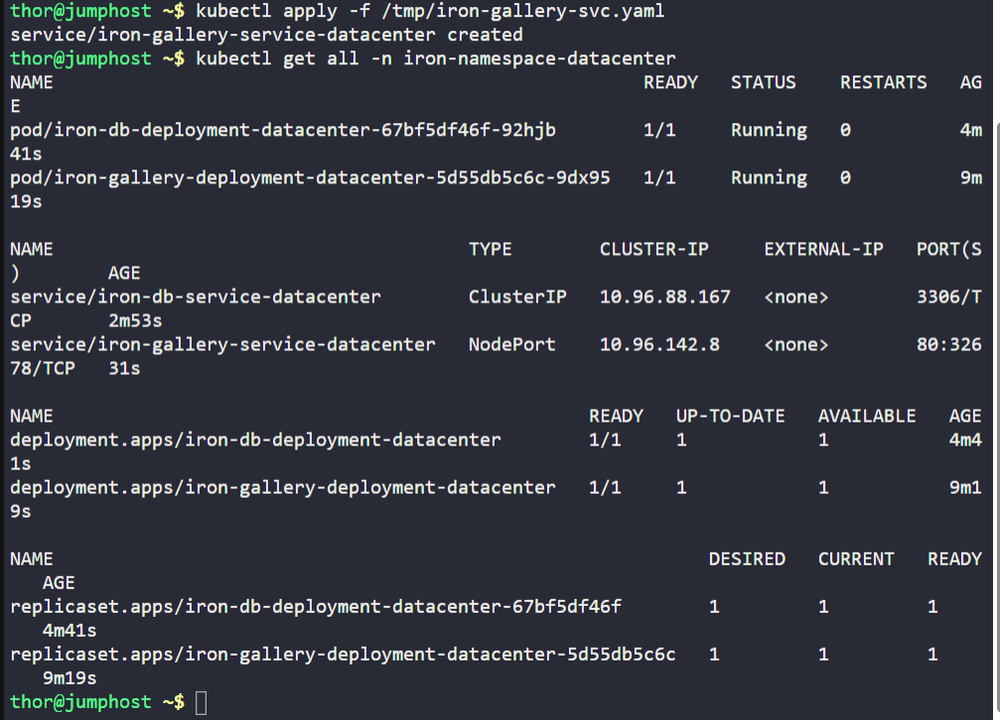
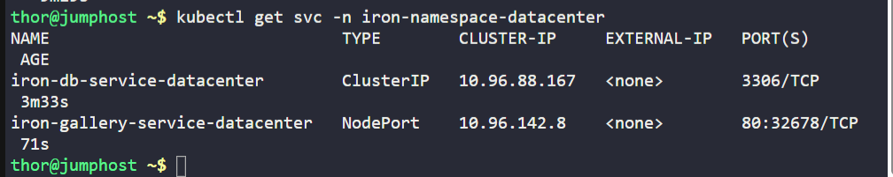
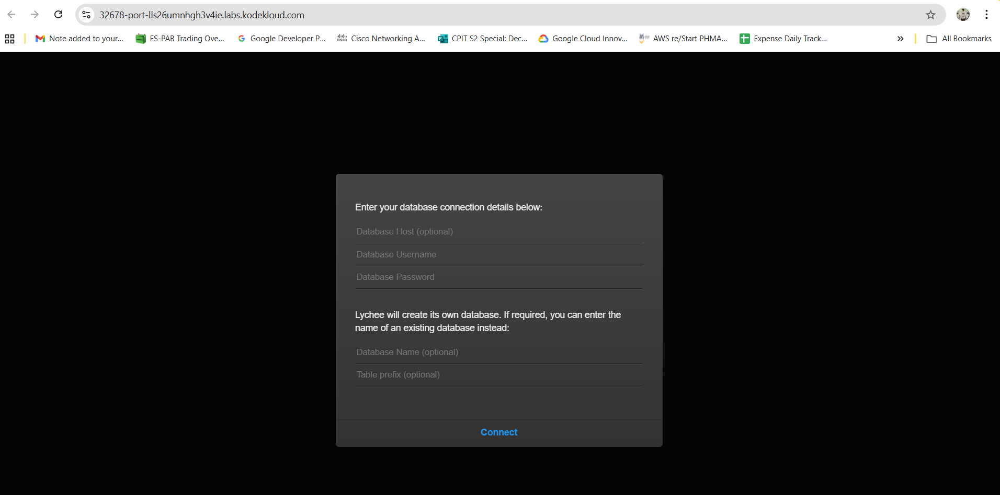


---

## 🗝️ Key Commands – Iron Gallery App
| Command                                              | Description                            |
| ---------------------------------------------------- | -------------------------------------- |
| `kubectl create namespace iron-namespace-datacenter` | Creates namespace for the app          |
| `kubectl apply -f iron-gallery.yaml`                 | Deploys Iron Gallery                   |
| `kubectl apply -f iron-db.yaml`                      | Deploys Iron DB                        |
| `kubectl apply -f iron-services.yaml`                | Creates both services                  |
| `kubectl apply -f /tmp/iron-gallery-svc.yaml`        | Creates both services                  |
| `kubectl get all -n iron-namespace-datacenter`       | Verify pods, deployments, and services |


---

## ✅ Task Completed

- Namespace created.
- Iron Gallery app deployed with resources and volumes.
- Iron DB deployed with environment variables and storage.
- Services created (ClusterIP for DB, NodePort for Gallery).
- Iron Gallery accessible via <NodeIP>:32678.
