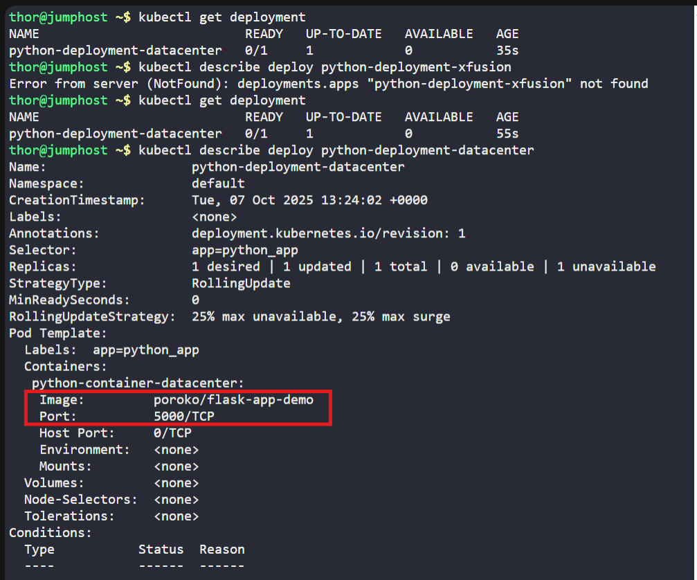
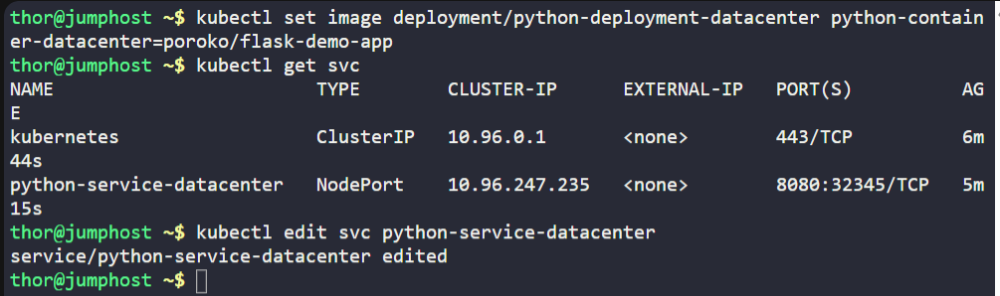
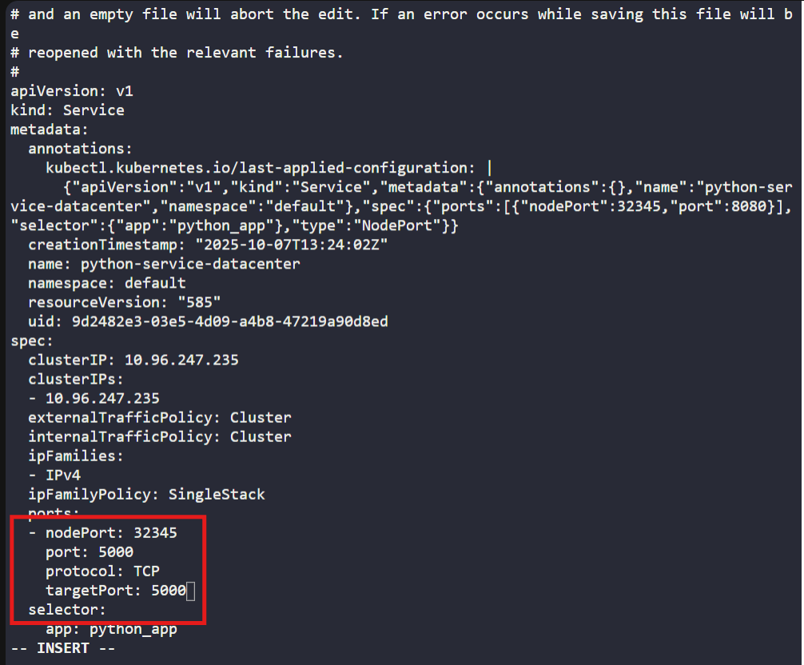
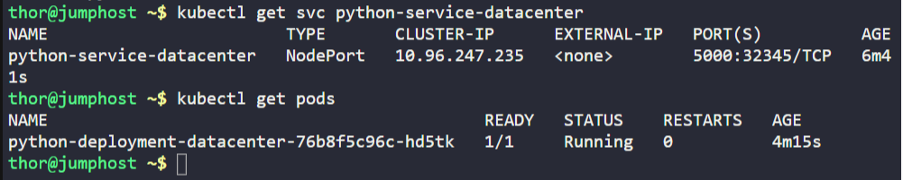

# ☸️ 100 Days of DevOps – Day 64
# ✅ Task: Fix Python Flask App Deployment on Kubernetes

```text
One of the DevOps engineers was trying to deploy a python app on Kubernetes cluster. Unfortunately, due to some mis-configuration,
the application is not coming up. Please take a look into it and fix the issues. Application should be accessible on the specified nodePort.

1. The deployment name is python-deployment-datacenter, its using poroko/flask-demo-app image. The deployment and service of this app is already deployed.
2. nodePort should be 32345 and targetPort should be python flask app's default port.


Note: The kubectl on jump_host has been configured to work with the kubernetes cluster.
```

---

📝 Task List

- Check deployment details for container port
- Check service configuration for incorrect targetPort.
- Edit and fix service targetPort to match Flask app (5000).
- Ensure nodePort is set to 32345.
- Verify the application is running and accessible.

----

### 🔁 Step 1: Check Deployment

```bash
kubectl get deployment
```

output:
```nginx
NAME                           READY   UP-TO-DATE   AVAILABLE   AGE
python-deployment-datacenter   0/1     1            0           35s
```
> python-deployment-datacenter is not running

then
```bash
kubectl describe deploy python-deployment-datacenter
```

issue found:
- Image: poroko/flask-app-demo ❌ (wrong)
- Port: 5000/TCP
- Correct image: poroko/flask-demo-app ✅

---

### 🔁 Step 2: Update the Deployment Image
Use the set image command to correct it:
```bash
kubectl set image deployment/python-deployment-datacenter python-container-datacenter=poroko/flask-demo-app
```

---

### 🔁 Step 3: Check the Service Configuration
```bash
kubectl get svc
```

output:
```nginx
NAME                        TYPE        CLUSTER-IP      EXTERNAL-IP   PORT(S)          AGE
kubernetes                  ClusterIP   10.96.0.1       <none>        443/TCP          4m15s
python-service-datacenter   NodePort    10.96.247.235   <none>        8080:32345/TCP   2m46s
```

issue found: 
- python-deployment-datacenter service port is 8080 ❌
- change it to 5000

---

### 🔁 Step 4: Edit the Service
Open the service for editing:
```bash
kubectl edit svc python-service-datacenter
```

Change the ports section to:

ports:
- port: 5000
  targetPort: 5000
  nodePort: 32345

Save and exit (:wq!)

---

### 🔁 Step 5: Verify the Service
```bash
kubectl get svc python-service-datacenter
```

output:
```nginx
NAME                        TYPE       CLUSTER-IP      EXTERNAL-IP   PORT(S)          AGE
python-service-datacenter   NodePort   10.96.247.235   <none>        5000:32345/TCP   6m41s
```
> the port is now 5000

---

### 🔁 Step 5: Verify Pod
Check pod status:
```bash
kubectl get pods
```

output:
```bash
NAME                                            READY   STATUS    RESTARTS   AGE
python-deployment-datacenter-76b8f5c96c-hd5tk   1/1     Running   0          4m15s
```
> it is now running

then check the app

---







---

## 🗝️ Key Commands – Flask App Deployment Fix
| Command                                                                                                 | Description          |
| ------------------------------------------------------------------------------------------------------- | -------------------- |
| `kubectl set image deployment/python-deployment-datacenter python-container-datacenter=poroko/flask-demo-app` | Update image         |
| `kubectl rollout status deployment/python-deployment-datacenter`                                           | Monitor rollout      |
| `kubectl edit svc python-service-datacenter`                                                               | Fix service ports    |
| `kubectl get svc`                                                                                       | Verify NodePort      |
| `curl http://<NodeIP>:32345`                                                                            | Test external access |

---

## ✅ Task Completed
- Updated image to poroko/flask-demo-app.
- Fixed service targetPort to match container port (5000).
- Verified app running and accessible on nodePort 32345.
- Flask app successfully deployed and working.
