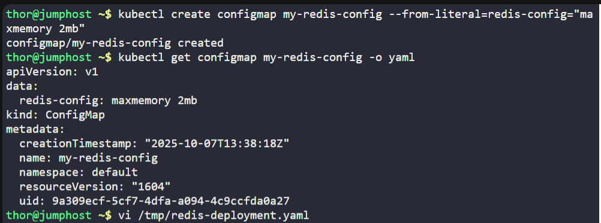
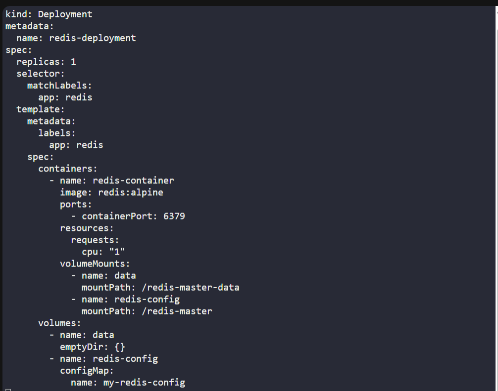
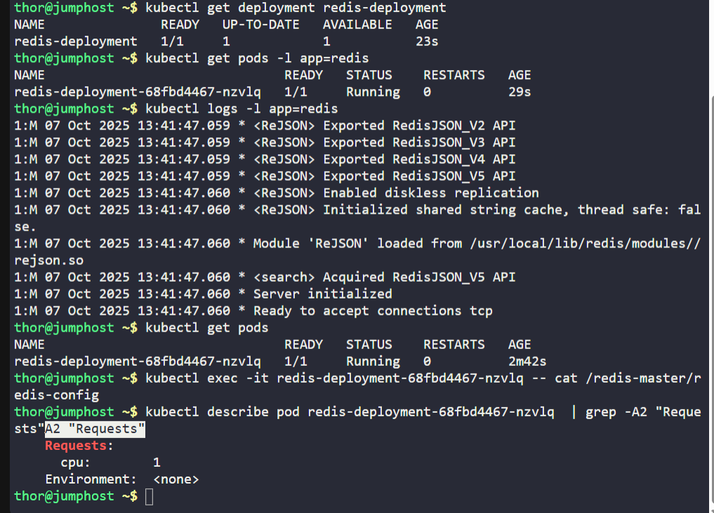

# ☸️ 100 Days of DevOps – Day 65
## ✅ Task: Deploy Redis Deployment on Kubernetes

```text
The Nautilus application development team observed some performance issues with one of the application that is deployed in Kubernetes cluster.
After looking into number of factors, the team has suggested to use some in-memory caching utility for DB service. After number of discussions,
they have decided to use Redis. Initially they would like to deploy Redis on kubernetes cluster for testing and later they will move it to production.
Please find below more details about the task:


Create a redis deployment with following parameters:

  1. Create a config map called my-redis-config having maxmemory 2mb in redis-config.
  2. Name of the deployment should be redis-deployment, it should use
      redis:alpine image and container name should be redis-container. Also make sure it has only 1 replica.
  3. The container should request for 1 CPU.
  4. Mount 2 volumes:
      a. An Empty directory volume called data at path /redis-master-data.
      b. A configmap volume called redis-config at path /redis-master.
      c. The container should expose the port 6379.
  5. Finally, redis-deployment should be in an up and running state.

Note: The kubectl utility on jump_host has been configured to work with the kubernetes cluster.
```

---

📝 Task List

- Create ConfigMap my-redis-config with Redis memory limit.
- Create Deployment redis-deployment with image redis:alpine.
- Container name: redis-container.
- Request 1 CPU.
- Mount data (EmptyDir) and redis-config (ConfigMap).
- Expose container port 6379.
- Verify deployment and pod status.

---

### 🔁 Step 1: Create ConfigMap
```bash
kubectl create configmap my-redis-config --from-literal=redis-config="maxmemory 2mb"
```

Verify:
```bash
kubectl get configmap my-redis-config -o yaml
```

output:
```yaml
apiVersion: v1
data:
  redis-config: maxmemory 2mb
kind: ConfigMap
metadata:
  creationTimestamp: "2025-10-07T13:38:18Z"
  name: my-redis-config
  namespace: default
  resourceVersion: "1604"
  uid: 9a309ecf-5cf7-4dfa-a094-4c9ccfda0a27
```

✅ ConfigMap created successfully.

---

### 🔁 Step 2: Create Deployment YAML
```bash
vi /tmp/redis-deployment.yaml
```

insert:
```yaml
apiVersion: apps/v1
kind: Deployment
metadata:
  name: redis-deployment
spec:
  replicas: 1
  selector:
    matchLabels:
      app: redis
  template:
    metadata:
      labels:
        app: redis
    spec:
      containers:
        - name: redis-container
          image: redis:alpine
          ports:
            - containerPort: 6379
          resources:
            requests:
              cpu: "1"
          volumeMounts:
            - name: data
              mountPath: /redis-master-data
            - name: redis-config
              mountPath: /redis-master
      volumes:
        - name: data
          emptyDir: {}
        - name: redis-config
          configMap:
            name: my-redis-config
```

Save and exit (:wq!).

---

### 🔁 Step 3: Apply Deployment

```bash
kubectl apply -f /tmp/redis-deployment.yaml
```

Check deployment:
```bash
kubectl get deployment redis-deployment
kubectl get pods -l app=redis
```

---

### 🔁 Step 4: Verify Configuration

Check pod logs:
```bash
kubectl logs -l app=redis
```

Check mounted config inside container:
```bash
kubectl exec -it redis-deployment-68fbd4467-nzvlq -- cat /redis-master/redis-config
```
> redis-deployment-68fbd4467-nzvlq is the pod name

output:
```nginx
maxmemory 2mb
```

✅ Redis container running successfully with correct configuration.

---

### 🔁 Step 5: Confirm Resource Requests

```bash
kubectl describe pod redis-deployment-68fbd4467-nzvlq  | grep -A2 "Requests"
```

output: 
```nginx
    Requests:
      cpu:        1
    Environment:  <none>
```
✅ Resource requests configured correctly.

---





---

## 🗝️ Key Commands – Redis Deployment

| Command                                                                                | Description                |
| -------------------------------------------------------------------------------------- | -------------------------- |
| `kubectl create configmap my-redis-config --from-literal=redis-config="maxmemory 2mb"` | Create ConfigMap for Redis |
| `kubectl apply -f redis-deployment.yaml`                                               | Deploy Redis               |
| `kubectl get pods -l app=redis`                                                        | Verify Redis pod           |
| `kubectl exec -it <redis-pod> -- cat /redis-master/redis-config`                       | Validate config            |
| `kubectl logs -l app=redis`                                                            | Check Redis logs           |

---

✅ Task Completed

- ConfigMap my-redis-config created successfully.
- Deployment redis-deployment created with 1 replica.
- Redis container requests 1 CPU and mounts both volumes correctly.
- Redis service running on port 6379 and configured with maxmemory 2mb.
