# ☸️ 100 Days of DevOps – Day 66
## ✅ Task: Deploy MySQL with Persistent Storage and Secrets on Kubernetes

```text
A new MySQL server needs to be deployed on Kubernetes cluster. The Nautilus DevOps team was working on to gather the requirements.
Recently they were able to finalize the requirements and shared them with the team members to start working on it. Below you can find the details:

1.) Create a PersistentVolume mysql-pv, its capacity should be 250Mi, set other parameters as per your preference.
2.) Create a PersistentVolumeClaim to request this PersistentVolume storage. Name it as mysql-pv-claim and request a 250Mi of storage.
Set other parameters as per your preference.
3.) Create a deployment named mysql-deployment, use any mysql image as per your preference. Mount the PersistentVolume at mount path /var/lib/mysql.
4.) Create a NodePort type service named mysql and set nodePort to 30007.
5.) Create a secret named mysql-root-pass having a key pair value, where key is password and its value is YUIidhb667,
create another secret named mysql-user-pass having some key pair values, where frist key is username and its value is kodekloud_gem,
second key is password and value is YchZHRcLkL, create one more secret named mysql-db-url, key name is database and value is kodekloud_db10
6.) Define some Environment variables within the container:
  a) name: MYSQL_ROOT_PASSWORD, should pick value from secretKeyRef name: mysql-root-pass and key: password
  b) name: MYSQL_DATABASE, should pick value from secretKeyRef name: mysql-db-url and key: database
  c) name: MYSQL_USER, should pick value from secretKeyRef name: mysql-user-pass key key: username
  d) name: MYSQL_PASSWORD, should pick value from secretKeyRef name: mysql-user-pass and key: password

Note: The kubectl utility on jump_host has been configured to work with the kubernetes cluster.
```

---

📝 Task List

- Create PersistentVolume mysql-pv (250Mi).
- Create PersistentVolumeClaim mysql-pv-claim (250Mi).
- Create MySQL secrets (mysql-root-pass, mysql-user-pass, mysql-db-url).
- Deploy mysql-deployment using a MySQL image.
- Mount PVC at /var/lib/mysql.
- Create NodePort Service mysql (port 30007).
- Verify all resources are running and connected properly.

---

### 🔁 Step 1: Create PersistentVolume

```bash
vi /tmp/mysql-pv.yaml
```

insert:
```yaml
apiVersion: v1
kind: PersistentVolume
metadata:
  name: mysql-pv
spec:
  capacity:
    storage: 250Mi
  accessModes:
    - ReadWriteOnce
  hostPath:
    path: /mnt/data/mysql
```

apply:
```bash
kubectl apply -f /tmp/mysql-pv.yaml
```
> output: persistentvolume/mysql-pv created

then verify:
```bash
kubectl get pv
```

output:
```nginx
NAME       CAPACITY   ACCESS MODES   RECLAIM POLICY   STATUS      CLAIM   STORAGECLASS   REASON   AGE
mysql-pv   250Mi      RWO            Retain           Available                                   6s
```


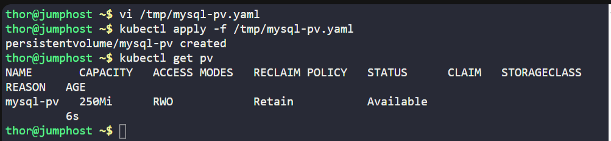
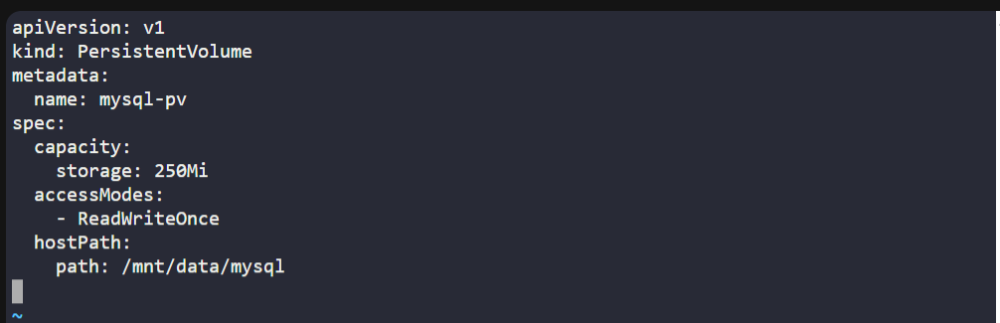

---


### 🔁 Step 2: Create PersistentVolumeClaim

```bash
vi /tmp/mysql-pvc.yaml
```

insert:
```yaml
apiVersion: v1
kind: PersistentVolumeClaim
metadata:
  name: mysql-pv-claim
spec:
  accessModes:
    - ReadWriteOnce
  resources:
    requests:
      storage: 250Mi
```

apply:
```bash
kubectl apply -f /tmp/mysql-pvc.yaml
```
> output: persistentvolumeclaim/mysql-pv-claim created

then verify:
```bash
kubectl get pvc
```

output:
```nginx
NAME             STATUS    VOLUME   CAPACITY   ACCESS MODES   STORAGECLASS   AGE
mysql-pv-claim   Pending                                      standard       25s
```

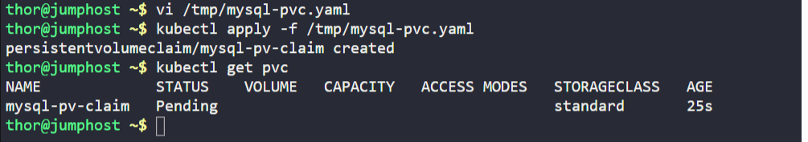
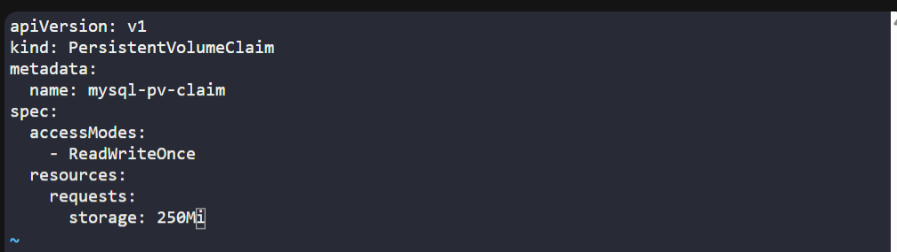

---

### 🔁 Step 3: Create Secrets

```bash
kubectl create secret generic mysql-root-pass --from-literal=password=YUIidhb667
kubectl create secret generic mysql-user-pass --from-literal=username=kodekloud_gem --from-literal=password=YchZHRcLkL
kubectl create secret generic mysql-db-url --from-literal=database=kodekloud_db10
```

verify:
```bash
kubectl get secrets
```

output:
```nginx
NAME              TYPE     DATA   AGE
mysql-db-url      Opaque   1      4s
mysql-root-pass   Opaque   1      17s
mysql-user-pass   Opaque   2      10s
```

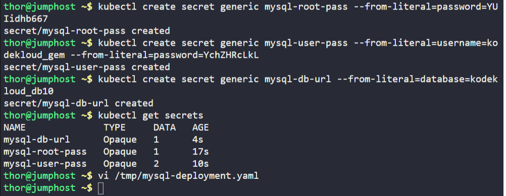

---

### 🔁 Step 4: Create MySQL Deployment

```bash
vi /tmp/mysql-deployment.yaml
```

insert:
```yaml
apiVersion: apps/v1
kind: Deployment
metadata:
  name: mysql-deployment
spec:
  replicas: 1
  selector:
    matchLabels:
      app: mysql
  template:
    metadata:
      labels:
        app: mysql
    spec:
      containers:
        - name: mysql
          image: mysql:5.7
          ports:
            - containerPort: 3306
          env:
            - name: MYSQL_ROOT_PASSWORD
              valueFrom:
                secretKeyRef:
                  name: mysql-root-pass
                  key: password
            - name: MYSQL_DATABASE
              valueFrom:
                secretKeyRef:
                  name: mysql-db-url
                  key: database
            - name: MYSQL_USER
              valueFrom:
                secretKeyRef:
                  name: mysql-user-pass
                  key: username
            - name: MYSQL_PASSWORD
              valueFrom:
                secretKeyRef:
                  name: mysql-user-pass
                  key: password
          volumeMounts:
            - name: mysql-persistent-storage
              mountPath: /var/lib/mysql
      volumes:
        - name: mysql-persistent-storage
          persistentVolumeClaim:
            claimName: mysql-pv-claim
```

save and exit (:wq!)

then apply:

```bash
kubectl apply -f /tmp/mysql-deployment.yaml
```
> output: deployment.apps/mysql-deployment created

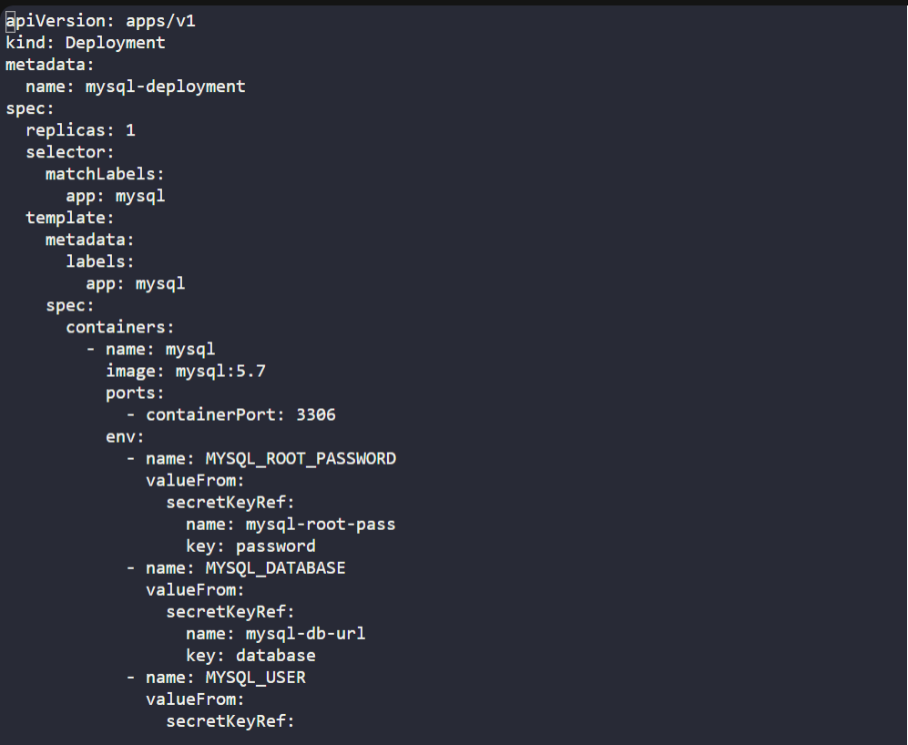
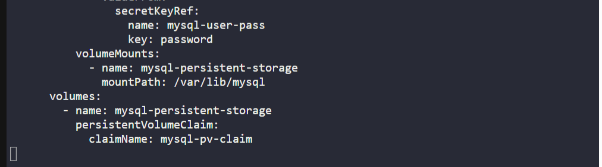
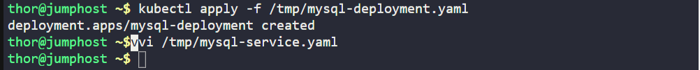

---

### 🔁 Step 5: Create Service

```bash
vi /tmp/mysql-service.yaml
```

insert:
```yaml
apiVersion: v1
kind: Service
metadata:
  name: mysql
spec:
  type: NodePort
  selector:
    app: mysql
  ports:
    - port: 3306
      targetPort: 3306
      nodePort: 30007
```

apply: 
```bash
kubectl apply -f /tmp/mysql-service.yaml
```
> output: service/mysql created

then verify:
```bash
kubectl get svc
```

output: 
```nginx
NAME         TYPE        CLUSTER-IP      EXTERNAL-IP   PORT(S)          AGE
kubernetes   ClusterIP   10.96.0.1       <none>        443/TCP          59m
mysql        NodePort    10.96.200.237   <none>        3306:30007/TCP   37s
```

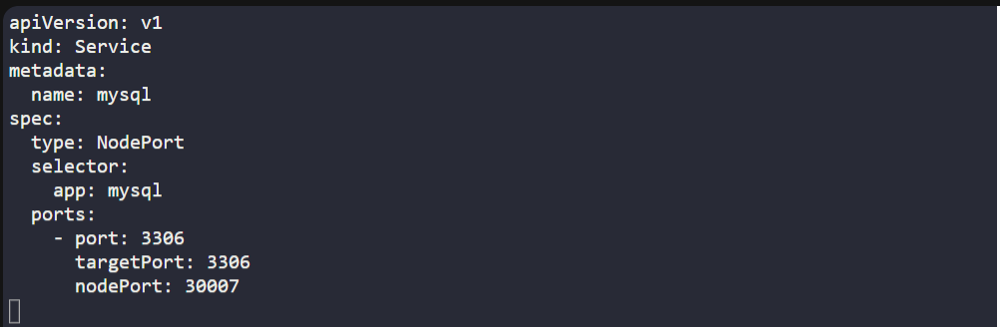
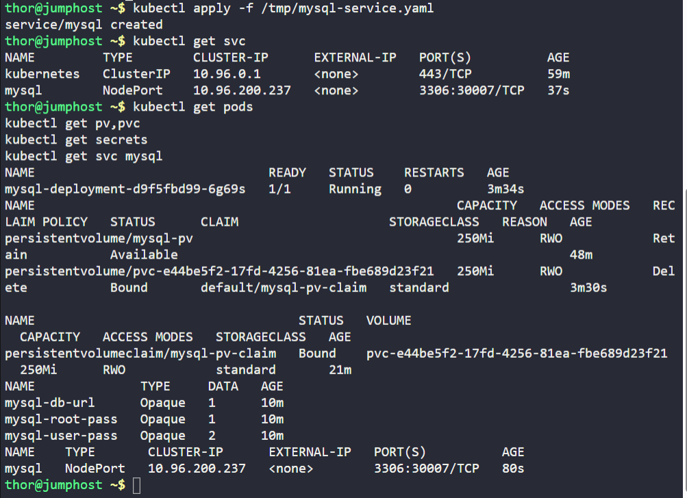

---

### 🔁 Step 6: Verify All Components

```bash
kubectl get pods
kubectl get pv,pvc
kubectl get secrets
kubectl get svc mysql
```

then Check logs to confirm database initialized:
```bash
kubectl logs -l app=mysql
```
> ✅ MySQL deployment is running successfully with secrets and persistent storage.

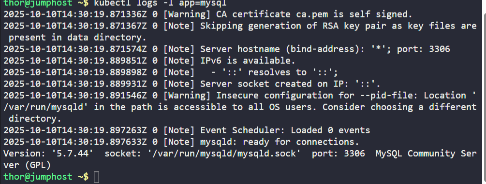

---

## 🗝️ Key Commands – MySQL on Kubernetes
| Command                                                                            | Description                 |
| ---------------------------------------------------------------------------------- | --------------------------- |
| `kubectl create secret generic mysql-root-pass --from-literal=password=YUIidhb667` | Create root password secret |
| `kubectl apply -f mysql-deployment.yaml`                                           | Deploy MySQL                |
| `kubectl get pv,pvc`                                                               | Check volumes               |
| `kubectl get svc mysql`                                                            | View service details        |
| `kubectl logs -l app=mysql`                                                        | Check MySQL logs            |

---

✅ Task Completed

- PersistentVolume & Claim created and bound.
- Secrets configured for root, user, and DB credentials.
- MySQL deployment mounted with PVC.
- NodePort service created (port 30007).
- MySQL running successfully with secret-based environment variables.


