# ☸️ 100 Days of DevOps – Day 67
## ✅ Task: Deploy Guest Book App on Kubernetes

```text
The Nautilus Application development team has finished development of one of the applications and it is ready for deployment.
It is a guestbook application that will be used to manage entries for guests/visitors. As per discussion with the DevOps team,
they have finalized the infrastructure that will be deployed on Kubernetes cluster. Below you can find more details about it.

BACK-END TIER
1. Create a deployment named redis-master for Redis master.
  a.) Replicas count should be 1.
  b.) Container name should be master-redis-devops and it should use image redis.
  c.) Request resources as CPU should be 100m and Memory should be 100Mi.
  d.) Container port should be redis default port i.e 6379.

2. Create a service named redis-master for Redis master. Port and targetPort should be Redis default port i.e 6379.

3. Create another deployment named redis-slave for Redis slave.
  a.) Replicas count should be 2.
  b.) Container name should be slave-redis-devops and it should use gcr.io/google_samples/gb-redisslave:v3 image.
  c.) Requests resources as CPU should be 100m and Memory should be 100Mi.
  d.) Define an environment variable named GET_HOSTS_FROM and its value should be dns.
  e.) Container port should be Redis default port i.e 6379.

4. Create another service named redis-slave. It should use Redis default port i.e 6379.

FRONT END TIER
1. Create a deployment named frontend.

  a.) Replicas count should be 3.
  b.) Container name should be php-redis-devops and it should use gcr.io/google-samples/gb-frontend@sha256:a908df8486ff66f2c4daa0d3d8a2fa09846a1fc8efd65649c0109695c7c5cbff image.
  c.) Request resources as CPU should be 100m and Memory should be 100Mi.
  d.) Define an environment variable named as GET_HOSTS_FROM and its value should be dns.
  e.) Container port should be 80.

2. Create a service named frontend. Its type should be NodePort, port should be 80 and its nodePort should be 30009.

Finally, you can check the guestbook app by clicking on App button.

You can use any labels as per your choice.

Note: The kubectl utility on jump_host has been configured to work with the kubernetes cluster.
```

---

📝 Task List

- Create Redis Master deployment and service.
- Create Redis Slave deployment and service.
- Create Frontend deployment and NodePort service.
- Verify that all pods and services are running.
- Access Guestbook via node IP and port 30009.

---

### 🔁 Step 1: Create Redis Master Deployment

```bash
vi /tmp/redis-master.yaml
```

insert:
```yaml
apiVersion: apps/v1
kind: Deployment
metadata:
  name: redis-master
spec:
  replicas: 1
  selector:
    matchLabels:
      app: redis-master
  template:
    metadata:
      labels:
        app: redis-master
    spec:
      containers:
        - name: master-redis-devops
          image: redis
          resources:
            requests:
              cpu: "100m"
              memory: "100Mi"
          ports:
            - containerPort: 6379
```
save and exit (:wq!)

then apply:
```bash
kubectl apply -f /tmp/redis-master.yaml
```

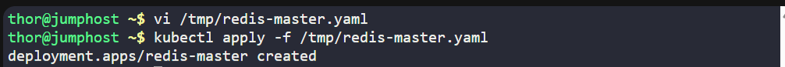
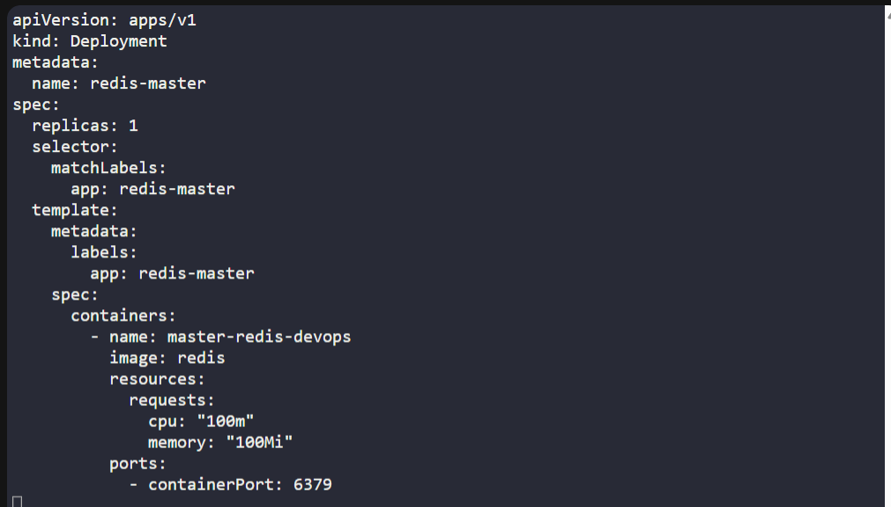

---

### 🔁 Step 2: Create Redis Master Service

```bash
vi /tmp/redis-master-svc.yaml
```

insert:
```yaml
apiVersion: v1
kind: Service
metadata:
  name: redis-master
spec:
  selector:
    app: redis-master
  ports:
    - port: 6379
      targetPort: 6379
```

save and exit (:wq!)

then apply:
```bash
kubectl apply -f /tmp/redis-master-svc.yaml
```
✅ Service created.

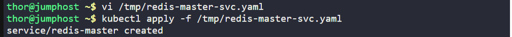
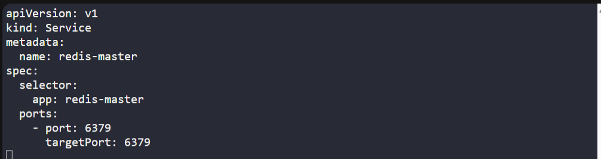

---

### 🔁 Step 3: Create Redis Slave Deployment

```bash
vi /tmp/redis-slave.yaml
```

insert:
```yaml
apiVersion: apps/v1
kind: Deployment
metadata:
  name: redis-slave
spec:
  replicas: 2
  selector:
    matchLabels:
      app: redis-slave
  template:
    metadata:
      labels:
        app: redis-slave
    spec:
      containers:
        - name: slave-redis-devops
          image: gcr.io/google_samples/gb-redisslave:v3
          resources:
            requests:
              cpu: "100m"
              memory: "100Mi"
          env:
            - name: GET_HOSTS_FROM
              value: dns
          ports:
            - containerPort: 6379
```

save and exit (:wq!)

then apply:
```bash
kubectl apply -f /tmp/redis-slave.yaml
```
✅ Redis Slave Deployment created with 2 replicas.

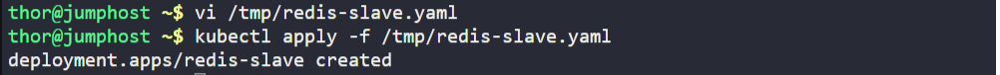
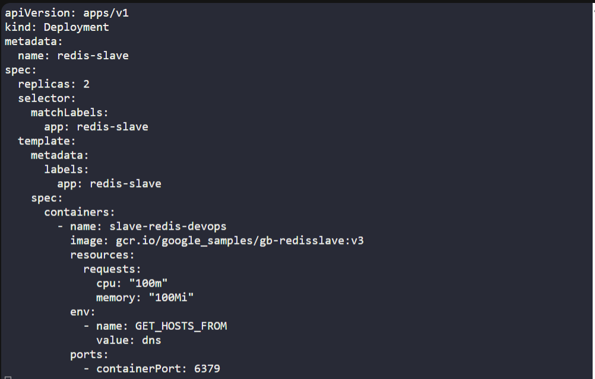

---

### 🔁 Step 4: Create Redis Slave Service

```bash
vi /tmp/redis-slave-svc.yaml
```

insert:
```yaml
apiVersion: v1
kind: Service
metadata:
  name: redis-slave
spec:
  selector:
    app: redis-slave
  ports:
    - port: 6379
      targetPort: 6379
```
save and exit (:wq!)

then apply:
```bash
kubectl apply -f /tmp/redis-slave-svc.yaml
```
✅ Redis Slave service created.


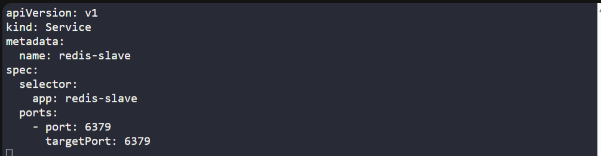

---

### 🔁 Step 5: Create Frontend Deployment

```bash
vi /tmp/frontend.yaml
```

insert:
```yaml
apiVersion: apps/v1
kind: Deployment
metadata:
  name: frontend
spec:
  replicas: 3
  selector:
    matchLabels:
      app: guestbook
  template:
    metadata:
      labels:
        app: guestbook
    spec:
      containers:
        - name: php-redis-devops
          image: gcr.io/google-samples/gb-frontend@sha256:a908df8486ff66f2c4daa0d3d8a2fa09846a1fc8efd65649c0109695c7c5cbff
          resources:
            requests:
              cpu: "100m"
              memory: "100Mi"
          env:
            - name: GET_HOSTS_FROM
              value: dns
          ports:
            - containerPort: 80

```
save and exit (:wq!)

then apply:
```bash
kubectl apply -f /tmp/frontend.yaml
```

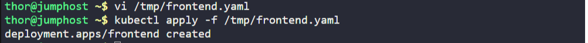
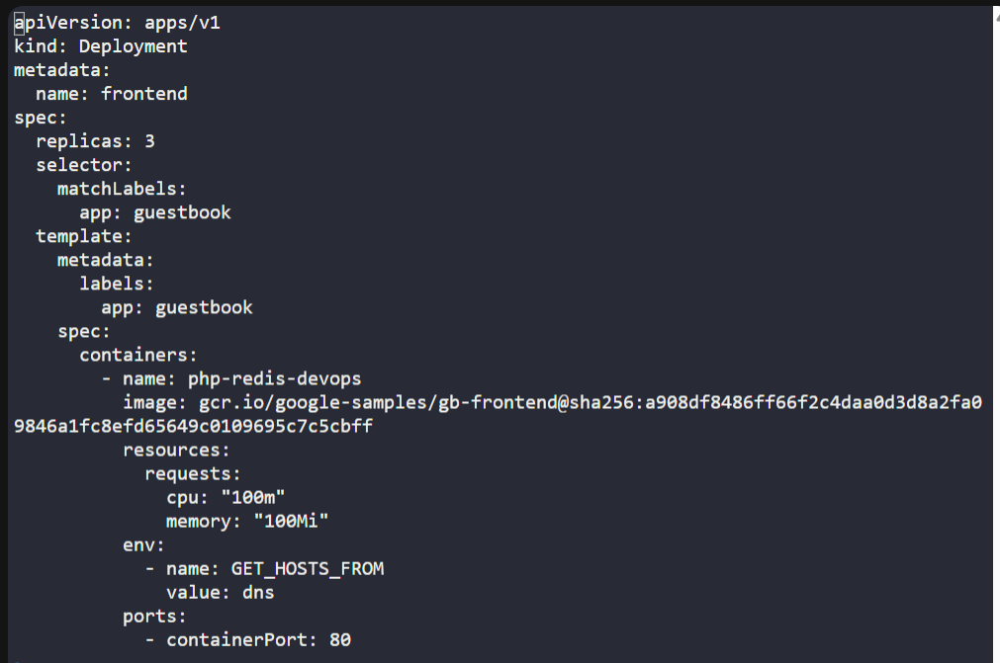

---

### 🔁 Step 6: Create Frontend Service
```bash
vi /tmp/frontend-svc.yaml
```

insert:
```yaml
apiVersion: v1
kind: Service
metadata:
  name: frontend
spec:
  type: NodePort
  selector:
    app: guestbook
  ports:
    - port: 80
      targetPort: 80
      nodePort: 30009
```
save and exit (:wq!)

then apply:
```bash
kubectl apply -f /tmp/frontend-svc.yaml
```
✅ Frontend Service created and exposed on NodePort 30009.


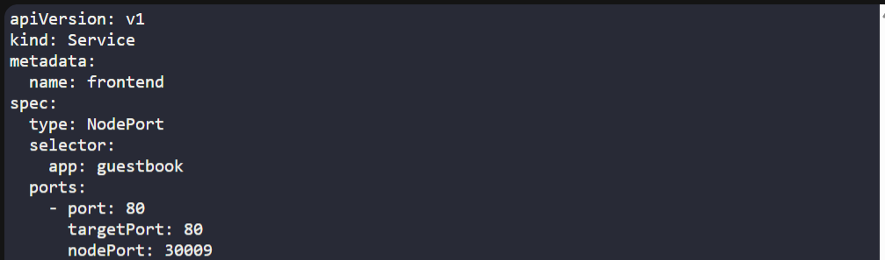

---

### 🔁 Step 7: Verify All Components
```bash
kubectl get pods
kubectl get svc
```
✅ Application components running and accessible.

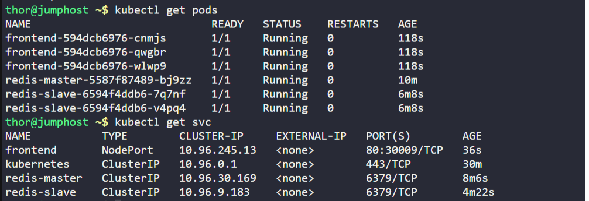

---

### 🌐 Step 8: Access the Guestbook App

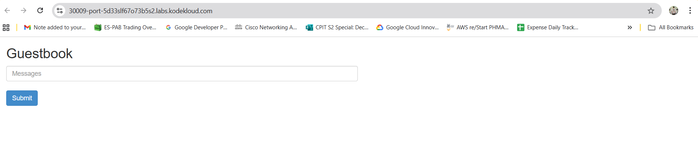

---

## 🗝️ Key Commands – Guestbook Deployment
| Command                              | Description                |
| ------------------------------------ | -------------------------- |
| `kubectl apply -f redis-master.yaml` | Deploy Redis master        |
| `kubectl apply -f redis-slave.yaml`  | Deploy Redis slave         |
| `kubectl apply -f frontend.yaml`     | Deploy frontend app        |
| `kubectl get svc`                    | List services and NodePort |
| `kubectl get pods`                   | Check pod status           |

---

## ✅ Task Completed
- Redis master and slave deployed successfully.
- Frontend application deployed with NodePort 30009.
- All pods and services verified running.
- Guestbook application accessible via browser.
