# ☸️ 100 Days of DevOps – Day 68
## ✅ Task: Set Up Jenkins Server

```text
The DevOps team at xFusionCorp Industries is initiating the setup of CI/CD pipelines and
has decided to utilize Jenkins as their server. Execute the task according to the provided requirements:
1. Install Jenkins on the jenkins server using the yum utility only, and start its service.
    If you face a timeout issue while starting the Jenkins service, refer to [this.](https://www.jenkins.io/doc/book/system-administration/systemd-services/#starting-services)
2. Jenkin's admin user name should be theadmin, password should be Adm!n321,
full name should be Mark and email should be mark@jenkins.stratos.xfusioncorp.com.

Note:
1. To access the jenkins server, connect from the jump host using the root user with the password S3curePass.
2. After Jenkins server installation, click the Jenkins button on the top bar to access the Jenkins UI and follow on-screen instructions to create an admin user.
```

---

📝 Task List
- SSH into Jenkins server using root credentials.
- Install Java 11 (required dependency).
- Add Jenkins repository and import key.
- Install Jenkins using yum.
- Start and enable Jenkins service.
- Configure firewall for port 8080 (if applicable).
- Access Jenkins UI and create the admin user with provided credentials.

---

### 🔁 Step 1: SSH into Jenkins Server
```bash
ssh root@jenkins
```
> Password: S3curePass

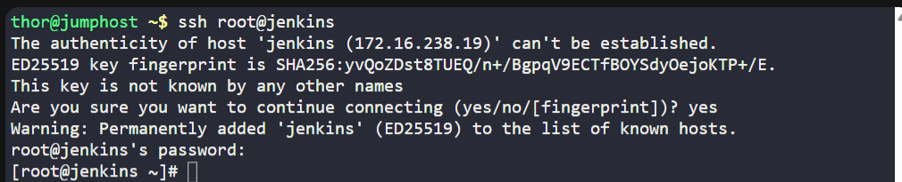

---

### 🔁 Step 2: Install Java (Required for Jenkins)
```bash
yum install java-11-openjdk -y
java -version
```
note: ✅ Ensure Java 17 is installed correctly.
if not, install the latest java version:
```bash
yum install -y java-17-openjdk
```

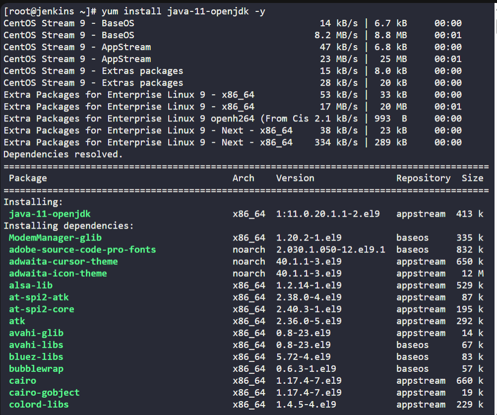
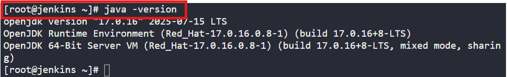


---

### 🔁 Step 3: Add Jenkins Repository
```bash
curl -o /etc/yum.repos.d/jenkins.repo https://pkg.jenkins.io/redhat-stable/jenkins.repo
rpm --import https://pkg.jenkins.io/redhat-stable/jenkins.io-2023.key
```

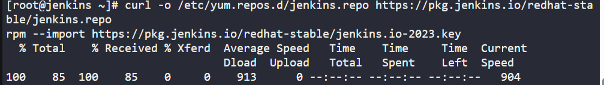

---

### 🔁 Step 4: Install Jenkins Using YUM
```bash
yum install jenkins -y
```

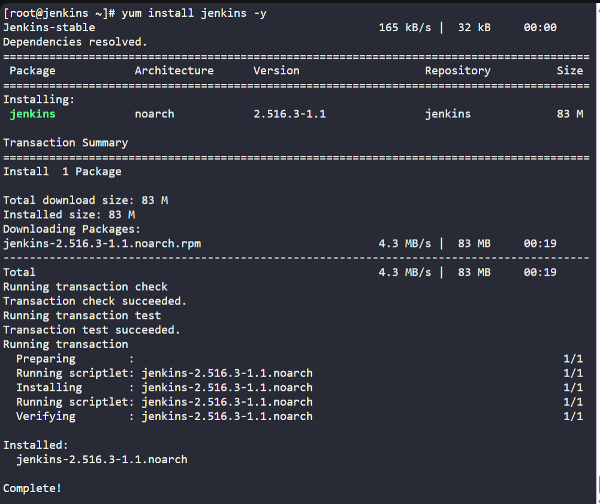

---

### 🔁 Step 5: Start and Enable Jenkins Service
```bash
systemctl start jenkins
systemctl enable jenkins
```

If you face a timeout (Optional):
```bash
systemctl daemon-reload
systemctl restart jenkins
```

Check status:
```bash
systemctl status jenkins
```
> ✅ Jenkins service is running

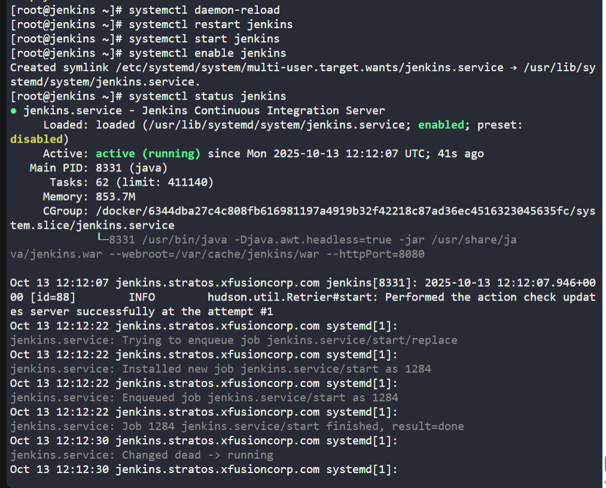

---

### 🔁 Step 7: Access Jenkins Web UI

retrieve initial admin password:
```bash
cat /var/lib/jenkins/secrets/initialAdminPassword
```
> password: c393a6e79d86495c915b382195522917

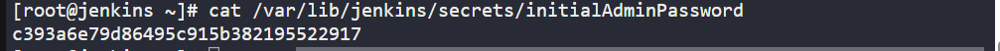

then access the Jenkins Web UI using the root password.

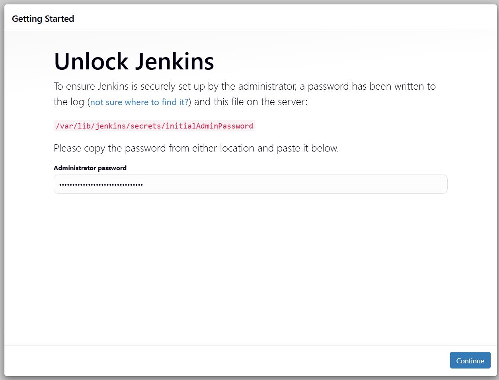

Install suggested plugins (just continue even there's failed installation)

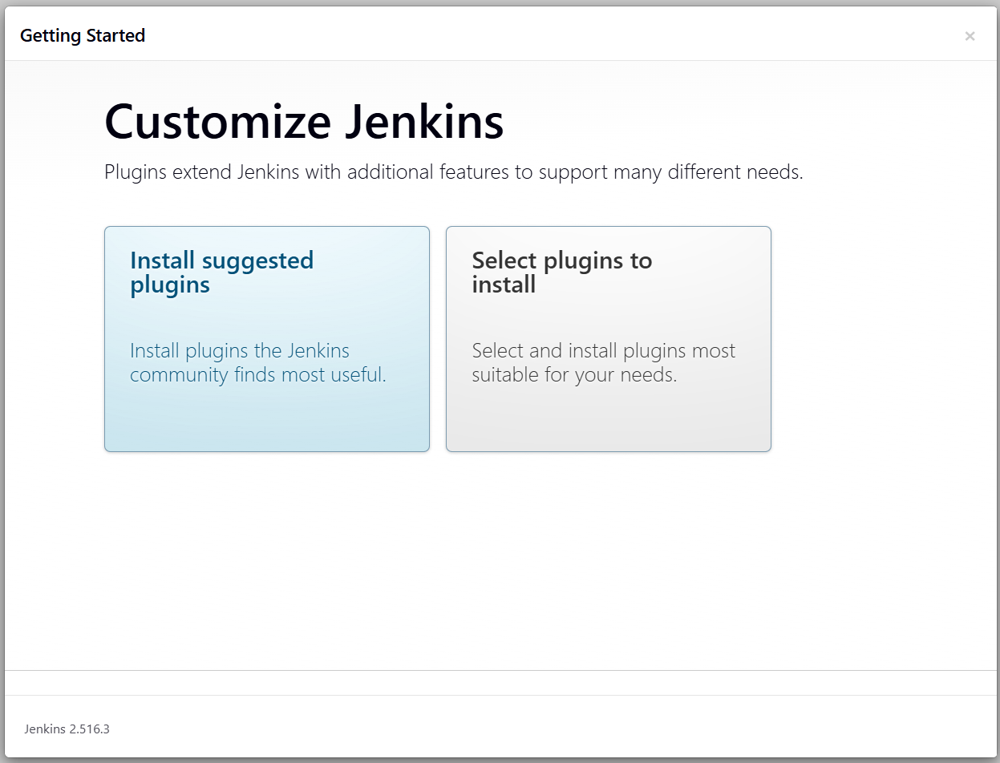
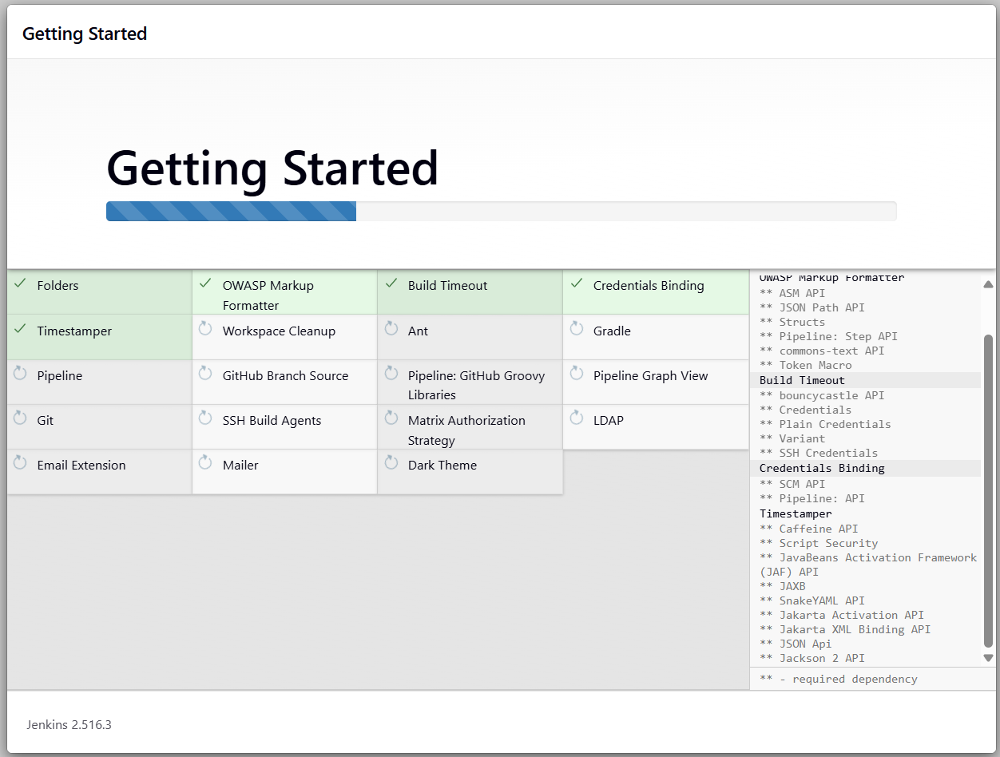

---

### 🔁 Step 6: Create Admin User
Fill in the fields as follows:
| Field     | Value                                 |
| --------- | ------------------------------------- |
| Username  | `theadmin`                            |
| Password  | `Adm!n321`                            |
| Full Name | `Mark`                                 |
| Email     | `mark@jenkins.stratos.xfusioncorp.com` |

Click Save and Continue → Save and Finish
>✅ Jenkins setup completed successfully.

Make sure to install all the plugins. install the necessary plugin, or 
update the jenkins (curl -O https://updates.jenkins.io/download/plugins/mailer/522.va_995fa_cfb_8b_d/mailer.hpi), 
in my case i installed manually the email extension in the Jenkins UI

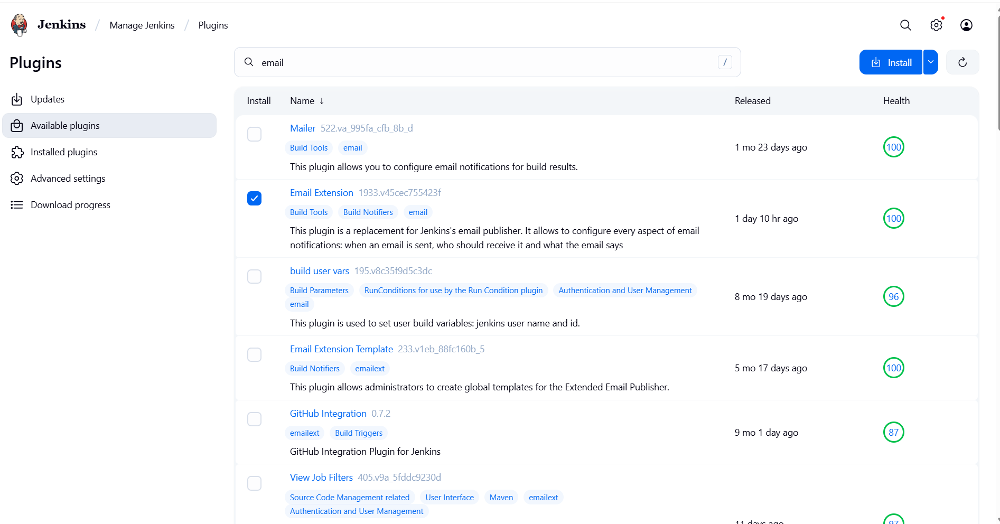

after installing the email extension plugin, input the email in the account details.


Click Save and Continue → Save and Finish
> ✅ Jenkins setup completed successfully.

---

## 🗝️ Key Commands – Jenkins Setup

| Command                                             | Description                       |
| --------------------------------------------------- | --------------------------------- |
| `yum install java-11-openjdk -y`                    | Installs Java dependency          |
| `yum install jenkins -y`                            | Installs Jenkins                  |
| `systemctl start jenkins`                           | Starts Jenkins service            |
| `systemctl enable jenkins`                          | Enables Jenkins to start on boot  |
| `cat /var/lib/jenkins/secrets/initialAdminPassword` | Displays Jenkins initial password |
| `firewall-cmd --permanent --add-port=8080/tcp`      | Opens Jenkins port                |
| `systemctl status jenkins`                          | Verifies Jenkins status           |

---

✅ Task Completed
- Jenkins installed using YUM ✅
- Jenkins service started and enabled ✅
- Admin user theadmin created ✅
- Jenkins web interface accessible ✅

