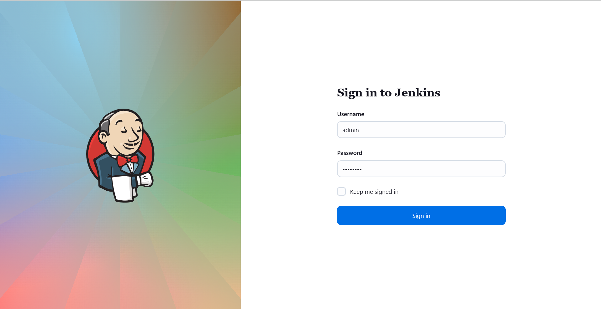
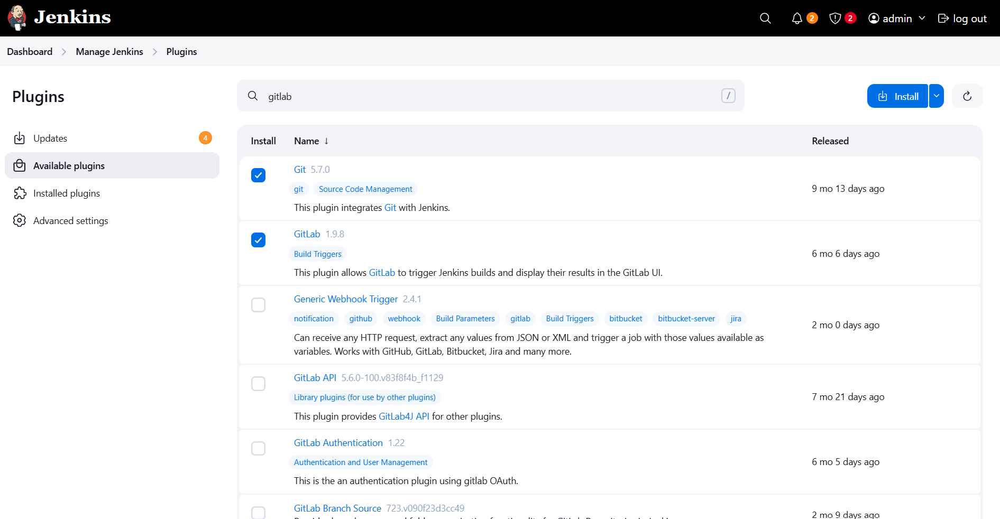
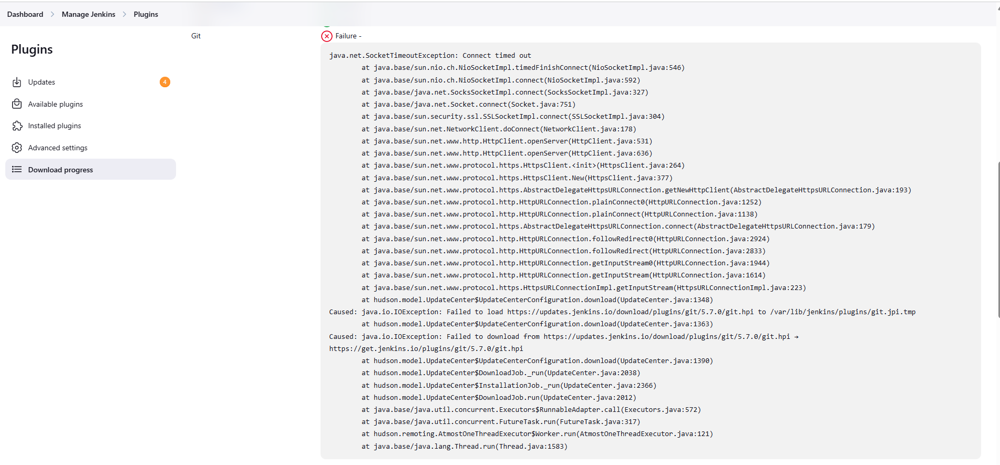
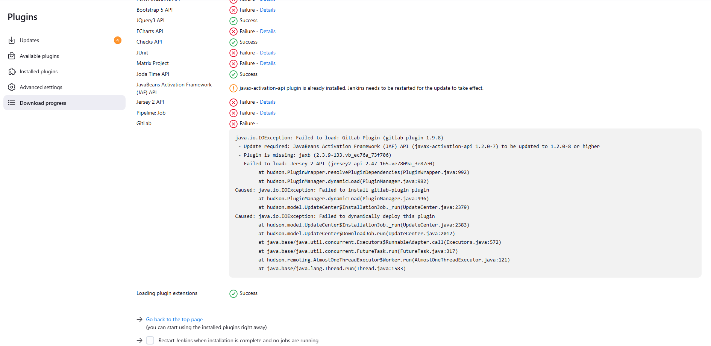
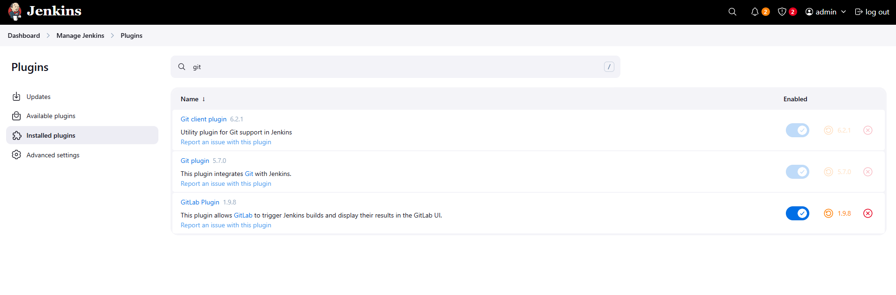

# ☸️ 100 Days of DevOps – Day 69
## ✅ Task: Install Jenkins Plugins

```text
The Nautilus DevOps team has recently setup a Jenkins server, which they want to use for some CI/CD jobs.
Before that they want to install some plugins which will be used in most of the jobs.
Please find below more details about the task

1. Click on the Jenkins button on the top bar to access the Jenkins UI. Login using username admin and Adm!n321 password.
2. Once logged in, install the Git and GitLab plugins. Note that you may need to restart Jenkins service to complete the
plugins installation, If required, opt to Restart Jenkins when installation is complete and no jobs are running on
plugin installation/update page i.e update centre.

Note:
1. After restarting the Jenkins service, wait for the Jenkins login page to reappear before proceeding.
2. For tasks involving web UI changes, capture screenshots to share for review or consider using screen recording
software like loom.com for documentation and sharing.
```

---

📝 Task List
- Login to Jenkins web interface.
- Navigate to Plugin Manager.
- Search and install Git and GitLab plugins.
- Restart Jenkins when prompted.
- Verify that plugins are installed successfully.

---

### 🔁 Step 1: Access Jenkins Web Interface

Open Jenkins in your browser
Login using:
```makefile
Username: admin
Password: Adm!n321
```
✅ You should now see the Jenkins dashboard.



---

### 🔁 Step 2: Navigate to Plugin Manager
From the left sidebar, go to:
```nginx
Manage Jenkins → Plugins → Available plugins
```

In the search bar, type Git.
Select:
- Git plugin
- GitLab plugin
Click Install without restart.




Issue encounter:

For Git:
```nginx
java.io.IOException: Failed to load: Git plugin (git 5.7.0)
 - Failed to load: Jenkins Git client plugin (git-client 6.2.1)
	at hudson.PluginWrapper.resolvePluginDependencies(PluginWrapper.java:992)
	at hudson.PluginManager.dynamicLoad(PluginManager.java:982)
Caused: java.io.IOException: Failed to install git plugin
	at hudson.PluginManager.dynamicLoad(PluginManager.java:996)
	at hudson.model.UpdateCenter$InstallationJob._run(UpdateCenter.java:2379)
Caused: java.io.IOException: Failed to dynamically deploy this plugin
	at hudson.model.UpdateCenter$InstallationJob._run(UpdateCenter.java:2383)
	at hudson.model.UpdateCenter$DownloadJob.run(UpdateCenter.java:2012)
	at java.base/java.util.concurrent.Executors$RunnableAdapter.call(Executors.java:572)
	at java.base/java.util.concurrent.FutureTask.run(FutureTask.java:317)
	at hudson.remoting.AtmostOneThreadExecutor$Worker.run(AtmostOneThreadExecutor.java:121)
	at java.base/java.lang.Thread.run(Thread.java:1583)
```



For Gitlab
```nginx
java.io.IOException: Failed to load: GitLab Plugin (gitlab-plugin 1.9.8)
Update required: JavaBeans Activation Framework (JAF) API (javax-activation-api 1.2.0-7)
to be updated to 1.2.0-8 or higher
Plugin is missing: jaxb (2.3.9-133.vb_ec76a_73f706)
Failed to load: Jersey 2 API (jersey2-api 2.47-165.ve7809a_3e87e0)
	at hudson.PluginWrapper.resolvePluginDependencies(PluginWrapper.java:992)
	at hudson.PluginManager.dynamicLoad(PluginManager.java:982)
Caused: java.io.IOException: Failed to install gitlab-plugin plugin
	at hudson.PluginManager.dynamicLoad(PluginManager.java:996)
	at hudson.model.UpdateCenter$InstallationJob._run(UpdateCenter.java:2379)
Caused: java.io.IOException: Failed to dynamically deploy this plugin
	at hudson.model.UpdateCenter$InstallationJob._run(UpdateCenter.java:2383)
	at hudson.model.UpdateCenter$DownloadJob.run(UpdateCenter.java:2012)
```



---

### Fix the issue by updating the jenkins 
```nginx
Manage Jenkins → Plugins → Updates
```
then restart

> check the installed plugins -> Now, git and gitlab will be installed



---

## 🗝️ Key Jenkins Plugin Steps
| Step                                   | Action                           |
| -------------------------------------- | -------------------------------- |
| `Manage Jenkins → Plugins → Available` | Open plugin installation section |
| Search “Git” and “GitLab”              | Find required plugins            |
| `Install without restart`              | Begin installation               |
| `Restart Jenkins`                      | Apply plugin updates             |
| `Manage Jenkins → Plugins → Installed` | Verify plugins are installed     |


---

## ✅ Task Completed
- Logged in to Jenkins successfully ✅
- Installed Git and GitLab plugins ✅
- Restarted Jenkins after installation ✅
- Verified plugins installed and active ✅

