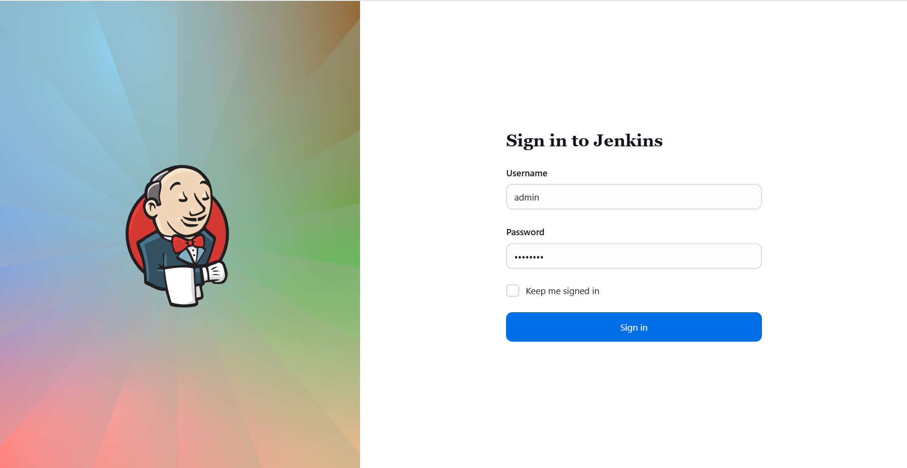
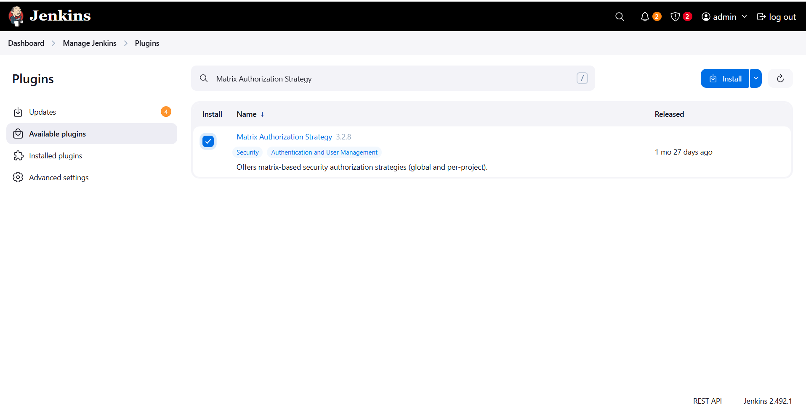
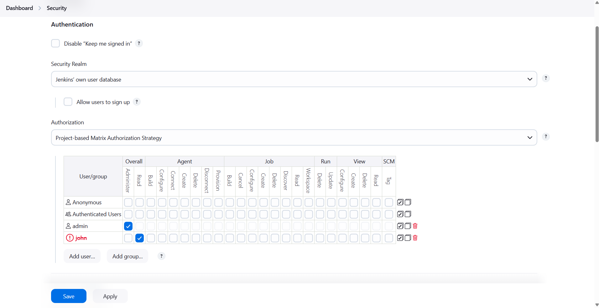
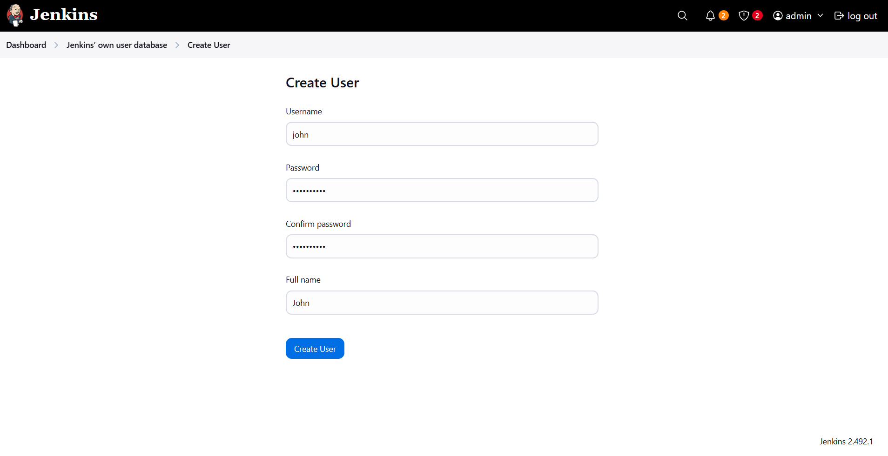
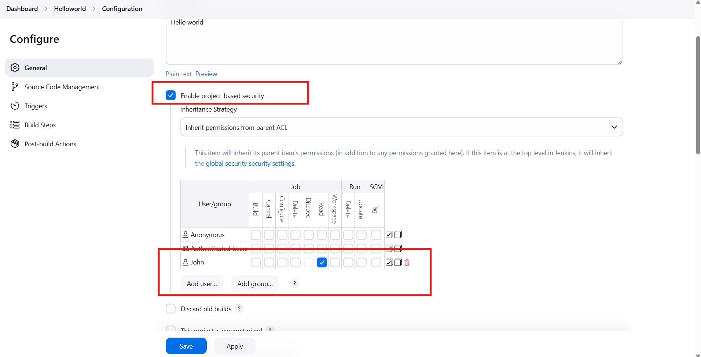
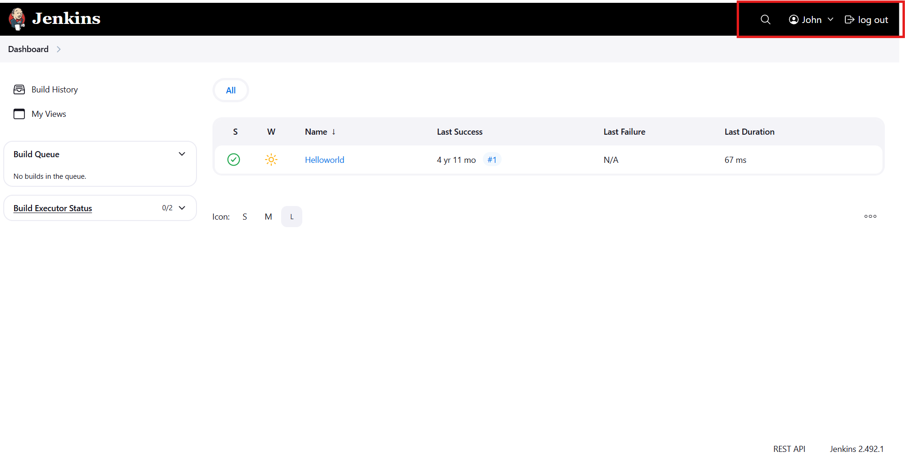
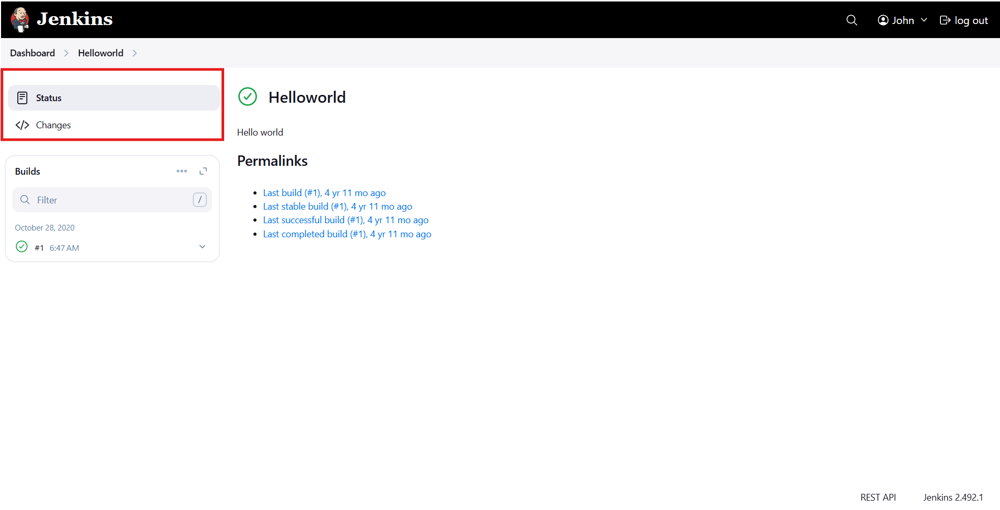

# ☸️ 100 Days of DevOps – Day 70
## ✅ Task: Configure Jenkins User Access

```text
The Nautilus team is integrating Jenkins into their CI/CD pipelines. After setting up a new Jenkins server, 
they're now configuring user access for the development team, Follow these steps:

1. Click on the Jenkins button on the top bar to access the Jenkins UI. Login with username admin and password Adm!n321.
2. Create a jenkins user named john with the passwordBruCStnMT5. Their full name should match John.
3. Utilize the Project-based Matrix Authorization Strategy to assign overall read permission to the john user.
4. Remove all permissions for Anonymous users (if any) ensuring that the admin user retains overall Administer permissions.
5. For the existing job, grant john user only read permissions, disregarding other permissions such as Agent, SCM etc.

Note:
1. You may need to install plugins and restart Jenkins service. After plugins installation, 
select Restart Jenkins when installation is complete and no jobs are running on plugin installation/update page.
2. After restarting the Jenkins service, wait for the Jenkins login page to reappear before proceeding. 
Avoid clicking Finish immediately after restarting the service.
3. Capture screenshots of your configuration for review purposes. Consider using screen recording software like
loom.com for documentation and sharing.
```

---

📝 Task List

- Login to Jenkins web interface.
- Create a new user john.
- Enable and configure Matrix Authorization Strategy.
- Assign correct permissions to admin and john.
- Remove all access for anonymous users.
- Verify access by logging in as john.

---

### 🔁 Step 1: Access Jenkins Web Interface
Open Jenkins in your browser.
Login using:
```makefile
Username: admin
Password: Adm!n321
```
> ✅ You should now see the Jenkins dashboard.



---

### 🔁 Step 2: Install and Enable Matrix Authorization Plugin
If not already enabled:

1. Navigate to
```nginx
Manage Jenkins → Plugins → Available plugins
```

2. Search for and install:
- Matrix Authorization Strategy

3. Once installed, click:
> ✅ Restart Jenkins when installation is complete and no jobs are running.
Wait until Jenkins reloads and the login page reappears.



---

### 🔁 Step 3: Enable Matrix Authorization Strategy

Go to:
```nginx
Manage Jenkins → Configure Global Security
```

Under Authorization, select:
```nginx
Project-based Matrix Authorization Strategy
```

Then assign permissions:
- admin → ✅ Administer (Full access)
- john → ✅ Overall → Read
- Anonymous → ❌ No permissions (remove completely)

Click Save.



--- 

### 🔁 Step 4: Create User “john”

1. Navigate to
```nginx
Manage Jenkins → Users → Create User
```

2. Fill in the details:
```makefile
Username: john
Password: BruCStnMT5
Confirm Password: BruCStnMT5
Full name: John
Email address: (optional)
```

3. Click Create User.



---

### 🔁 Step 5: Configure Job-Level Permissions

1. Go to the existing Jenkins job (e.g., a sample or demo job).

2. Click:
```nginx
Configure → Enable project-based security
```

3. Add the john user and assign only:
```mathematica
Job → Read
```

4. Leave all other permissions unchecked.

Click Save.



---

### 🔁 Step 6: Verify User Access

1. Log out from Jenkins.
   
3. Log in as john:

```nginx
Username: john
Password: BruCStnMT5
```


Confirmed:
- John can view jobs.
- John cannot build, configure, or delete any jobs.
- Anonymous users see no access to Jenkins dashboard.



---

## 🗝️ Key Jenkins Access Configuration Steps

| Step | Action                                       | Description                     |
| ---- | -------------------------------------------- | ------------------------------- |
| 1    | `Manage Jenkins → Users → Create User`       | Create user John                |
| 2    | `Manage Jenkins → Configure Global Security` | Enable Matrix Authorization     |
| 3    | `Grant Permissions`                          | Admin → Administer, John → Read |
| 4    | `Remove Anonymous Access`                    | Disable all for Anonymous       |
| 5    | `Job → Configure`                            | Assign John “Read” only         |
| 6    | `Login as John`                              | Verify restricted access        |

---

## ✅ Task Completed

- Jenkins admin and user permissions configured successfully ✅
- John user created with limited access ✅
- Anonymous access removed ✅
- Job-level permissions verified ✅
