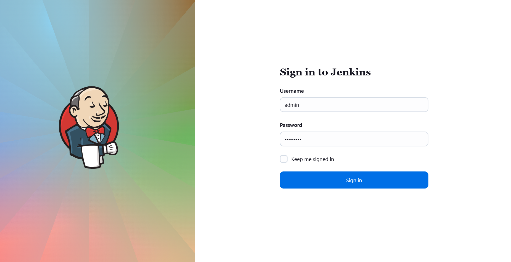
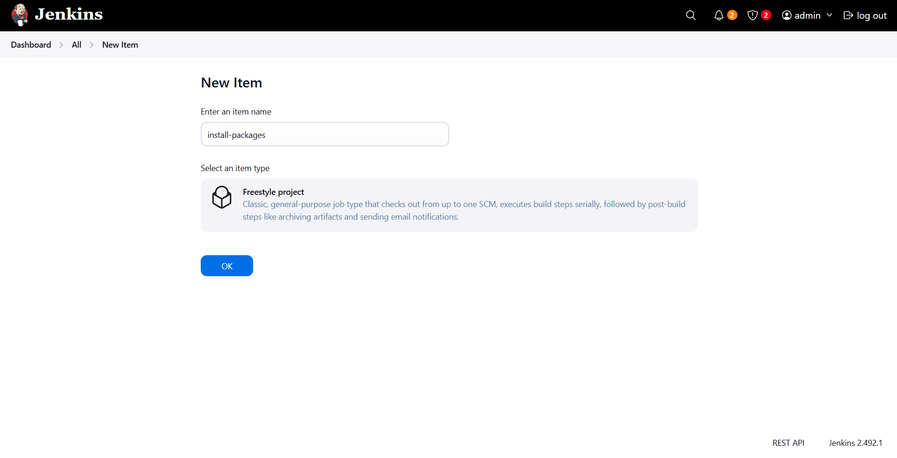
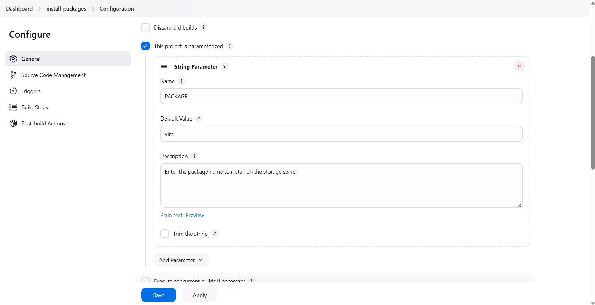
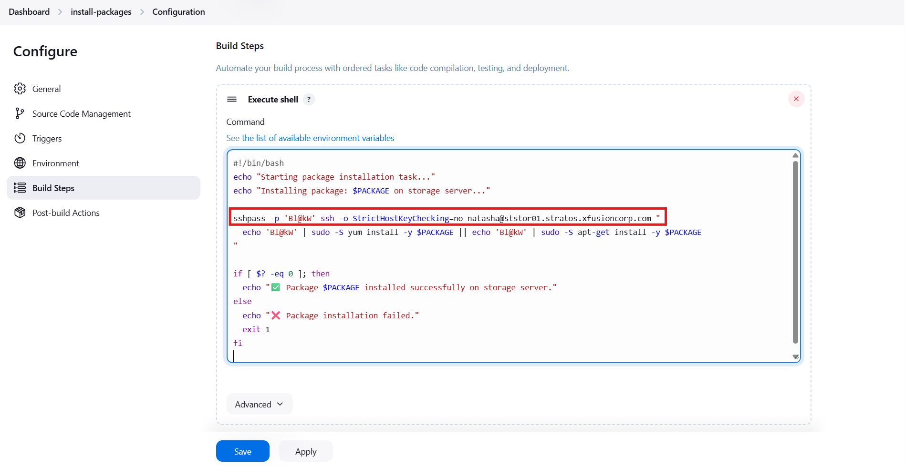
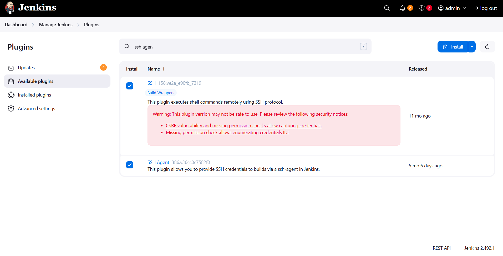
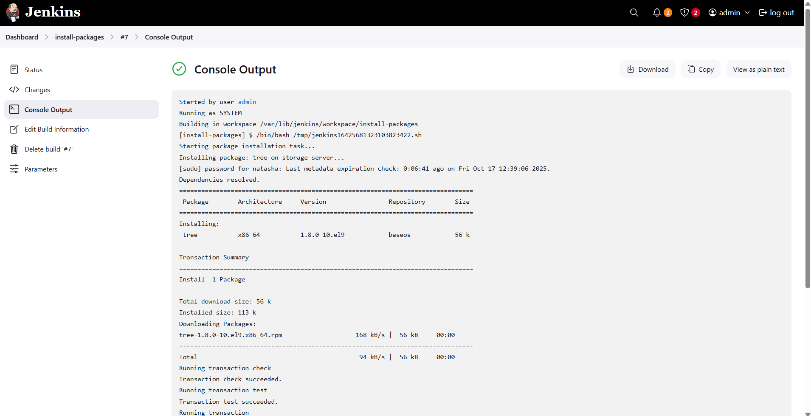

# ☸️ 100 Days of DevOps – Day 71
## ✅ Task: Configure Jenkins Job for Package Installation

```text
Some new requirements have come up to install and configure some packages on the Nautilus
infrastructure under Stratos Datacenter. The Nautilus DevOps team installed and configured a new Jenkins server so
they wanted to create a Jenkins job to automate this task. Find below more details and complete the task accordingly:

1. Access the Jenkins UI by clicking on the Jenkins button in the top bar.
Log in using the credentials: username admin and password Adm!n321.
2. Create a new Jenkins job named install-packages and configure it with the following specifications:
    - Add a string parameter named PACKAGE.
    - Configure the job to install a package specified in the $PACKAGE parameter on the storage server within the Stratos Datacenter.

Note:

1. Ensure to install any required plugins and restart the Jenkins service if necessary.
Opt for Restart Jenkins when installation is complete and no jobs are running on the plugin installation/update page.
Refresh the UI page if needed after restarting the service.

2. Verify that the Jenkins job runs successfully on repeated executions to ensure reliability.

3. Capture screenshots of your configuration for documentation and review purposes. Alternatively,
use screen recording software like loom.com for comprehensive documentation and sharing.
```

---

📝 Task List

- Access Jenkins UI using admin credentials.
- Create a new Freestyle Jenkins job named install-packages.
- Add a String Parameter named PACKAGE.
- Configure the build step to SSH into the storage server and install the package.
- Install and configure any required plugins (e.g., SSH, SSH Agent).
- Verify the job runs successfully multiple times.
- Capture screenshots or record documentation using Loom.

---

### 🔁 Step 1: Access Jenkins UI

1. Click Jenkins on the top bar in the Stratos environment.
2. Login using:
```nginx
Username: admin
Password: Adm!n321
````



---

### 🔁 Step 2: Create a New Job

1. From the Jenkins dashboard → click “New Item.”
2. Enter the job name:
```nginx
install-packages
```
3. Choose Freestyle project → click OK.



---

### 🔁 Step 3: Add String Parameter

In the General tab:
1. Check “This project is parameterized.”
2. Click Add Parameter → String Parameter.
3. Fill in the details
```nginx
| Field         | Value                                                      |
| ------------- | ---------------------------------------------------------- |
| Name          | `PACKAGE`                                                  |
| Default Value | `vim`                                                      |
| Description   | `Enter the package name to install on the storage server.` |
```



---

### 🔁 Step 4: Configure Build Step

1. Scroll to the Build section → click Add build step → Execute shell.
2. Add the following script:
```bash
#!/bin/bash
echo "Starting package installation task..."
echo "Installing package: $PACKAGE on storage server..."

sshpass -p 'Bl@kW' ssh -o StrictHostKeyChecking=no natasha@ststor01.stratos.xfusioncorp.com "
  echo 'Bl@kW' | sudo -S yum install -y $PACKAGE || echo 'Bl@kW' | sudo -S apt-get install -y $PACKAGE
"

if [ $? -eq 0 ]; then
  echo "✅ Package $PACKAGE installed successfully on storage server."
else
  echo "❌ Package installation failed."
  exit 1
fi
```

🔹 Ensure Jenkins can connect to the storage server via SSH (use SSH keys or sshpass).

then save



---

### 🔁 Step 5: Install Required Plugins (if needed)

If Jenkins cannot connect via SSH:
1. Go to Manage Jenkins → Plugins → Available Plugins.
2. Install:
```nginx
SSH Plugin
SSH Agent Plugin
```
3. Select Restart Jenkins when installation is complete and no jobs are running.
4. After restart, refresh the Jenkins UI.



---

### 🔁 Step 5: Build

1. Click Build with Parameters.
2. Enter the package name, for example:
```nginx
tree
```
3. Click Build.
> ✅ The build console should show logs confirming the package installation on the remote server.



---

## 🗝️ Key Commands – Jenkins Package Job

| Command                                             | Description                                  |                                    |
| --------------------------------------------------- | -------------------------------------------- | ---------------------------------- |
| `sshpass -p 'Bl@kW' ssh user@ststor01`              | SSH into the storage server using password   |                                    |
| `echo 'Bl@kW'                                       | sudo -S yum install -y $PACKAGE`             | Installs package non-interactively |
| `yum install -y <pkg>` / `apt-get install -y <pkg>` | Package installation commands                |                                    |
| `systemctl restart jenkins`                         | Restart Jenkins service after plugin install |                                    |
| `Build with Parameters`                             | Run Jenkins job with custom input            |                                    |

---

✅ Task Completed

- Jenkins job install-packages created ✅
- String parameter PACKAGE configured ✅
- SSH + sudo automation verified ✅
- Plugins installed and Jenkins restarted ✅
- Job runs successfully multiple times ✅
- Screenshots and documentation captured ✅
