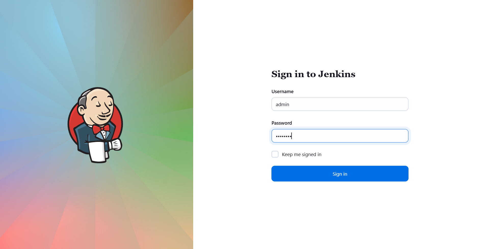
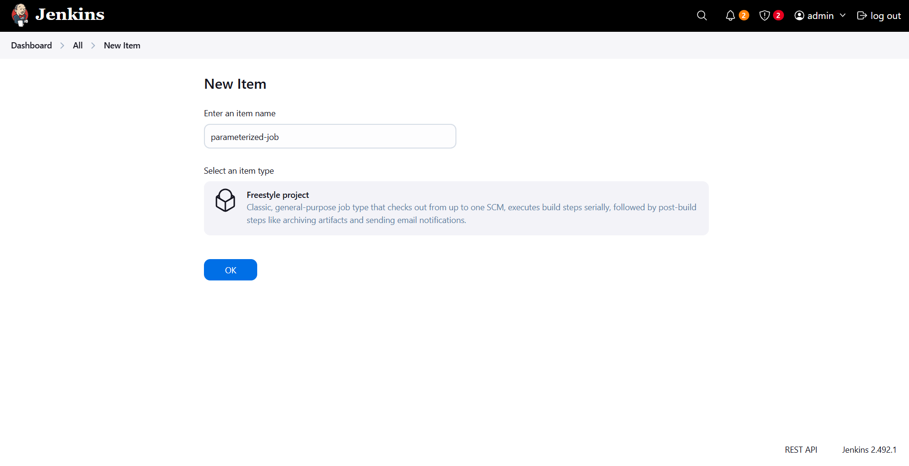
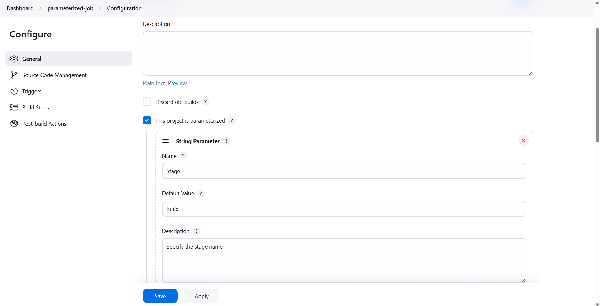
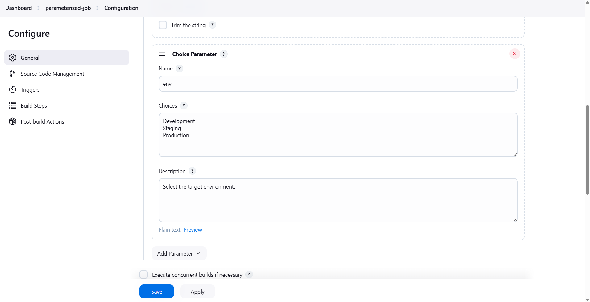
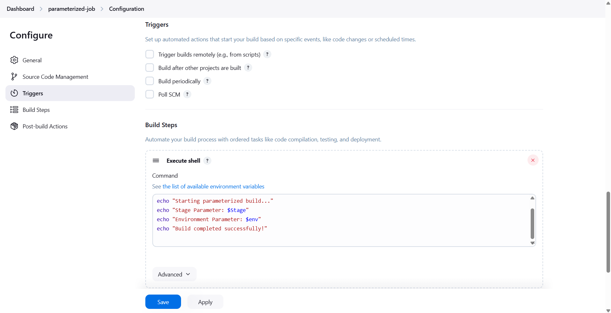
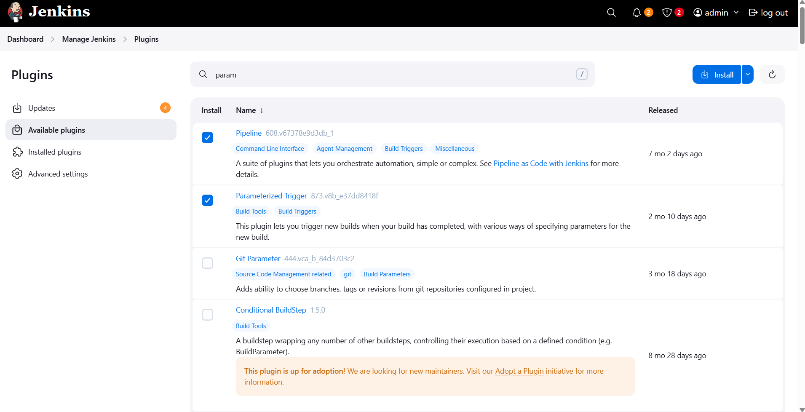
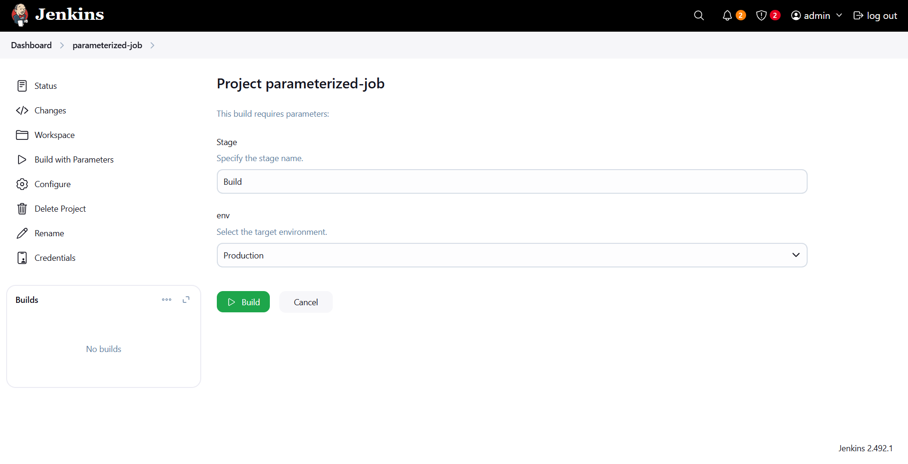
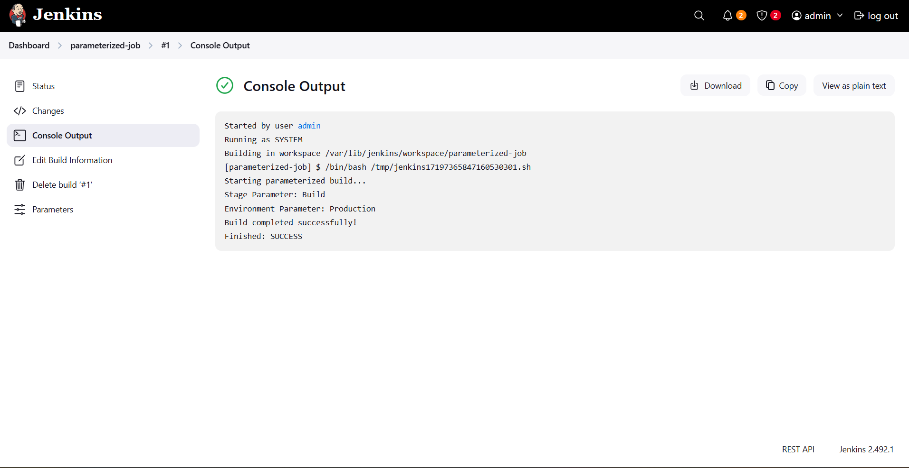
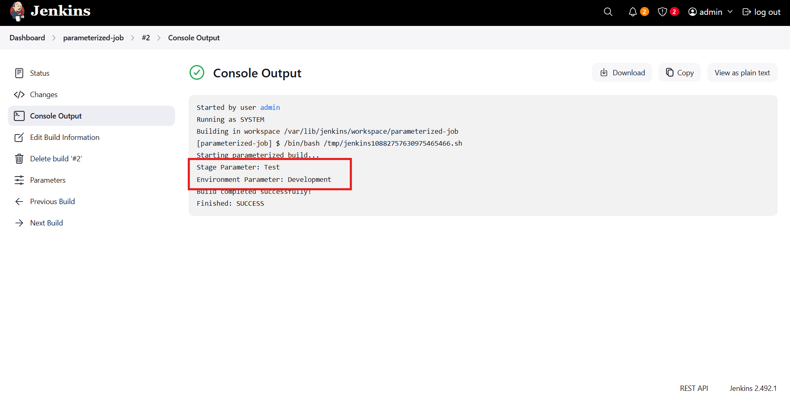
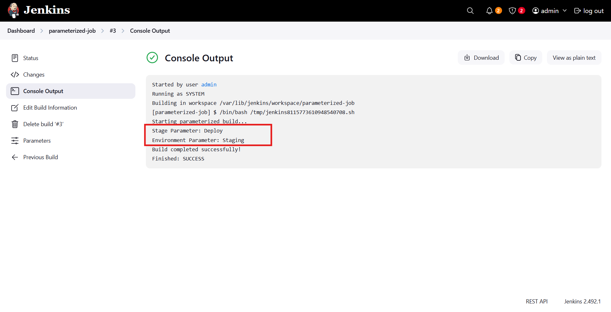

# ☸️ 100 Days of DevOps – Day 72
## ✅ Task: Jenkins Parameterized Builds

```text
A new DevOps Engineer has joined the team and he will be assigned some Jenkins related tasks.
Before that, the team wanted to test a simple parameterized job to understand basic functionality of parameterized builds.
He is given a simple parameterized job to build in Jenkins. Please find more details below:

Click on the Jenkins button on the top bar to access the Jenkins UI. Login using username admin and password Adm!n321.

1. Create a parameterized job which should be named as parameterized-job
2. Add a string parameter named Stage; its default value should be Build.
3. Add a choice parameter named env; its choices should be Development, Staging and Production.
4. Configure job to execute a shell command, which should echo both parameter values (you are passing in the job).
5. Build the Jenkins job at least once with choice parameter value Production to make sure it passes.

Note:

1. You might need to install some plugins and restart Jenkins service. So, we recommend clicking on 
Restart Jenkins when installation is complete and no jobs are running on plugin installation/update page i.e update centre. 
Also, Jenkins UI sometimes gets stuck when Jenkins service restarts in the back end. In this case, please make sure to refresh the UI page.
2. For these kind of scenarios requiring changes to be done in a web UI, please take screenshots so that you can share it with us
for review in case your task is marked incomplete. You may also consider using a screen recording software such as loom.com to record and share your work.
```

---

📝 Task Summary

| Step | Action                                                                               |
| ---- | ------------------------------------------------------------------------------------ |
| 1    | Access Jenkins UI using admin credentials                                            |
| 2    | Create a new parameterized Jenkins job named `parameterized-job`                     |
| 3    | Add a **String Parameter**: `Stage` with default value `Build`                       |
| 4    | Add a **Choice Parameter**: `env` with values `Development`, `Staging`, `Production` |
| 5    | Add a **Shell Build Step** to echo both parameters                                   |
| 6    | Build the job using `env=Production` and verify successful execution                 |

---

### 🔁 Step 1: Access Jenkins UI

1. Click the Jenkins button on the top bar in the Stratos environment.
2. Log in using:
  - Username: admin
  - Password: Adm!n321



---

### 🔁 Step 2: Create a New Jenkins Job
1. From the Jenkins dashboard → click “New Item.”
2. Enter job name:
   ```bash
   parameterized-job
   ```
3. Choose Freestyle project → click OK.



---

### 🔁 Step 3: Add String Parameter

In the General section:
1. Check “This project is parameterized.”
2. Click Add Parameter → String Parameter.
3. Fill in the details:
```nginx
| Field         | Value                     |
| ------------- | ------------------------- |
| Name          | `Stage`                   |
| Default Value | `Build`                   |
| Description   | `Specify the stage name.` |
```



---

### 🔁 Step 4: Add Choice Parameter

1. Click Add Parameter → Choice Parameter.
2. Fill in the details:

```nginx
| Field       | Value                                      |
| ----------- | ------------------------------------------ |
| Name        | `env`                                      |
| Choices     | `Development`<br>`Staging`<br>`Production` |
| Description | `Select the target environment.`           |
```



---

### 🔁 Step 5: Add Build Step

Scroll to the Build section → click Add build step → Execute shell.

Add the following script:
```bash
#!/bin/bash
echo "Starting parameterized build..."
echo "Stage Parameter: $Stage"
echo "Environment Parameter: $env"
echo "Build completed successfully!"
```

Apply and save



---

### 🔁 Step 6: (Optional) Install or Update Plugins

If parameter options don’t appear correctly or Jenkins is missing UI features:

1. Go to Manage Jenkins → Plugins → Available Plugins.
2. Install or update:
    - Pipeline Plugin
    - Parameterized Trigger Plugin
3. Choose Restart Jenkins when installation is complete and no jobs are running.
4. Refresh Jenkins UI after restart.
> Note: IF pipeline installation is failed, install also other pipeline plugins.



---

### 🔁 Step 7: Build

1. Click Build with Parameters.
2. Set parameters:
  - Stage: Keep as Build
  - env: Select Production
3. Click Build.



---

🔁 Step 7: Verify Console Output

After the build completes successfully, check Console Output.
Output:
```nginx
Started by user admin

Running as SYSTEM
Building in workspace /var/lib/jenkins/workspace/parameterized-job
[parameterized-job] $ /bin/bash /tmp/jenkins17197365847160530301.sh
Starting parameterized build...
Stage Parameter: Build
Environment Parameter: Production
Build completed successfully!
Finished: SUCCESS
```
> ✅ The job ran successfully using both parameters.



---

🔁 Step 9: Verify Repeated Builds

Re-run the job with different parameter combinations:
- Stage = Test, env = Development
- Stage = Deploy, env = Staging
All should print successfully.




---

## 🗝️ Key Commands – Jenkins Parameterized Job

| Command                     | Description                                           |
| --------------------------- | ----------------------------------------------------- |
| `$Stage`                    | Reads value of string parameter                       |
| `$env`                      | Reads value of choice parameter                       |
| `echo "..."`                | Prints to console output                              |
| `Build with Parameters`     | Runs Jenkins job interactively with user input        |
| `systemctl restart jenkins` | Restart Jenkins if required after plugin installation |

---

✅ Task Completed

- Jenkins job parameterized-job created ✅
- Parameters Stage and env configured ✅
- Shell command echoes parameters correctly ✅
- Build verified successfully using Production ✅
- Screenshots captured for documentation ✅
