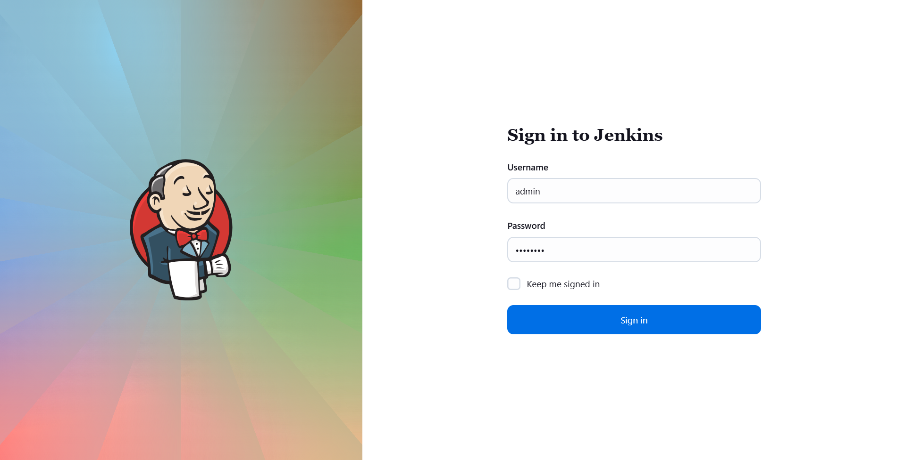
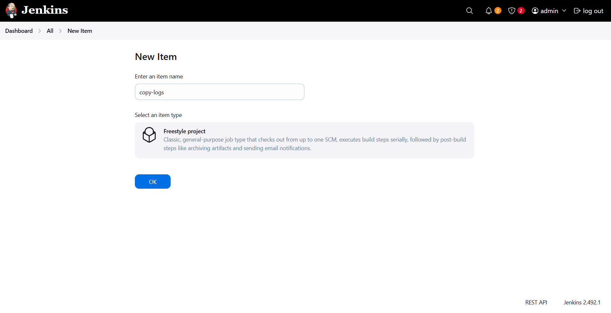
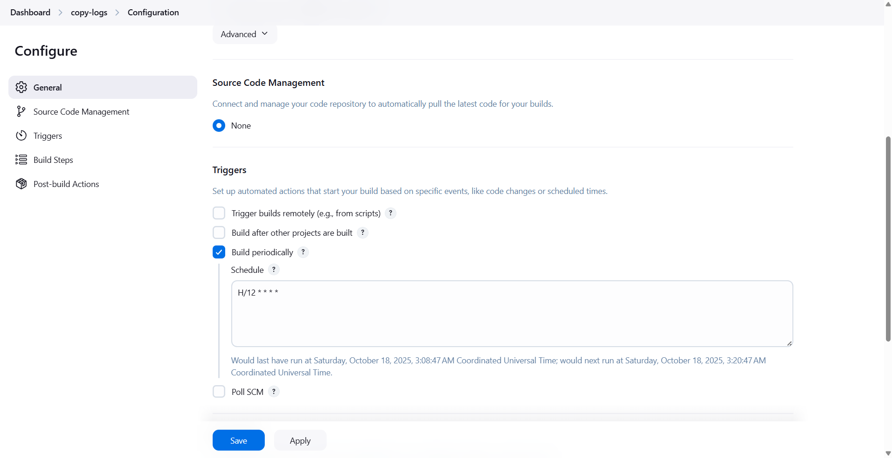
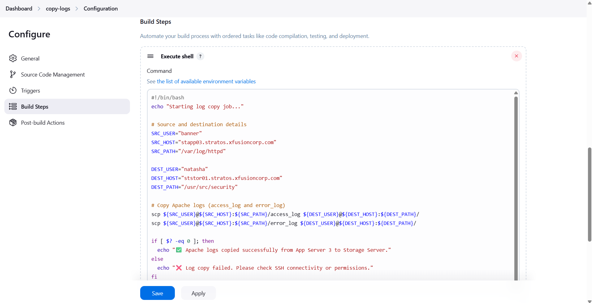
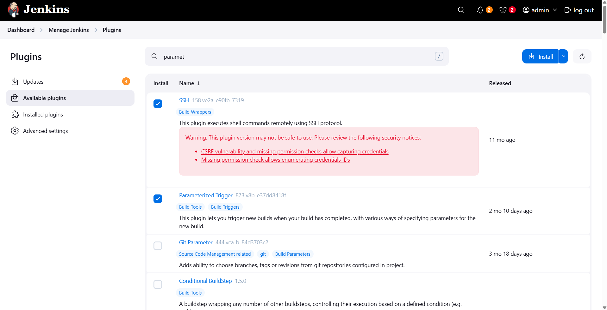
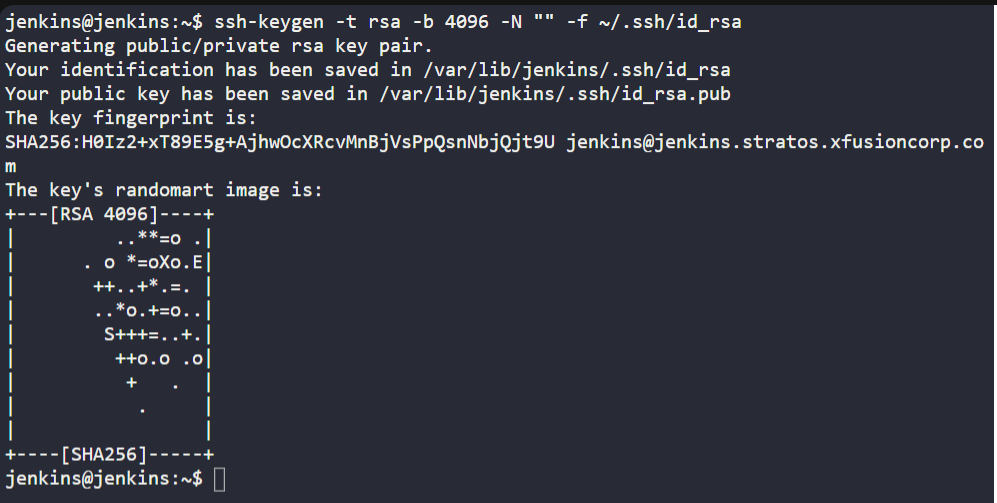
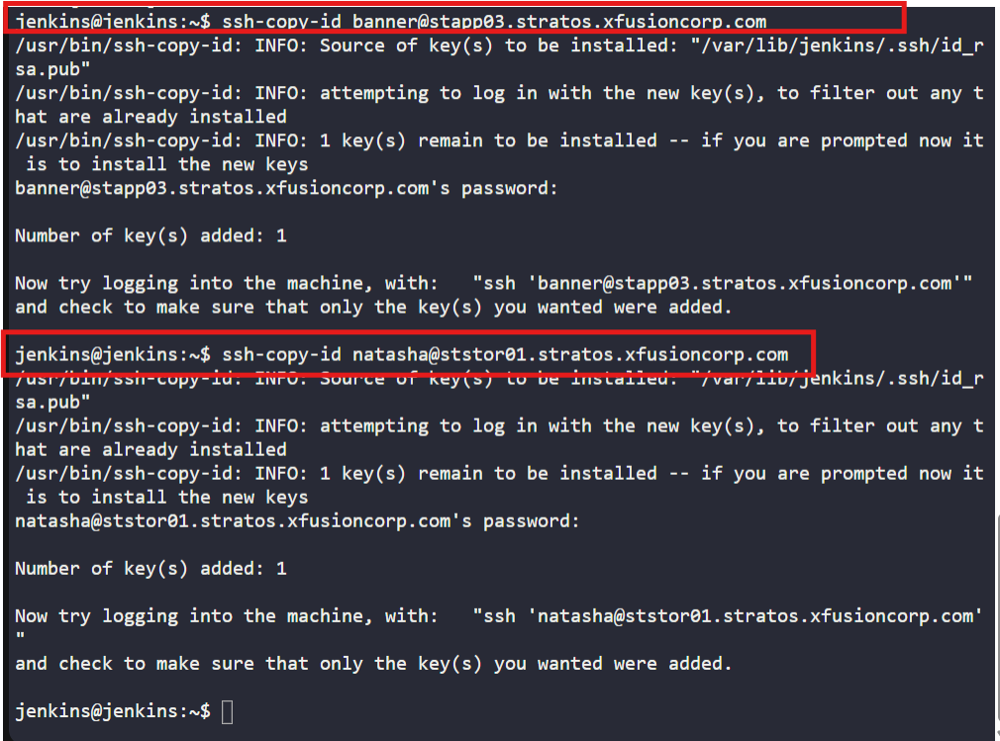
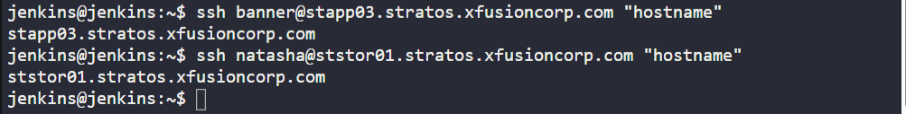
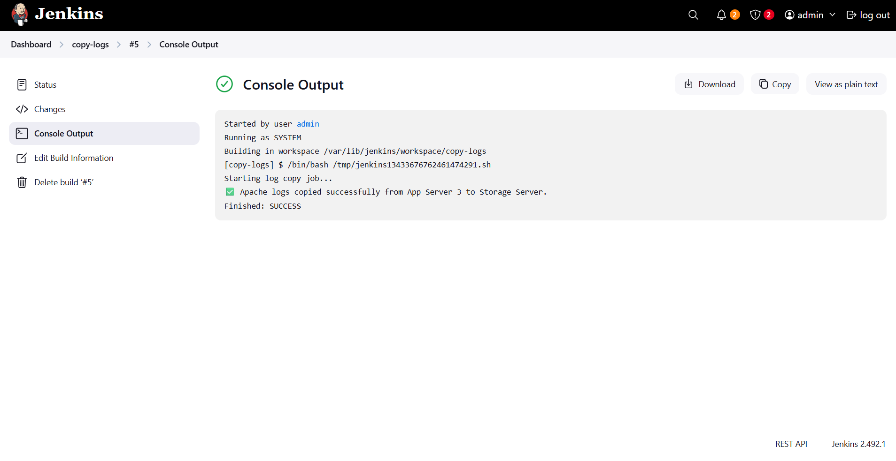
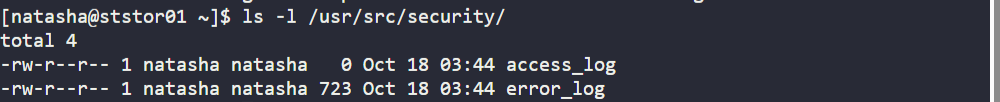

# ☸️ 100 Days of DevOps – Day 73
## ✅ Task: Jenkins Scheduled Jobs

```text
The devops team of xFusionCorp Industries is working on to setup centralised logging management system to
maintain and analyse server logs easily. Since it will take some time to implement, they wanted to gather
some server logs on a regular basis. At least one of the app servers is having issues with the Apache server.
The team needs Apache logs so that they can identify and troubleshoot the issues easily if they arise.
So they decided to create a Jenkins job to collect logs from the server. Please create/configure a Jenkins job
as per details mentioned below:

Click on the Jenkins button on the top bar to access the Jenkins UI. Login using username admin and password Adm!n321

1. Create a Jenkins jobs named copy-logs.
2. Configure it to periodically build every 12 minutes to copy the Apache logs (both access_log and error_logs)
from App Server 3 (from default logs location) to location /usr/src/security on Storage Server.

Note:
1. You might need to install some plugins and restart Jenkins service. So, we recommend clicking on Restart Jenkins
when installation is complete and no jobs are running on plugin installation/update page i.e update centre.
Also, Jenkins UI sometimes gets stuck when Jenkins service restarts in the back end. In this case please make sure to refresh the UI page.
2. Please make sure to define you cron expression like this */10 * * * * (this is just an example to run job every 10 minutes).
3. For these kind of scenarios requiring changes to be done in a web UI, please take screenshots so that you can share it with
us for review in case your task is marked incomplete. You may also consider using a screen recording software such as loom.com
to record and share your work.
```

---

📝 Task Summary

| Step | Action                                                       |
| ---- | ------------------------------------------------------------ |
| 1    | Access Jenkins using admin credentials                       |
| 2    | Create a new Jenkins job named `copy-logs`                   |
| 3    | Configure periodic build trigger every 12 minutes            |
| 4    | Configure SSH-based copy command to transfer Apache logs     |
| 5    | Verify job execution and ensure logs are copied successfully |
| 6    | (Optional) Install and restart plugins if needed             |

---

### 🔁 Step 1: Access Jenkins UI

1. Click the Jenkins button in the Stratos environment top bar.
2. Login using:
  - Username: admin
  - Password: Adm!n321



---

### 🔁 Step 2: Create a New Jenkins Job

1. From Jenkins dashboard, click “New Item.”
2. Enter job name:
   ```go
   copy-logs
   ```
3. Select Freestyle project → click OK.



---

🔁 Step 3: Configure Build Triggers
Under Build Triggers, check “Build periodically.”

Add the cron schedule to run every 12 minutes:
```text
H/12 * * * *
```
> ⏱️ Jenkins uses the Unix-style cron syntax.
Example: H/12 * * * * runs approximately every 12 minutes (using Jenkins hash for balanced load).



---

### 🔁 Step 4: Add Build Step

Scroll to the Build section → click Add build step → Execute shell
Add the following script:
```bash
#!/bin/bash
echo "Starting log copy job..."

# Source and destination details
SRC_USER="banner"
SRC_HOST="stapp03.stratos.xfusioncorp.com"
SRC_PATH="/var/log/httpd"

DEST_USER="natasha"
DEST_HOST="ststor01.stratos.xfusioncorp.com"
DEST_PATH="/usr/src/security"

# Copy Apache logs (access_log and error_log)
scp ${SRC_USER}@${SRC_HOST}:${SRC_PATH}/access_log ${DEST_USER}@${DEST_HOST}:${DEST_PATH}/
scp ${SRC_USER}@${SRC_HOST}:${SRC_PATH}/error_log ${DEST_USER}@${DEST_HOST}:${DEST_PATH}/

if [ $? -eq 0 ]; then
  echo "✅ Apache logs copied successfully from App Server 3 to Storage Server."
else
  echo "❌ Log copy failed. Please check SSH connectivity or permissions."
fi
```

Apply and save



---

### 🔁 Step 5: (Optional) Install Plugins

If you encounter SSH or credential-related issues, install:
 - SSH Agent Plugin
  - Parameterized Trigger Plugin

Go to:
Manage Jenkins → Plugins → Available Plugins → Search → Install → Restart Jenkins

When done, click:

🌀 Restart Jenkins when installation is complete and no jobs are running

Then refresh the UI.

> Note: If installation has failed, just install other plugins needed



---

### 🔁 Step 6: Verify SSH Access and Set Passwordless SSH between app server 3 and storage 1

Go to Kodekloud CLI then login to jenkins server

1️⃣ Generate SSH Key Pair
You’re already jenkins@jenkins, so just run:
```bash
ssh-keygen -t rsa -b 4096 -N "" -f ~/.ssh/id_rsa
```
> When prompted for overwrite confirmation or file path, just press Enter to accept defaults.

output:
```nginx
Generating public/private rsa key pair.
Your identification has been saved in /var/lib/jenkins/.ssh/id_rsa
Your public key has been saved in /var/lib/jenkins/.ssh/id_rsa.pub
The key fingerprint is:
SHA256:H0Iz2+xT89E5g+AjhwOcXRcvMnBjVsPpQsnNbjQjt9U jenkins@jenkins.stratos.xfusioncorp.com
```



2️⃣ Copy the Public Key to App Server 3 (Source)
```bash
ssh-copy-id banner@stapp03.stratos.xfusioncorp.com
```
When prompted for password, enter:
```bash
BigGr33n
```
✅ This allows Jenkins to fetch logs from App Server 3 without password next time.

3️⃣ Copy the Public Key to Storage Server (Destination)
```bash
ssh-copy-id natasha@ststor01.stratos.xfusioncorp.com
```
When prompted, enter:
```bash
Bl@kW
```
✅ This allows Jenkins to push logs to Storage Server without password next time.



4️⃣ Test Passwordless SSH Connectivity
Run these tests:
```bash
ssh banner@stapp03.stratos.xfusioncorp.com "hostname"
ssh natasha@ststor01.stratos.xfusioncorp.com "hostname"
```

output:
```nginx
stapp03.stratos.xfusioncorp.com
ststor01.stratos.xfusioncorp.com
```
> (no password prompts)



---

### 🔁 Step 7: Run Job Manually (First Run)

Click Build Now to trigger the job manually and verify output.

Check Console Output:
```bash
Started by user admin

Running as SYSTEM
Building in workspace /var/lib/jenkins/workspace/copy-logs
[copy-logs] $ /bin/bash /tmp/jenkins13433676762461474291.sh
Starting log copy job...
✅ Apache logs copied successfully from App Server 3 to Storage Server.
Finished: SUCCESS
```



---


🔁 Step 8: Verify Files on Storage Server

SSH into ststor01:
```bash
ssh natasha@ststor01.stratos.xfusioncorp.com
ls -l /usr/src/security/
```

output:
```nginx
total 4
-rw-r--r-- 1 natasha natasha   0 Oct 18 03:44 access_log
-rw-r--r-- 1 natasha natasha 723 Oct 18 03:44 error_log
```
> ✅ Logs are being copied successfully every 12 minutes.



---

## 🗝️ Key Commands – Log Copy Automation

| Command             | Description                                   |
| ------------------- | --------------------------------------------- |
| `scp`               | Securely copy files between remote hosts      |
| `ssh-copy-id`       | Sets up passwordless SSH for automation       |
| `H/12 * * * *`      | Jenkins cron syntax to run every 12 minutes   |
| `/var/log/httpd`    | Default Apache log directory                  |
| `/usr/src/security` | Destination for copied logs on Storage Server |

---

## 🎯 Task Completed:

- Jenkins job copy-logs created and configured ✅
- Periodic build trigger set to 12 minutes ✅
- SSH passwordless access established ✅
- Apache logs transferred from App Server 3 to Storage Server ✅
- Job validated with successful output ✅
