# ☸️ 100 Days of DevOps – Day 74
## ✅ Task: Jenkins Database Backup Job

```text
There is a requirement to create a Jenkins job to automate the database backup.
Below you can find more details to accomplish this task:

Click on the Jenkins button on the top bar to access the Jenkins UI. Login using username admin and password Adm!n321.

1. Create a Jenkins job named database-backup.
2. Configure it to take a database dump of the kodekloud_db01 database present on the Database
server in Stratos Datacenter, the database user is kodekloud_roy and password is asdfgdsd.
3. The dump should be named in db_$(date +%F).sql format, where date +%F is the current date.
4. Copy the db_$(date +%F).sql dump to the Backup Server under location /home/clint/db_backups.
5. Further, schedule this job to run periodically at */10 * * * * (please use this exact schedule format).

Note:

1. You might need to install some plugins and restart Jenkins service.
So, we recommend clicking on Restart Jenkins when installation is complete and no jobs are running on plugin
installation/update page i.e update centre. Also, Jenkins UI sometimes gets stuck when Jenkins service restarts
in the back end. In this case please make sure to refresh the UI page.
2. Please make sure to define you cron expression like this */10 * * * * (this is just an example to run job every 10 minutes).
3. For these kind of scenarios requiring changes to be done in a web UI, please take screenshots so that you can share it with
us for review in case your task is marked incomplete. You may also consider using a screen recording software such as loom.com
to record and share your work.
```

---


---

📝 **Task Summary**

| Step | Action |
| ---- | ------- |
| 1 | Access Jenkins using admin credentials |
| 2 | Create a new Jenkins job named `database-backup` |
| 3 | Configure a shell build step to take MySQL dump and copy it |
| 4 | Schedule job to run every 10 minutes |
| 5 | Set up SSH keys for passwordless connection |
| 6 | Verify successful job execution and backup file creation |

---

### 🔁 Step 1: Access Jenkins UI

1. Click the **Jenkins** button in the Stratos environment top bar.  
2. Login using:
   - Username: `admin`
   - Password: `Adm!n321`

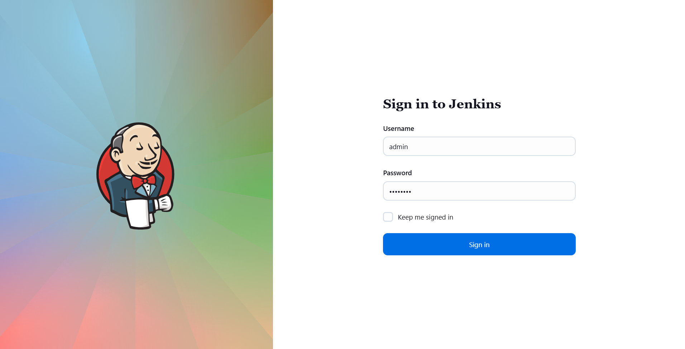

---

### 🔁 Step 2: Create the Jenkins Job

1. From Jenkins dashboard, click **New Item**.  
2. Enter job name:
   ```go
   database-backup
   ```
3. Select Freestyle Project → click OK.

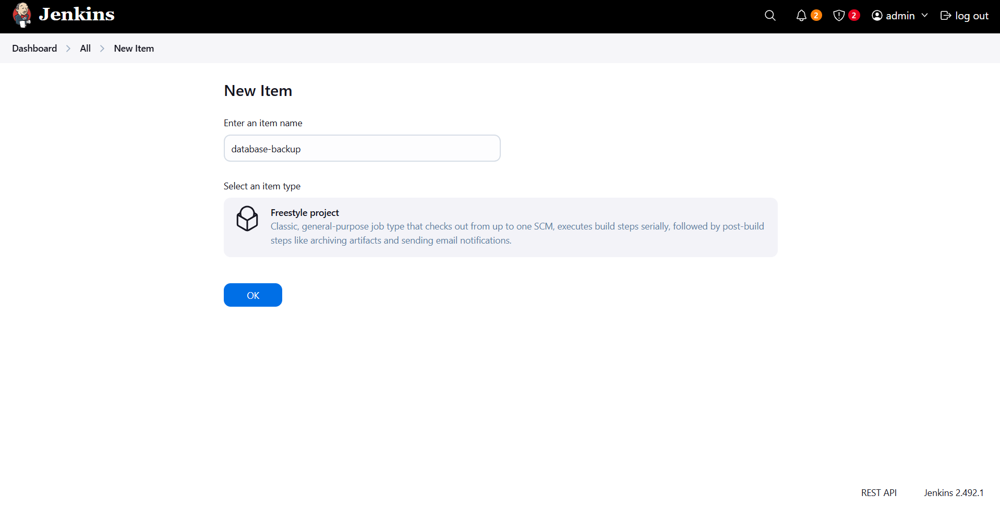

---

### 🔁 Step 3: Configure Build Triggers

Under Build Triggers, check Build periodically.

Add the schedule:
```bash
*/10 * * * *
```
> ⏱️ This runs the job every 10 minutes.

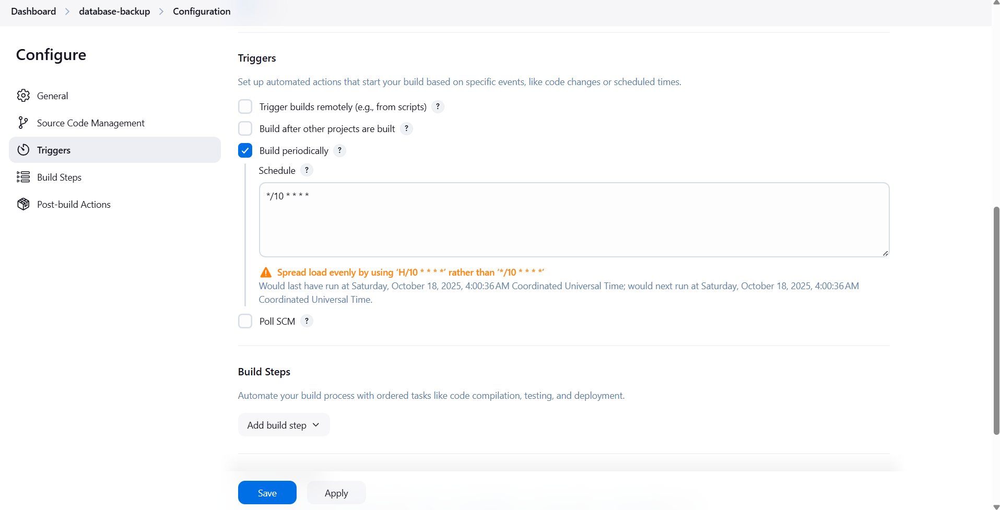

---

### 🔁 Step 4: Configure Build Step

Scroll to Build → Add build step → Execute shell
Add the following script:
```bash
#!/bin/bash
echo "Starting database backup job..."

# Database details
DB_USER="kodekloud_roy"
DB_PASS="asdfgdsd"
DB_NAME="kodekloud_db01"
DB_HOST="stdb01.stratos.xfusioncorp.com"

# Backup details
BACKUP_FILE="db_$(date +%F).sql"
DEST_USER="clint"
DEST_HOST="stbkp01.stratos.xfusioncorp.com"
DEST_PATH="/home/clint/db_backups"

# Create DB dump
ssh peter@${DB_HOST} "mysqldump -u${DB_USER} -p${DB_PASS} ${DB_NAME} > /tmp/${BACKUP_FILE}"

# Copy dump to backup server
scp peter@${DB_HOST}:/tmp/${BACKUP_FILE} ${DEST_USER}@${DEST_HOST}:${DEST_PATH}/

# Cleanup temporary dump
ssh peter@${DB_HOST} "rm -f /tmp/${BACKUP_FILE}"

if [ $? -eq 0 ]; then
  echo "✅ Database backup copied successfully to ${DEST_HOST}:${DEST_PATH}/"
else
  echo "❌ Database backup failed. Check SSH connectivity or permissions."
fi
```

Click Apply → Save.

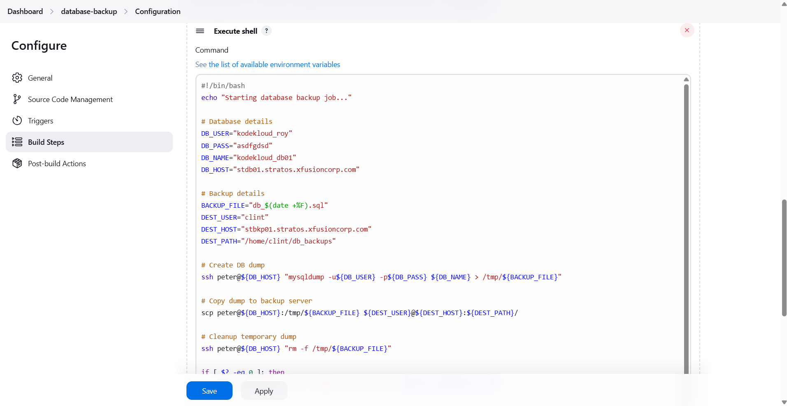

---

### 🔁 Step 5: Setup SSH Passwordless Access

Login first to Jenkins server
```bash
ssh jenkins@jenkins
```
> pw: j@rv!s

Generate SSH Key Pair on Jenkins Server
```bash
ssh-keygen -t rsa -b 4096 -N "" -f ~/.ssh/id_rsa
```

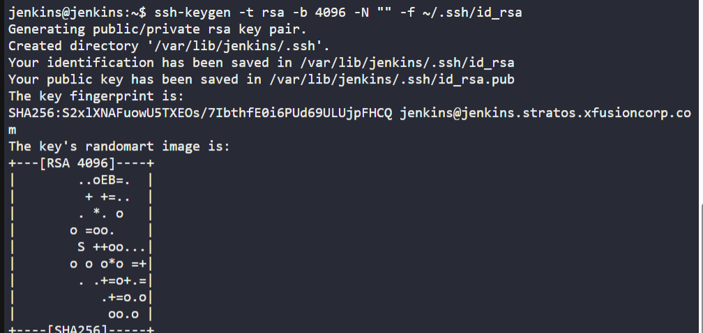

Copy Public Key to Database Server
```bash
ssh-copy-id peter@stdb01.stratos.xfusioncorp.com
```
> pw: Sp!dy

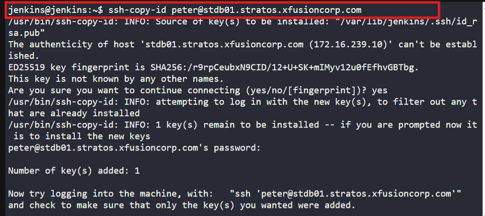

Copy Public Key to Backup Server
```bash
ssh-copy-id clint@stbkp01.stratos.xfusioncorp.com
```
> pw: H@wk3y3

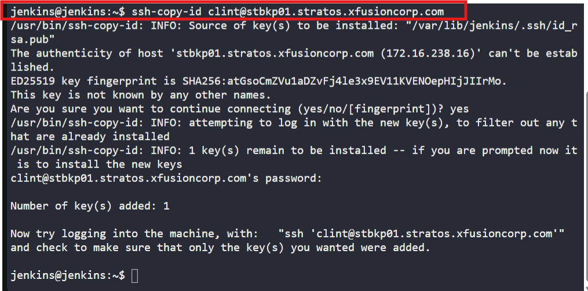

Test Connectivity
```bash
ssh peter@stdb01.stratos.xfusioncorp.com "hostname"
ssh clint@stbkp01.stratos.xfusioncorp.com "hostname"
```

> successfully connected without asking for passwords.

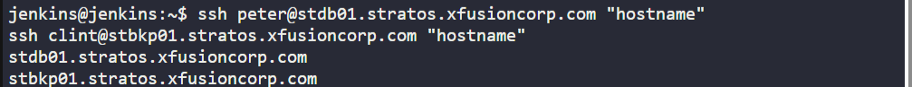

---

### 🔁 Step 6: (Optional) Install Plugins

If you encounter SSH or credential-related issues, install:
  - SSH Agent Plugin
  - Parameterized Trigger Plugin

Go to:
Manage Jenkins → Plugins → Available Plugins → Search → Install → Restart Jenkins

When done, click:

🌀 Restart Jenkins when installation is complete and no jobs are running

Then refresh the UI page.

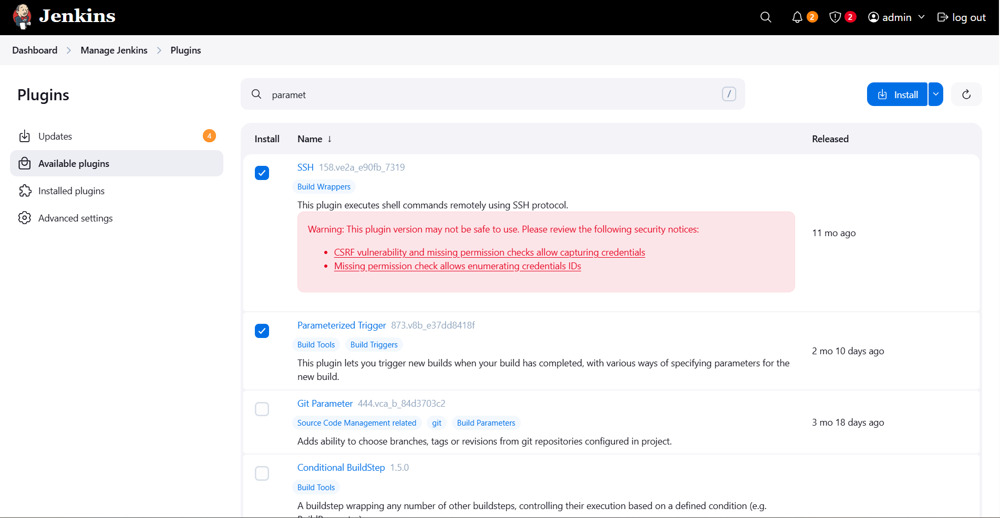

---

### 🔁 Step 6: Run and Validate Job

Click Build Now to test manually.

Console Output:
```nginx
Started by timer
Running as SYSTEM
Building in workspace /var/lib/jenkins/workspace/database-backup
[database-backup] $ /bin/bash /tmp/jenkins10072133489788311714.sh
Starting database backup job...
✅ Database backup copied successfully to stbkp01.stratos.xfusioncorp.com:/home/clint/db_backups/
Finished: SUCCESS
```

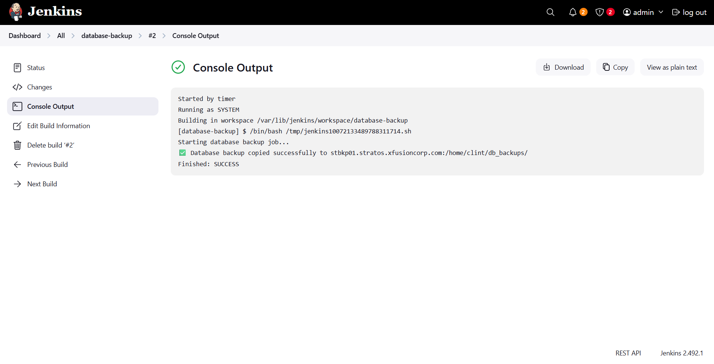

---

🔁 Step 7: Verify on Backup Server

SSH into backup server and check the backup file:
```bash
ssh clint@stbkp01.stratos.xfusioncorp.com
ls -l /home/clint/db_backups/
```
output:
```nginx
total 44
-rw-r--r-- 1 clint clint 44958 Oct 18 04:24 db_2025-10-18.sql
```

> ✅ Database backup file successfully created and transferred.

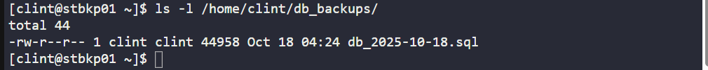

---

## 🗝️ Key Commands – Database Backup Automation

| Command                   | Description                                     |
| ------------------------- | ----------------------------------------------- |
| `mysqldump`               | Create a MySQL database dump                    |
| `scp`                     | Securely copy files between remote hosts        |
| `ssh-copy-id`             | Set up passwordless SSH for Jenkins automation  |
| `*/10 * * * *`            | Jenkins cron syntax to run every 10 minutes     |
| `/tmp/db_$(date +%F).sql` | Temporary location for generated dump           |
| `/home/clint/db_backups`  | Destination folder for backups on backup server |

---

## 🎯 Task Completed

- Jenkins job database-backup created ✅
- Configured periodic schedule (*/10 * * * *) ✅
- MySQL dump automated from Database Server ✅
- Passwordless SSH setup for Jenkins ✅
- Backups stored under /home/clint/db_backups ✅
- Job verified with successful run ✅
