# ☸️ 100 Days of DevOps – Day 75
## ✅ Task: Jenkins Slave Nodes

```text
The Nautilus DevOps team has installed and configured new Jenkins server in Stratos DC which they
will use for CI/CD and for some automation tasks. There is a requirement to add all app servers as
slave nodes in Jenkins so that they can perform tasks on these servers using Jenkins.
Find below more details and accomplish the task accordingly.

Click on the Jenkins button on the top bar to access the Jenkins UI. Login using username admin and
password Adm!n321.

1. Add all app servers as SSH build agent/slave nodes in Jenkins. Slave node name for app server 1,
app server 2 and app server 3 must be App_server_1, App_server_2, App_server_3 respectively.

2. Add labels as below:
  - App_server_1 : stapp01
  - App_server_2 : stapp02
  - App_server_3 : stapp03

3. Remote root directory for App_server_1 must be /home/tony/jenkins,
for App_server_2 must be /home/steve/jenkins and
for App_server_3 must be /home/banner/jenkins.

4. Make sure slave nodes are online and working properly.

Note:

1. You might need to install some plugins and restart Jenkins service. So, we recommend clicking on
Restart Jenkins when installation is complete and no jobs are running on plugin installation/update
page i.e update centre. Also, Jenkins UI sometimes gets stuck when Jenkins service restarts in the back end.
In this case, please make sure to refresh the UI page.

2. For these kind of scenarios requiring changes to be done in a web UI, please take screenshots so that
you can share it with us for review in case your task is marked incomplete. You may also consider using a
screen recording software such as loom.com to record and share your work.
```

---

📝 Task Summary

| Step | Action                                                 |
| ---- | ------------------------------------------------------ |
| 1    | Access Jenkins UI using admin credentials              |
| 2    | Add three SSH build agent nodes                        |
| 3    | Assign labels to each node                             |
| 4    | Set remote root directories                            |
| 5    | Verify all nodes are online                            |
| 6    | Install necessary plugins (SSH Build Agents) if needed |

---

### 🔁 Step 1: Access Jenkins UI
1. Click the Jenkins button on the Stratos portal top bar.
2. Login credentials:
  - Username: admin
  - Password: Adm!n321

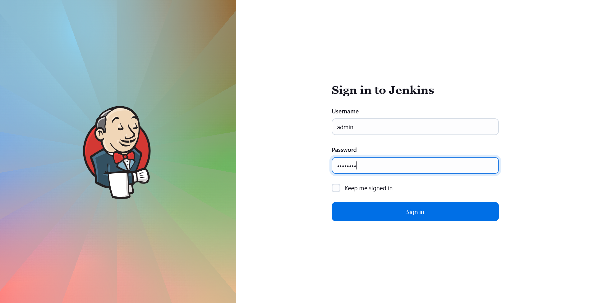

---

### 🔁 Step 2: Install SSH Build Agent Plugin (if required)

If Jenkins cannot connect via SSH, install this plugin:

1. Go to Manage Jenkins → Plugins → Available Plugins
2. Search for:
   - SSH 
   - SSH Agent
4. Install and restart Jenkins

Then reconnect the agents.

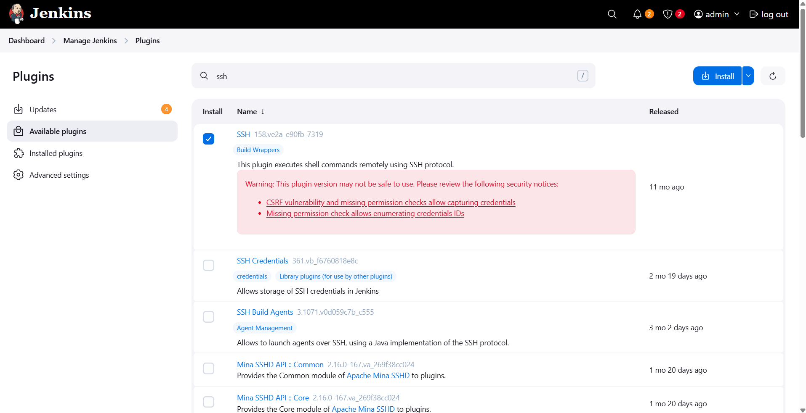

---

### 🔁 Step 3: Configure SSH Keys

Connect to jenkins server using CLI
```bash
ssh jenkins@jenkins
```
> pw: j@rv!s

then set each app server ssh keys
```bash
# Generate key on Jenkins master
ssh-keygen -t rsa -b 4096 -N "" -f ~/.ssh/id_rsa
```

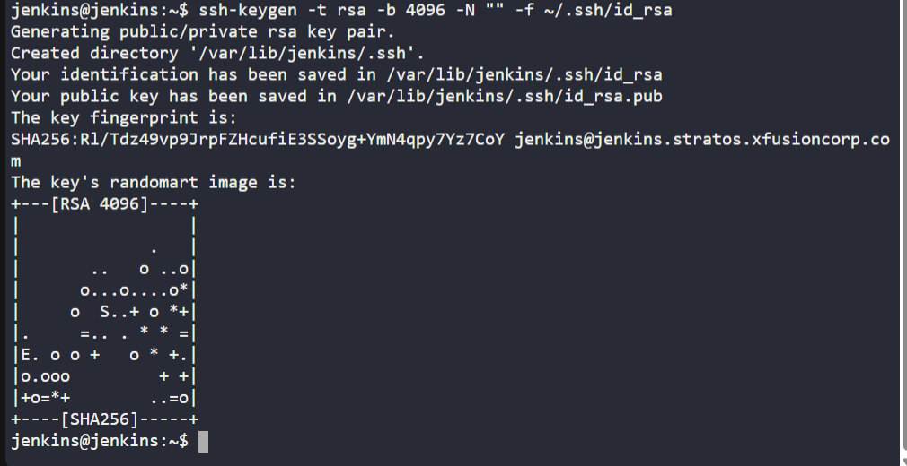

Copy Public Key to App Server 1
```bash
ssh-copy-id tony@stapp01.stratos.xfusioncorp.com
```
> pw: Ir0nM@n

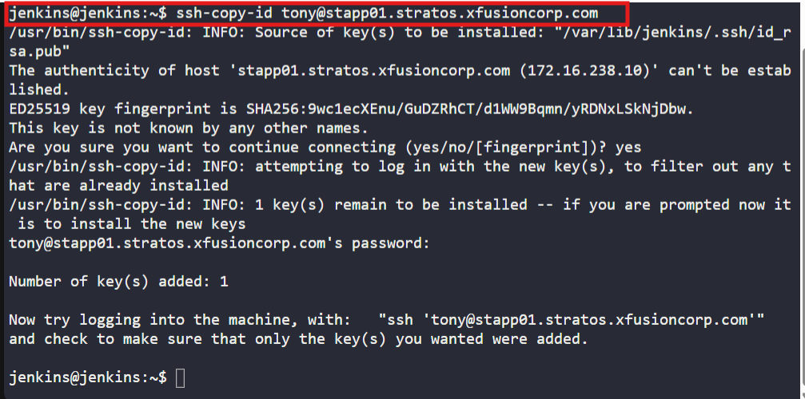

Copy Public Key to App Server 2
```bash
ssh-copy-id steve@stapp02.stratos.xfusioncorp.com
```
> pw: Am3ric@

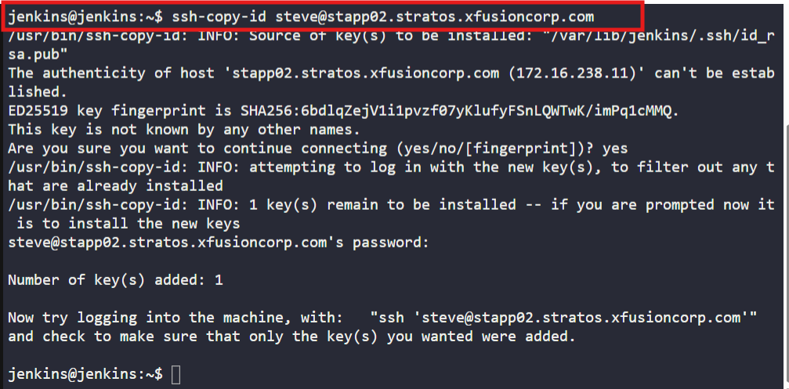

Copy Public Key to App Server 3
```bash
ssh-copy-id banner@stapp03.stratos.xfusioncorp.com
```
> pw: BigGr33n

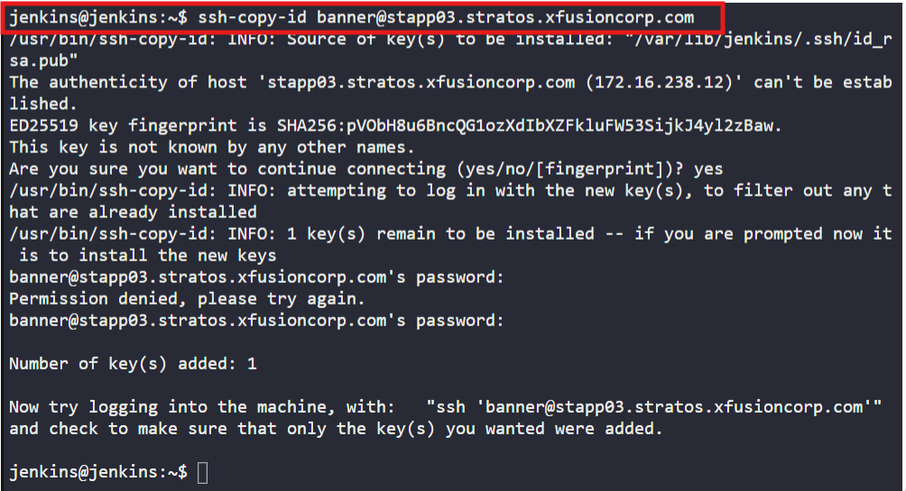

then 💡 Test each connection:
```bash
ssh tony@stapp01.stratos.xfusioncorp.com "hostname"
ssh steve@stapp02.stratos.xfusioncorp.com "hostname"
ssh banner@stapp03.stratos.xfusioncorp.com "hostname"
```
> successfully connected without asking for passwords.

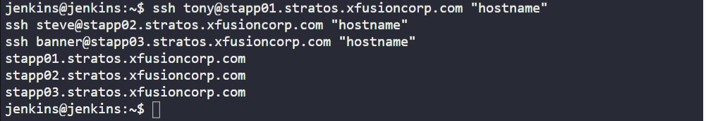

---

### 🔁 Step 4: Create SSH Credentials for each App Server

1. Go to Manage Jenkins → Credentials → System → Global credentials (unrestricted).

2. Click Add Credentials.

3. Choose SSH Username with private key.
   
5. Enter private key
To get private key, enter this in Jenkins CLI:
```bash
ssh -i ~/.ssh/id_rsa
```
> 📋 Copy this entire block, including both BEGIN and END lines.


Then fill in the following details for each App Server:
```nginx
| App Server   | Username | Example Credential ID | Notes                       |
| ------------ | -------- | --------------------- | --------------------------- |
| App Server 1 | `tony`   | `tony-ssh`            | Private key for tony user   |
| App Server 2 | `steve`  | `steve-ssh`           | Private key for steve user  |
| App Server 3 | `banner` | `banner-ssh`          | Private key for banner user |
```

Click Create after entering each credential.


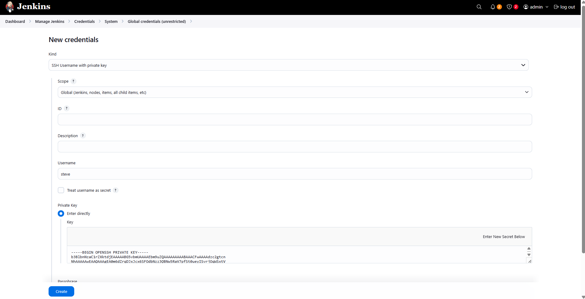
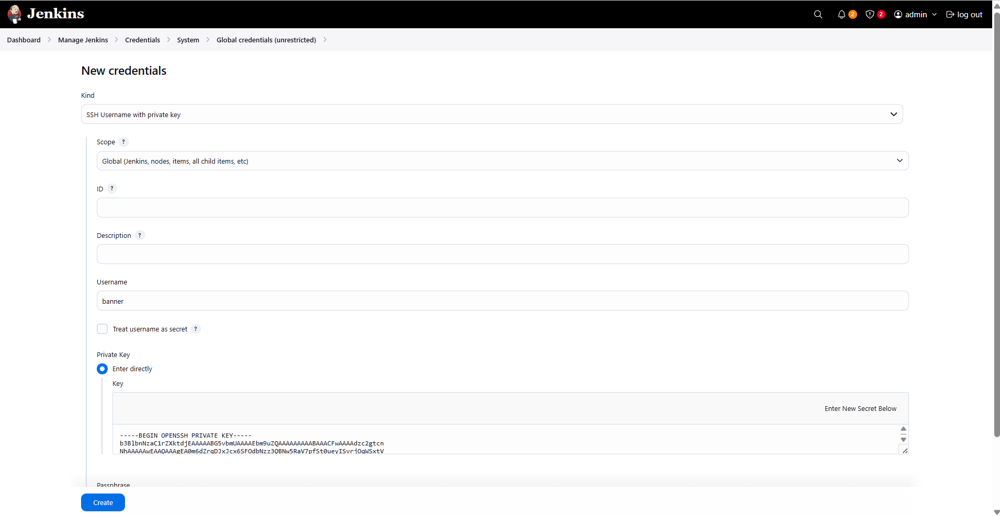
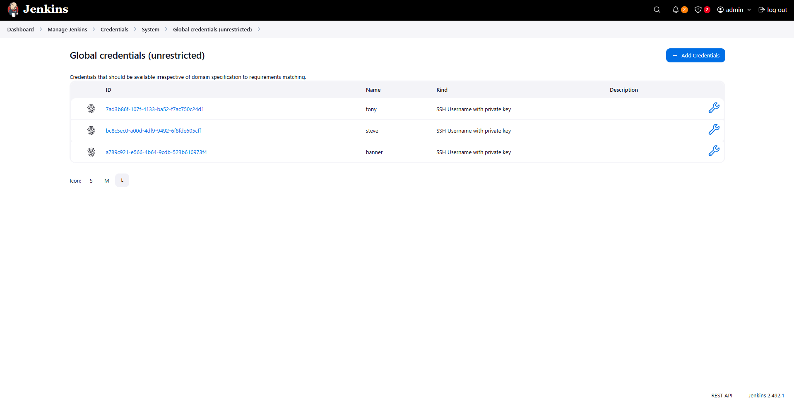

---

### 🔁 Step 3: Navigate to Manage Nodes
1. Go to:
Manage Jenkins → Nodes → New Node

2. Click New Node to create your first slave.

---

### 🔁 Step 4: Create App_server_1

1. Enter node name:
```bash
App_server_1
```

2. Select Permanent Agent → Click OK.
   
3. Fill the configuration as follows:
```nginx
| Field                 | Value                                                  |
| --------------------- | ------------------------------------------------------ |
| Description           | App Server 1                                           |
| # of executors        | 1                                                      |
| Remote root directory | `/home/tony/jenkins`                                   |
| Labels                | `stapp01`                                              |
| Launch method         | Launch agents via SSH                                  |
| Host                  | `stapp01.stratos.xfusioncorp.com`                      |
| Credentials           | Add → Jenkins → SSH Username with private key → `tony` |
```


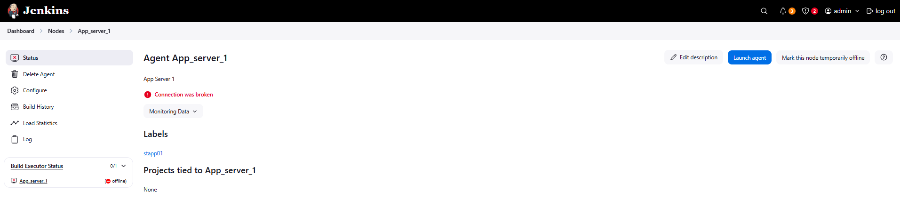


Issue Found:
The Node is offline
Based on the logs: No Java installed in the App server that cause failed connection

Fix:
- Install java in App Server 1
- Make Sure the java version to be installed in each App Server is same as the Java installed in Jenkins. In my case it is Java 17
Install:
```bash
sudo yum install java-17-openjdk -y
```
- Install Java in all App Server

---

### 🔁 Step 5: Create App_server_2

1. Enter node name:
```bash
App_server_2
```

2. Select Permanent Agent → Click OK.
   
3. Fill the configuration as follows:
```nginx
| Field                 | Value                                                  |
| --------------------- | ------------------------------------------------------ |
| Description           | App Server 2                                           |
| # of executors        | 1                                                      |
| Remote root directory | `/home/steve/jenkins`                                   |
| Labels                | `stapp02`                                              |
| Launch method         | Launch agents via SSH                                  |
| Host                  | `stapp02.stratos.xfusioncorp.com`                      |
| Credentials           | Add → Jenkins → SSH Username with private key → `steve` |
```

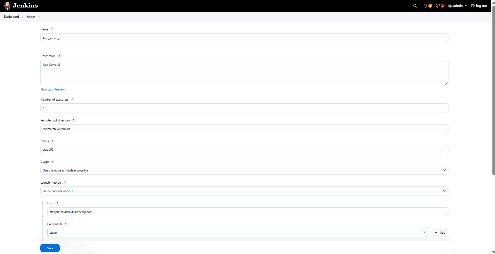

---

### 🔁 Step 6: Create App_server_3

1. Enter node name:
```bash
App_server_3
```

2. Select Permanent Agent → Click OK.
   
3. Fill the configuration as follows:
```nginx
| Field                 | Value                                                  |
| --------------------- | ------------------------------------------------------ |
| Description           | App Server 3                                           |
| # of executors        | 1                                                      |
| Remote root directory | `/home/banner/jenkins`                                   |
| Labels                | `stapp03`                                              |
| Launch method         | Launch agents via SSH                                  |
| Host                  | `stapp03.stratos.xfusioncorp.com`                      |
| Credentials           | Add → Jenkins → SSH Username with private key → `banner` |
```

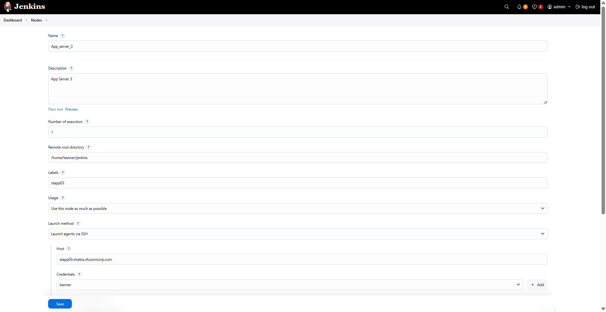

---

### 🔁 Step 7: Verify All Nodes Online

Once all nodes are configured and connected, confirm under:

Manage Jenkins → Nodes and Clouds → Nodes List

You should see all three nodes Online and ready for builds 🚀

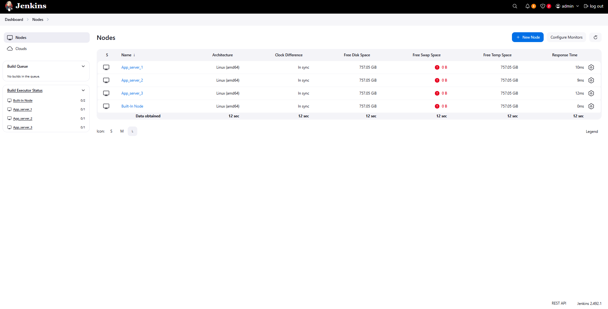

---

## 🗝️ Key Commands – Jenkins Node Setup

| Command                             | Description                    |
| ----------------------------------- | ------------------------------ |
| `ssh-keygen`                        | Generate SSH keypair           |
| `ssh-copy-id`                       | Copy public key to remote host |
| `hostname`                          | Verify remote connection       |
| `/home/<user>/jenkins`              | Remote Jenkins agent directory |
| `Manage Jenkins → Nodes and Clouds` | Node management section        |

---

🎯 Task Completed

- Jenkins slave nodes added: App_server_1, App_server_2, App_server_3 ✅
- Labels assigned: stapp01, stapp02, stapp03 ✅
- Remote root directories configured ✅
- SSH connections verified ✅
- All nodes online and ready ✅
