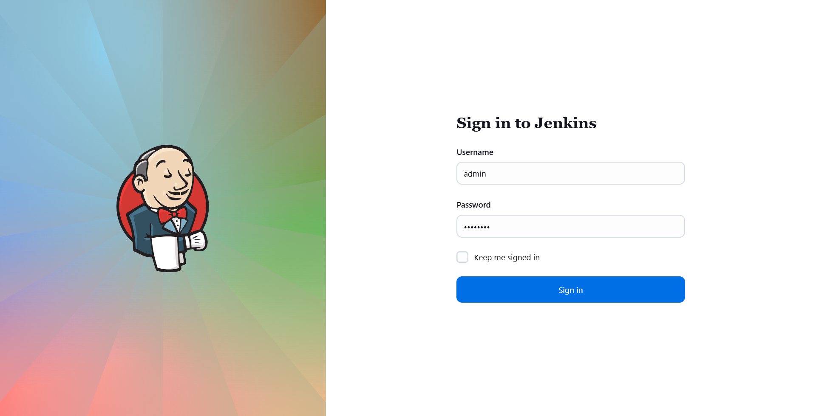
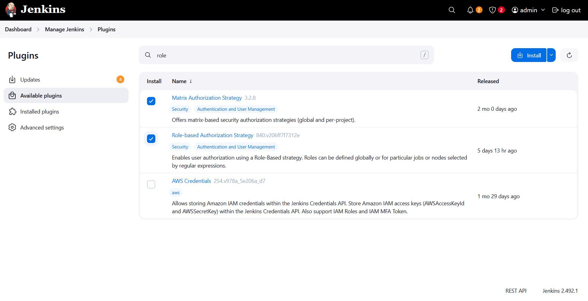
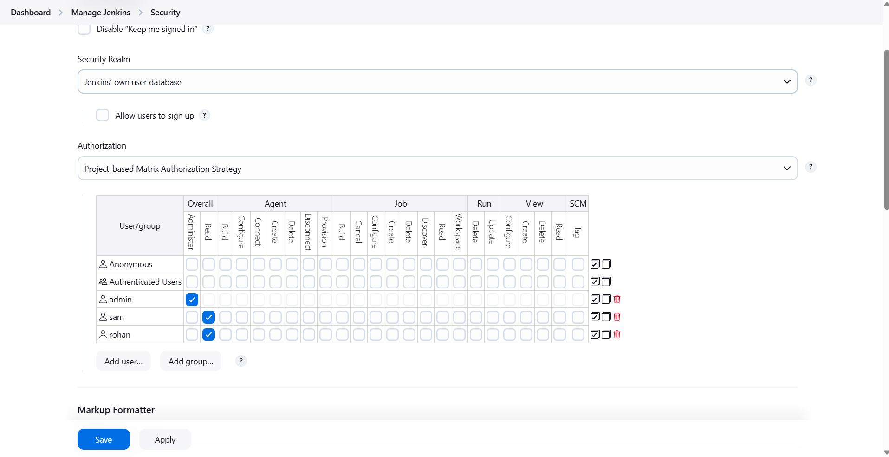
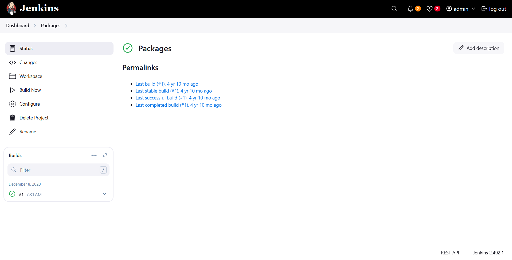
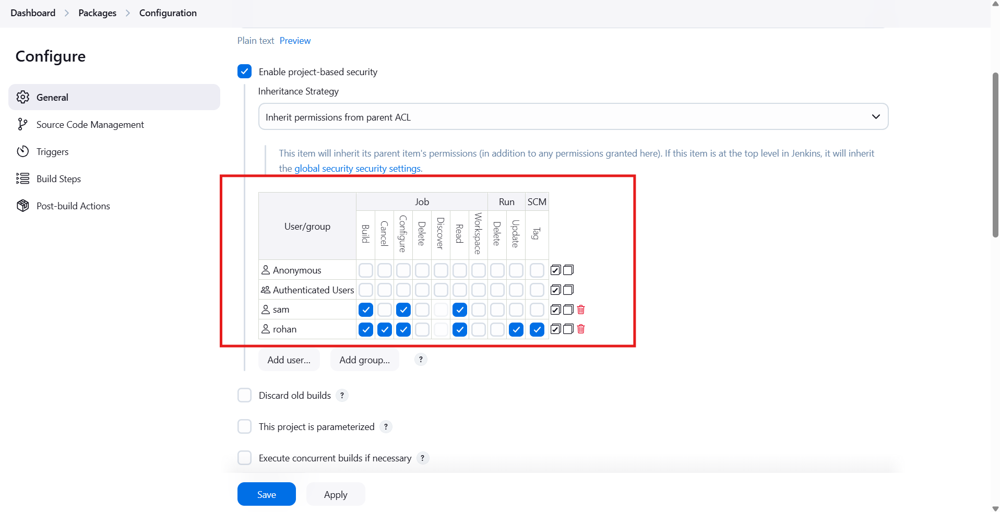
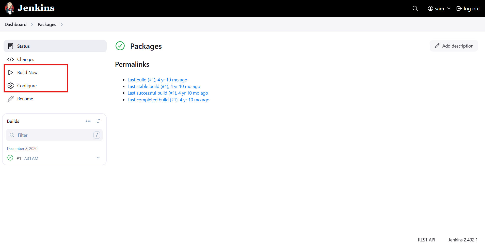
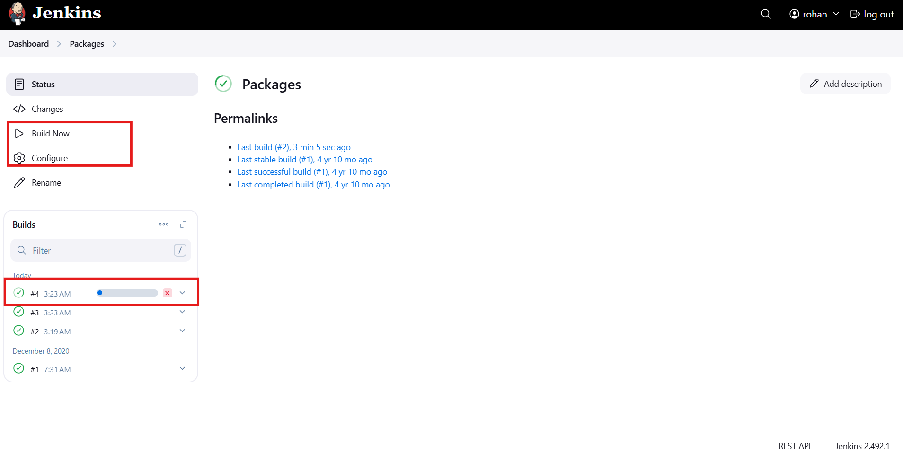

# ☸️ 100 Days of DevOps – Day 76
## ✅ Task: Jenkins Project Security

```text
The xFusionCorp Industries has recruited some new developers. There are already some existing jobs on Jenkins and
two of these new developers need permissions to access those jobs. The development team has already shared those
requirements with the DevOps team, so as per details mentioned below grant required permissions to the developers.

Click on the Jenkins button on the top bar to access the Jenkins UI. Login using username admin and password Adm!n321.

1. There is an existing Jenkins job named Packages, there are also two existing Jenkins users named sam with
password sam@pass12345 and rohan with password rohan@pass12345.


2. Grant permissions to these users to access Packages job as per details mentioned below:

    a.) Make sure to select Inherit permissions from parent ACL under inheritance strategy for granting
    permissions to these users.
    b.) Grant mentioned permissions to sam user : build, configure and read.
    c.) Grant mentioned permissions to rohan user : build, cancel, configure, read, update and tag.

Note:

1. Please do not modify/alter any other existing job configuration.
2. You might need to install some plugins and restart Jenkins service. So, we recommend clicking on
Restart Jenkins when installation is complete and no jobs are running on plugin installation/update page i.e update centre.
Also Jenkins UI sometimes gets stuck when Jenkins service restarts in the back end. In this case, please make sure to refresh the UI page.
3. For these kind of scenarios requiring changes to be done in a web UI, please take screenshots so that you can share it with us
for review in case your task is marked incomplete. You may also consider using a screen recording software such as loom.com to
record and share your work.
```

---

📝 Task Summary

| Step | Action                                                                                                  |
| ---- | ------------------------------------------------------------------------------------------------------- |
| 1    | Access Jenkins UI using admin credentials                                                               |
| 2    | Ensure Required Plugins were installed                                                                  |
| 3    | Enable Project-Based Matrix-Based Authorization                                                         |
| 4    | Locate the existing Jenkins job named `Packages`                                                        |
| 5    | Enable project-based security for that job                                                              |
| 6    | Configure inheritance strategy to “Inherit permissions from parent ACL”                                 |
| 7    | Grant user `sam` permissions: **Build**, **Configure**, and **Read**                                    |
| 8    | Grant user `rohan` permissions: **Build**, **Cancel**, **Configure**, **Read**, **Update**, and **Tag** |
| 9    | Save changes and verify access                                                                          |

---

### 🔁 Step 1: Access Jenkins Dashboard

1. Click the Jenkins button on the top bar of the Stratos environment.
2. Login credentials:
  - Username: admin
  - Password: Adm!n321



---

### 🔁 Step 2: Ensure Required Plugins were installed
1. If project-based security options are missing, Go to:
```pgsql
Manage Jenkins → Plugins
```

2. then install these:
- Matrix Authorization Strategy Plugin
- Role-based Authorization Strategy Plugin
> You may need to install other plugins



3. Restart Jenkins when installation is complete


### 🔁 Step 3: Enable Global Matrix-Based Authorization
1. From Jenkins dashboard, go to:
   ```pgsql
   Manage Jenkins → Security
   ```
2. Under Authorization, select:
   ```bash
   Project-based Matrix-based security
   ```
3. Add permissions:
    For admin: Overall = Administer
    For sam: Overall: Read
    For rohan: Overall: Read


   
3. Click Save.

---

### 🔁 Step 3: Open the Existing Job
From the Jenkins Dashboard, click the job `Packages`.



---

### 🔁 Step 4: Enable Project-Based Security for the Job
1. Click Configure on the left-hand menu.
2. Under General
3. Check ✅ Enable project-based security.

A new matrix will appear.

---

### 🔁 Step 5: Set Inheritance Strategy

Under the security matrix dropdown list, select: 
```pgsql
Inherit permissions from parent ACL
```
> This allows global permissions to be inherited while adding specific user access for this job.

---

### 🔁 Step 6: Add Permissions for Each User
Click Add User or Group… and enter each username:

For user sam
1. Type sam → press Enter.
2. Grant permissions:
   ```mathematic
   ☑ Build
   ☑ Configure
   ☑ Read
   ```

For user rohan
1. Type rohan → press Enter.
2. Grant permissions:
   ```mathematica
   ☑ Build
   ☑ Cancel
   ☑ Configure
   ☑ Read
   ☑ Update
   ☑ Tag
   ```

---

### 🔁 Step 7: Save Configuration
1. Scroll down and click Save or Apply.
2. You’ll return to the Packages job overview page.



---

### 🔁 Step 8: Verify Permissions
Option 1 – Simulate Login (UI Test)
1. Log out from the admin account.
2. Log in as sam:
   ```makefile
   Username: sam
   Password: sam@pass12345
   ```
   
   Verify
- ✅ Can view “Packages” job.
- ✅ Can configure and build.
- ✅ Cannot delete or manage other jobs.



3. Log in as rohan:
   ```makefile
   Username: rohan
   Password: rohan@pass12345
   ```
   
   Verify
- ✅ Can view “Packages” job.
- ✅ Can build, configure, cancel, read, update, and tag the "Packages" job.



---

## 🗝️ Key Concepts Recap

| Term                               | Description                                         |
| ---------------------------------- | --------------------------------------------------- |
| Project-based Matrix Authorization | Enables per-job permission control                  |
| Inherit from Parent ACL            | Inherit global permissions defined at Jenkins level |
| Build Permission                   | Allows user to start builds                         |
| Configure Permission               | Allows user to edit job configuration               |
| Tag Permission                     | Allows tagging builds (used in version control)     |

---

## 🎯 Task Completed

- Project-based security enabled ✅
- Permissions granted to users sam and rohan ✅
