# ☸️ 100 Days of DevOps – Day 77
## ✅ Task: Jenkins Deploy Pipeline

```text
The development team of xFusionCorp Industries is working on to develop a new static website and they are planning 
to deploy the same on Nautilus App Servers using Jenkins pipeline. They have shared their requirements with the DevOps
team and accordingly we need to create a Jenkins pipeline job. Please find below more details about the task:

Click on the Jenkins button on the top bar to access the Jenkins UI. Login using username admin and password Adm!n321.

Similarly, click on the Gitea button on the top bar to access the Gitea UI. Login using username sarah and password Sarah_pass123.
There under user sarah you will find a repository named web_app that is already cloned on Storage server under /var/www/html. 
sarah is a developer who is working on this repository.

  1. Add a slave node named Storage Server. It should be labeled as ststor01 and its remote root directory should be /var/www/html.
  2. We have already cloned repository on Storage Server under /var/www/html.
  3. Apache is already installed on all app Servers its running on port 8080.
  4. Create a Jenkins pipeline job named datacenter-webapp-job (it must not be a Multibranch pipeline) and configure it to:
    - Deploy the code from web_app repository under /var/www/html on Storage Server, as this location is already mounted to 
    the document root /var/www/html of app servers. The pipeline should have a single stage named Deploy ( which is case sensitive )
    to accomplish the deployment.

LB server is already configured. You should be able to see the latest changes you made by clicking on the App button. 
Please make sure the required content is loading on the main URL https://<LBR-URL> i.e there should not be a sub-directory 
like https://<LBR-URL>/web_app etc.


Note:
1. You might need to install some plugins and restart Jenkins service. So, we recommend clicking on Restart Jenkins when installation
is complete and no jobs are running on plugin installation/update page i.e update centre. Also, Jenkins UI sometimes gets stuck when 
Jenkins service restarts in the back end. In this case, please make sure to refresh the UI page.

2. For these kind of scenarios requiring changes to be done in a web UI, please take screenshots so that you can share it with us for
review in case your task is marked incomplete. You may also consider using a screen recording software such as loom.com to record and
share your work.
```

---

📝 Task Summary

- Login to Jenkins and Gitea
- Install Necessary Plugins
- Add SSH credentials for natasha (Storage Server)
- Add Jenkins slave node labeled ststor01
- Create pipeline job datacenter-webapp-job
- Deploy code from sarah’s web_app repository
- Verify deployment on Load Balancer URL
  
---

### 🔁 Step 1: Access Jenkins & Gitea

Jenkins
- URL: Click the Jenkins button on top bar
- Login:
  ```makefile
  Username: admin
  Password: Adm!n321
  ```

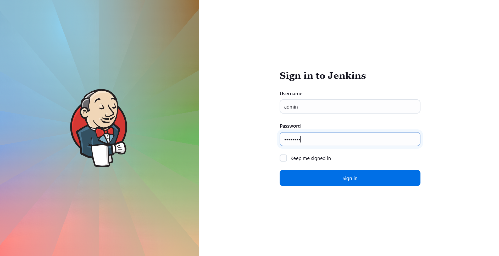

Gitea
- URL: Click the Gitea button on top bar
- Login:
  ```makefile
  Username: sarah
  Password: Sarah_pass123
  ```
  
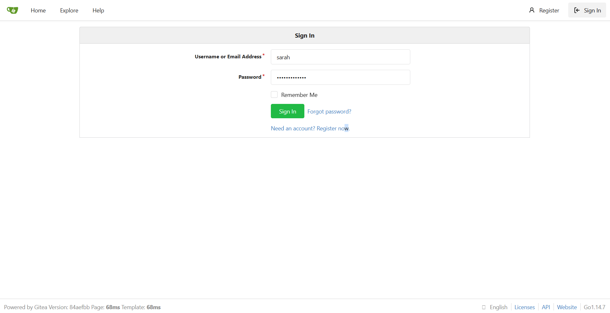

- Verify repository exists:
  `web_app` (this repo contains the static website code)

---

### 🔁 Step 2: Install Necessary Plugins

1. In Jenkins, go to:
```go
Manage Jenkins → Plug-ins
```

2. Install the following:
- SSH
- SSH Credentials
- SSH Build Agents
- Pipeline
- Git
- Credentials
- Java Framework, update the java as well

3. Restart Jenkins after installation

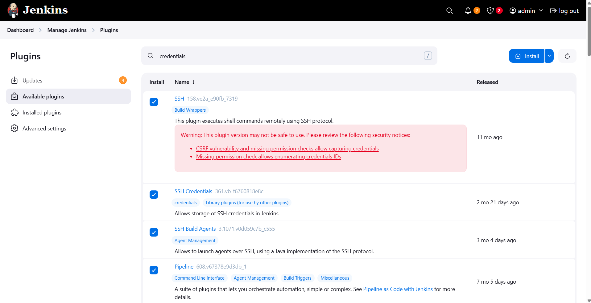

---

### 🔁 Step 3: Update java version in Storage Server

1. login to natasha using CLI
```bash
ssh natasha@ststor01
```
> pw: Bl@kW

2. Login as super user
```bash
sudo su
```

3. then install java:
```bash
yum install java-17-openjdk -y
```

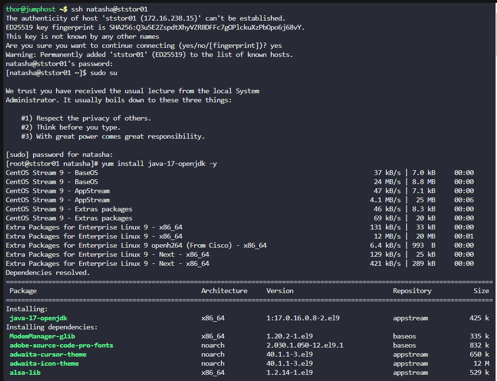

---

### 🔁 Step 3: Create SSH Credentials for Storage Server

1. In Jenkins, go to:
```go
Manage Jenkins → Credentials → System → Global credentials (unrestricted)
```

2. Click Add Credentials and enter:
```nginx
Kind: Username with password
Scope: Global
Username: natasha
Password: Bl@kW
ID: ststor01-ssh
Description: SSH credentials for Storage Server (ststor01)
```

3. Click Create ✅

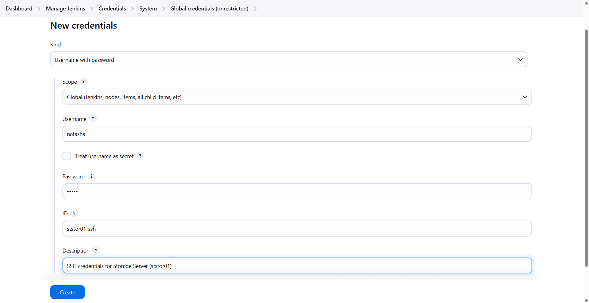

---

### 🔁 Step 4: Configure Jenkins Slave (Storage Server)

1. On Jenkins dashboard → Click Manage Jenkins → Nodes → New Node
2. Name:
   ```pgsql
   Storage Server
   ```
3. Select: Permanent Agent → Click OK

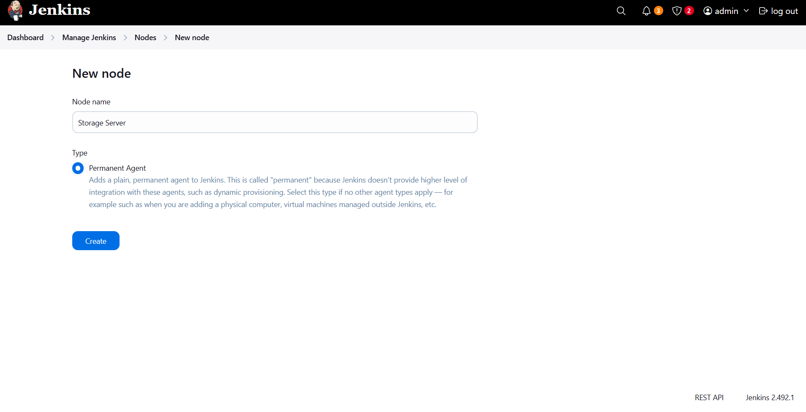
   
5. Configure the following:
   - Remote root directory: /var/www/html
   - Labels: ststor01
   - Launch method: “Launch agent via SSH”
   - Host: ststor01.stratos.xfusioncorp.com
   - Credentials: Natasha
   - Host Key Verification Strategy: Manually trusted key Verification Strategy
    
6. Click Save and Launch agent.

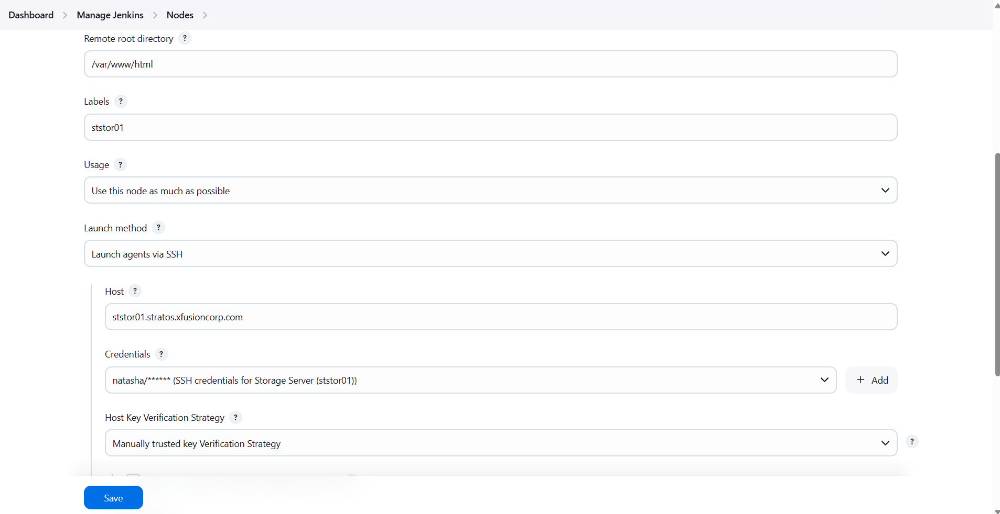

> Issue found: Give Jenkins User Permission to /var/www/html

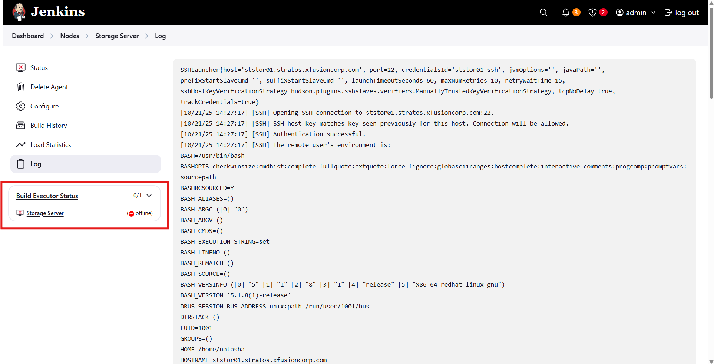

   Steps to Fix:
   1. On Storage Server:
   ```bash
   chown -R natasha:natasha /var/www/html
   ```


   2. Relaunch the Node
   > Now, the node is online ✅

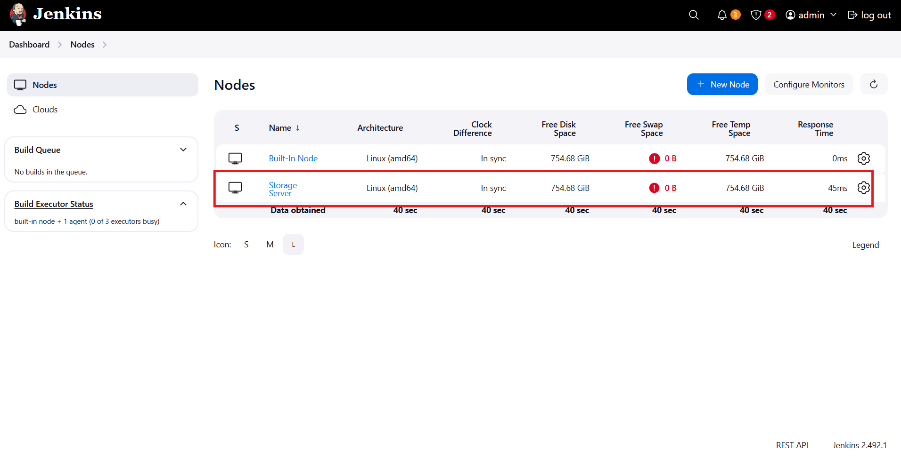

---

### 🔁 Step 5: Create Jenkins Pipeline Job
1. From Jenkins Dashboard → Click New Item
2. Enter name:
```bash
xfusion-webapp-job
```
3. Select Pipeline (❌ Not Multibranch)
4. Click OK

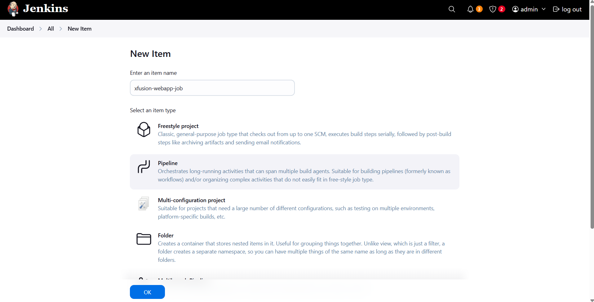

---

### 🔁 Step 6: Configure Pipeline Script

Under Pipeline → Definition → Pipeline script, paste the following:
```groovy
pipeline {
    agent { label 'ststor01' }

    stages {
        stage('Deploy') {
            steps {
                echo 'Updating existing website in /var/www/html...'
                dir('/var/www/html') {
                    sh '''
                        if [ -d .git ]; then
                            git reset --hard
                            git pull origin main || git pull origin master
                        else
                            rm -rf ./*
                            git clone http://git.stratos.xfusioncorp.com/sarah/web_app.git .
                        fi
                    '''
                }
                echo 'Deployment successful.'
            }
        }
    }
}
```

✅ Notes:
- The stage name must be Deploy (case-sensitive).
- Replace the Gitea URL if it differs in your environment.

Click Save.

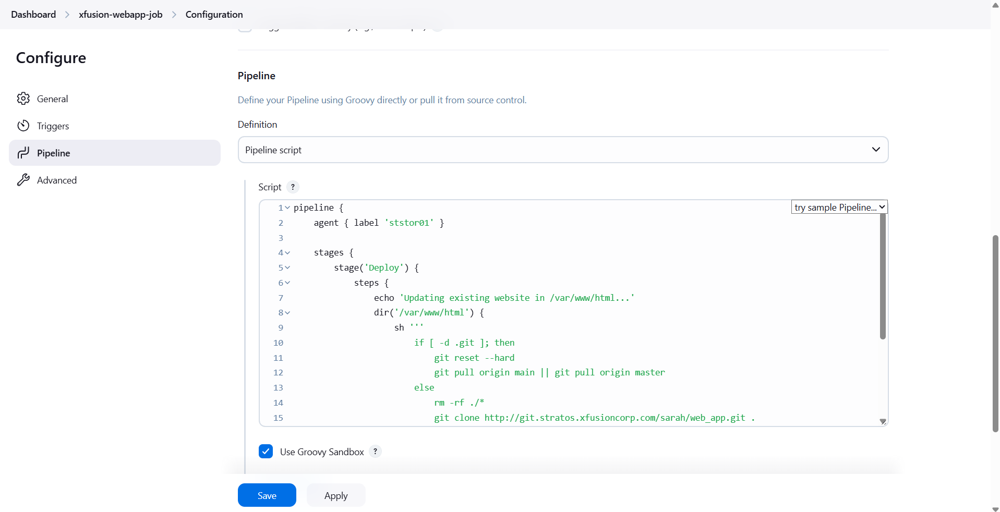

---

### 🔁 Step 7: Run and Verify
1. Click Build Now

issue found: Can't create a temporary directory under the workspace path for internal use (like /var/www/html@tmp).

fix: 
```bash
sudo chown -R natasha:natasha /var/www
sudo chmod -R 755 /var/www
```

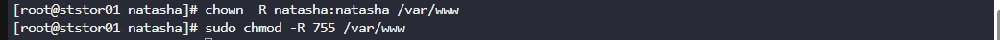

then re-run. 

3. Open Console Output
> The deployment is successful. ✅

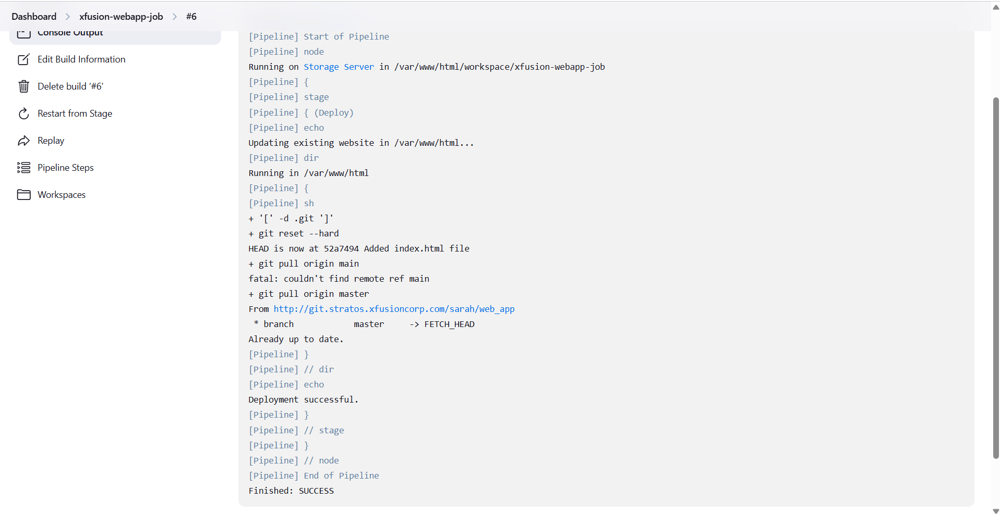

4. Click the App button on the top bar.
> Web-App can now be accessed. ✅

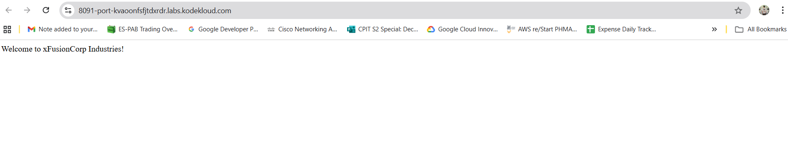

---

## 🗝️ Key Commands and Configs

| Command                          | Description                     |
| -------------------------------- | ------------------------------- |
| `yum install java-17-openjdk -y` | Install Java on agent node      |
| `git clone <repo>`               | Clone the static web repo       |
| `/var/www/html`                  | Document root of App Servers    |
| `agent { label 'ststor01' }`     | Runs pipeline on Storage Server |
| `stage('Deploy')`                | Defines deployment stage        |

---

## 🎯 Task Completed

- ✅ Jenkins slave node Storage Server added and labeled ststor01
- ✅ Pipeline job xfusion-webapp-job created
- ✅ Single stage Deploy configured
- ✅ Static website deployed to /var/www/html
- ✅ Verified site loads correctly on Load Balancer URL
