# ☸️ 100 Days of DevOps – Day 78
## ✅ Task: Jenkins Conditional Deploy Pipeline

```text
The development team of xFusionCorp Industries is working on to develop a new static website and they are planning to deploy the same on
Nautilus App Servers using Jenkins pipeline. They have shared their requirements with the DevOps team and accordingly we need to create
a Jenkins pipeline job. Please find below more details about the task:

Click on the Jenkins button on the top bar to access the Jenkins UI. Login using username admin and password Adm!n321.

Similarly, click on the Gitea button on the top bar to access the Gitea UI. Login using username sarah and password Sarah_pass123.
There under user sarah you will find a repository named web_app that is already cloned on Storage server under /var/www/html.
sarah is a developer who is working on this repository.

  1. Add a slave node named Storage Server. It should be labeled as ststor01 and its remote root directory should be /var/www/html.
  2. We have already cloned repository on Storage Server under /var/www/html.
  3. Apache is already installed on all app Servers its running on port 8080.
  4. Create a Jenkins pipeline job named datacenter-webapp-job (it must not be a Multibranch pipeline) and configure it to:
    - Add a string parameter named BRANCH.
    - It should conditionally deploy the code from web_app repository under /var/www/html on Storage Server, as this location
    is already mounted to the document root /var/www/html of app servers. The pipeline should have a single stage named Deploy
    ( which is case sensitive ) to accomplish the deployment.
    - The pipeline should be conditional, if the value master is passed to the BRANCH parameter then it must deploy the master branch,
    on the other hand if the value feature is passed to the BRANCH parameter then it must deploy the feature branch.

LB server is already configured. You should be able to see the latest changes you made by clicking on the App button.
Please make sure the required content is loading on the main URL https://<LBR-URL> i.e there should not be a sub-directory
like https://<LBR-URL>/web_app etc.


Note:

1. You might need to install some plugins and restart Jenkins service. So, we recommend clicking on Restart Jenkins when installation
is complete and no jobs are running on plugin installation/update page i.e update centre. Also, Jenkins UI sometimes gets stuck when
Jenkins service restarts in the back end. In this case, please make sure to refresh the UI page.

2. For these kind of scenarios requiring changes to be done in a web UI, please take screenshots so that you can share it with us for
review in case your task is marked incomplete. You may also consider using a screen recording software such as loom.com to record and
share your work.
```

---

📝 Task Summary

- Login to Jenkins and Gitea
- Install required Jenkins plugins
- Create SSH credentials for the Storage Server
- Add Jenkins slave node (Storage Server) labeled ststor01
- Create pipeline job datacenter-webapp-job (non-multibranch)
- Add parameter BRANCH (master or feature)
- Deploy code from the corresponding branch conditionally
- Verify deployment on the Load Balancer URL

---

### 🔁 Step 1: Access Jenkins & Gitea

Jenkins
- URL: Click the Jenkins button on top bar
- Login:
  ```makefile
  Username: admin
  Password: Adm!n321
  ```

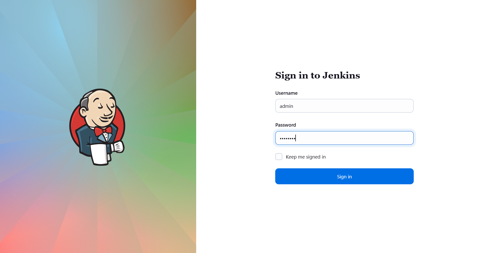

Gitea
- URL: Click the Gitea button on top bar
- Login:
  ```makefile
  Username: sarah
  Password: Sarah_pass123
  ```

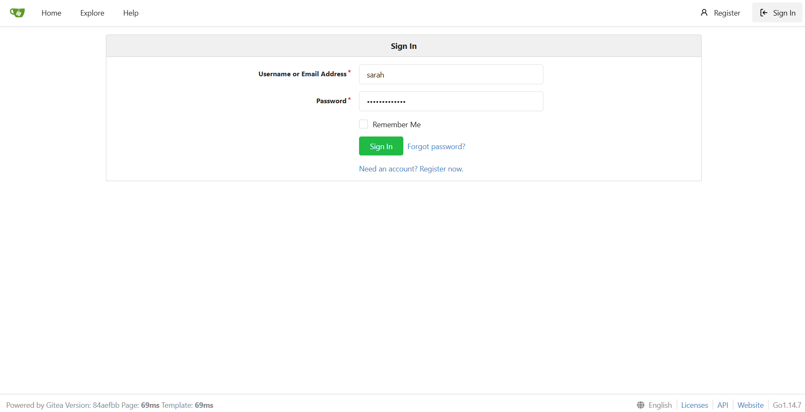

- Verify repository exists:
> web_app → contains the static website code

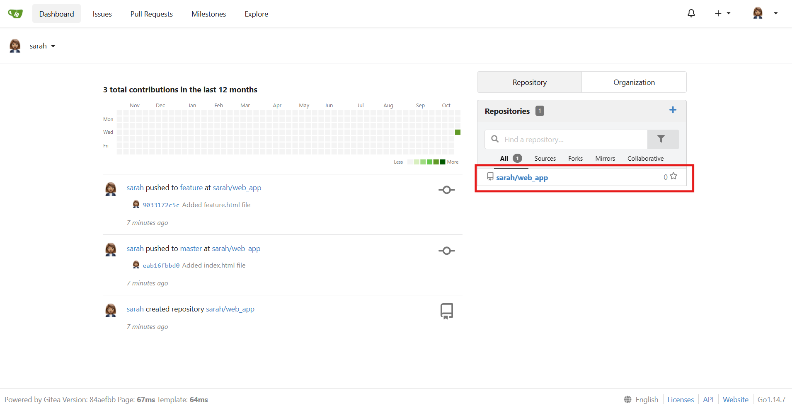

---

### 🔁 Step 2: Install Necessary Plugins

1. In Jenkins, go to:
```go
Manage Jenkins → Plug-ins
```

2. Install the following:
- SSH
- SSH Credentials
- SSH Build Agents
- Pipeline
- Git
- Credentials
- Java Framework, update the java as well

3. Restart Jenkins after installation

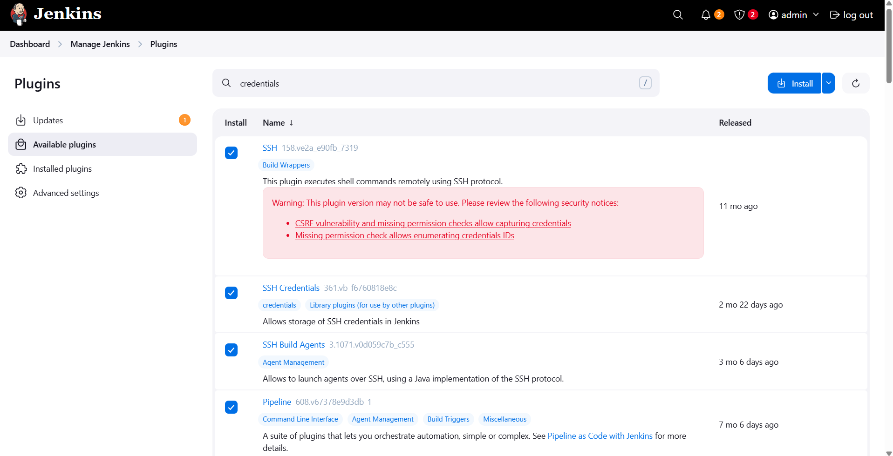

---

### 🔁 Step 3: Update java version in Storage Server

1. login to natasha using CLI
```bash
ssh natasha@ststor01
```
> pw: Bl@kW

2. Login as super user
```bash
sudo su
```

3. then install java:
```bash
yum install java-17-openjdk -y
```

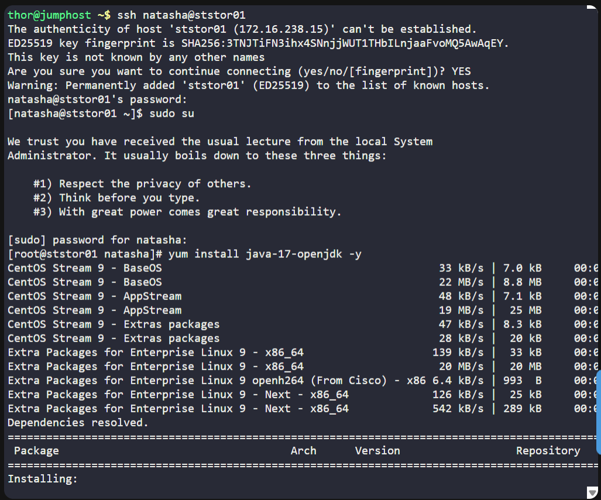

---

### 🔁 Step 4: Create SSH Credentials for Storage Server

1. In Jenkins, go to:
```go
Manage Jenkins → Credentials → System → Global credentials (unrestricted)
```

2. Click Add Credentials and enter:
```nginx
Kind: Username with password
Scope: Global
Username: natasha
Password: Bl@kW
ID: ststor01-ssh
Description: SSH credentials for Storage Server (ststor01)
```

3. Click Create ✅

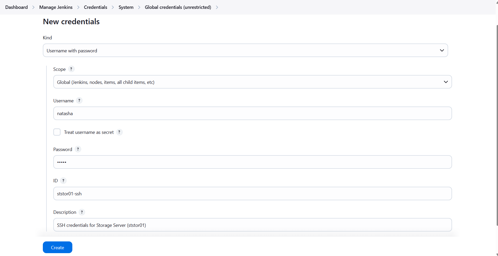

---

### 🔁 Step 5: Configure Jenkins Slave (Storage Server)

- Node name: Storage Server
- Label: ststor01
- Remote root directory: /var/www/html

If not created, follow these:

1. On Jenkins dashboard → Click Manage Jenkins → Nodes → New Node
2. Name:
   ```pgsql
   Storage Server
   ```
3. Select: Permanent Agent → Click OK

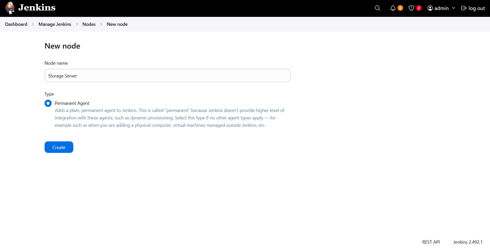

4. Configure the following:
   - Remote root directory: /var/www/html
   - Labels: ststor01
   - Launch method: “Launch agent via SSH”
   - Host: ststor01.stratos.xfusioncorp.com
   - Credentials: Natasha
   - Host Key Verification Strategy: Manually trusted key Verification Strategy

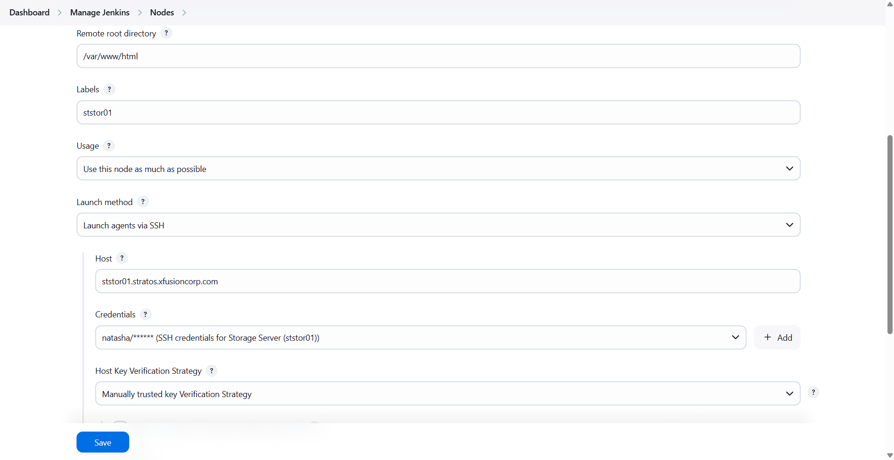

5. Click Save and Launch agent.

> Issue found: Give Jenkins User Permission to /var/www/html

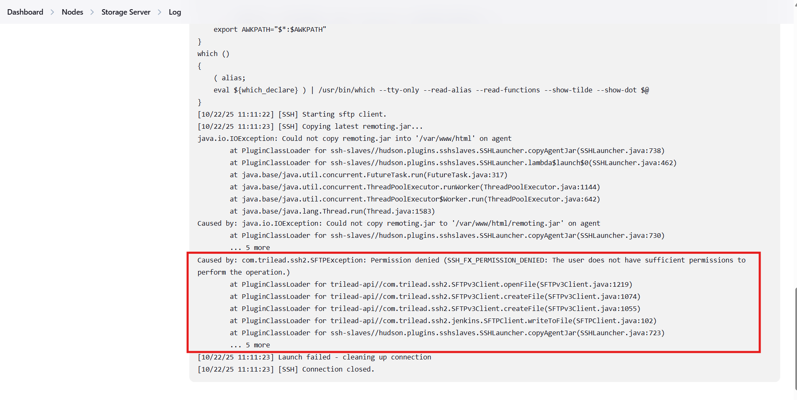

   Steps to Fix:
   1. On Storage Server:
   navigate to:
   ```bash
   cd /var/www
   ```
   verify content:
   ```bash
   ls
   ```
   > html

   check current permission
   ```bash
   ls -l
   ```
   > total of 4

  edit permission:
  ```bash
  sudo chown -R natasha html/
  ```

   
   ```bash
   sudo chown -R natasha html/
   sudo chown -R natasha:natasha /var/www
   sudo chmod -R 755 /var/www
   ```

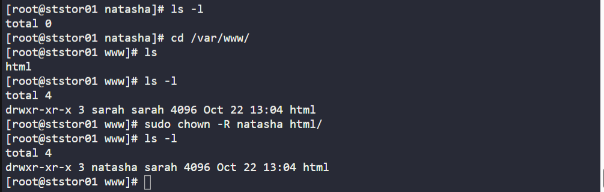

   2. Relaunch the Node
   > Now, the node is online ✅

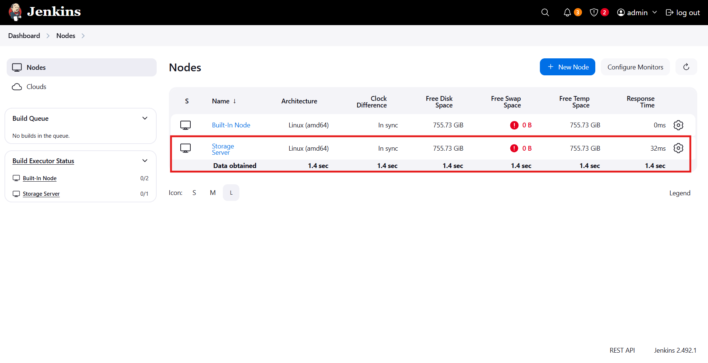


---

### 🔁 Step 6: Create Jenkins Pipeline Job

1. From Jenkins Dashboard → Click New Item
2. Enter name:
   ```bash
   datacenter-webapp-job
   ```
3. Select Pipeline (❌ Not Multibranch)

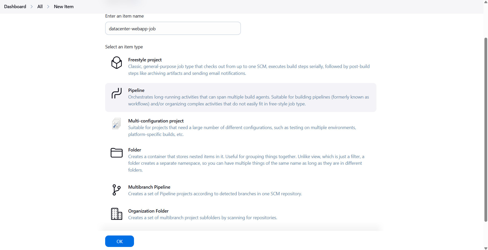

4. Under General, check:
   ```csharp
   This project is parameterized
   ```
5. Add:
   ```bash
   Type: String Parameter
   Name: BRANCH
   Default Value: master
   Description: Specify the branch to deploy (master or feature)
   ```

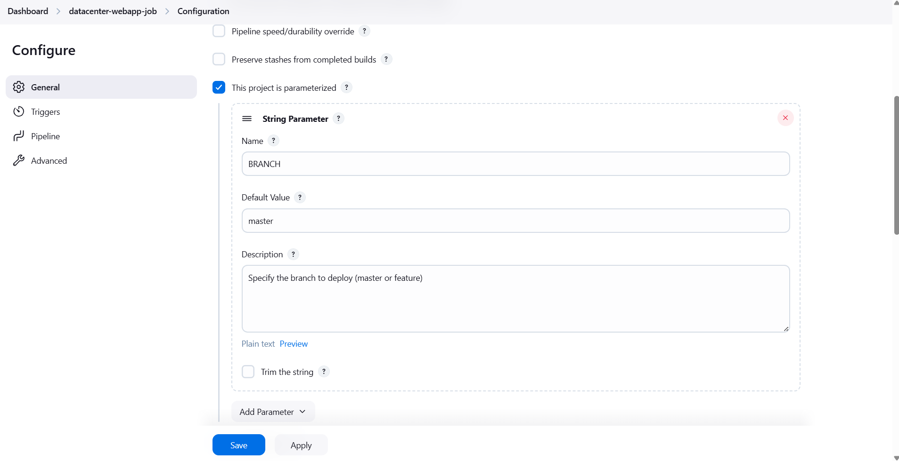

---

### 🔁 Step 7: Configure Pipeline Script

Under Pipeline → Definition → Pipeline script, paste the following:
```groovy
pipeline {
    agent {
        label 'ststor01'
    }
    
    parameters {
        string(name: 'BRANCH', defaultValue: 'master', description: 'Branch to deploy (master or feature)')
    }
    
    stages {
        stage('Deploy') {
            when {
                expression {
                    params.BRANCH == 'master' || params.BRANCH == 'feature'
                }
            }
            steps {
                script {
                    def repositoryPath = '/var/www/html/'

                    if (params.BRANCH == 'master') {
                        git branch: 'master',
                            url: 'http://git.stratos.xfusioncorp.com/sarah/web_app.git'
                    } else if (params.BRANCH == 'feature') {
                        git branch: 'feature',
                            url: 'http://git.stratos.xfusioncorp.com/sarah/web_app.git'
                    }
                    
                    sh "cp -r /var/www/html/workspace/datacenter-webapp-job/* /var/www/html/"
            }
                }
            }
        }
    }

```

✅ Notes:
- Stage name must be Deploy (case-sensitive).
- This job runs on the Storage Server (ststor01).
- The BRANCH parameter controls which branch is deployed.

Click Save.

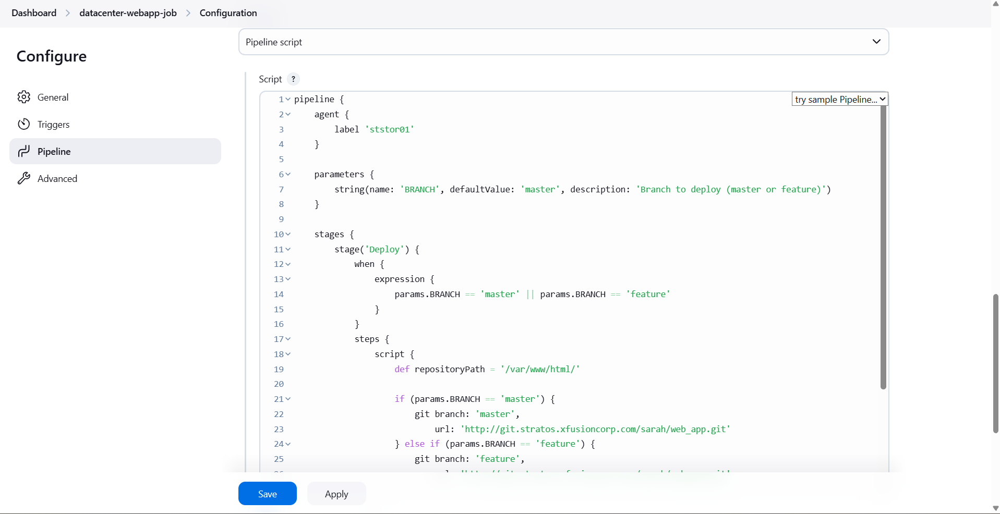

---

### 🔁 Step 8: Run and Verify

Click Build with Parameters

Enter:
```bash
BRANCH = master
```

Open Console Output
> The deployment is successful. ✅

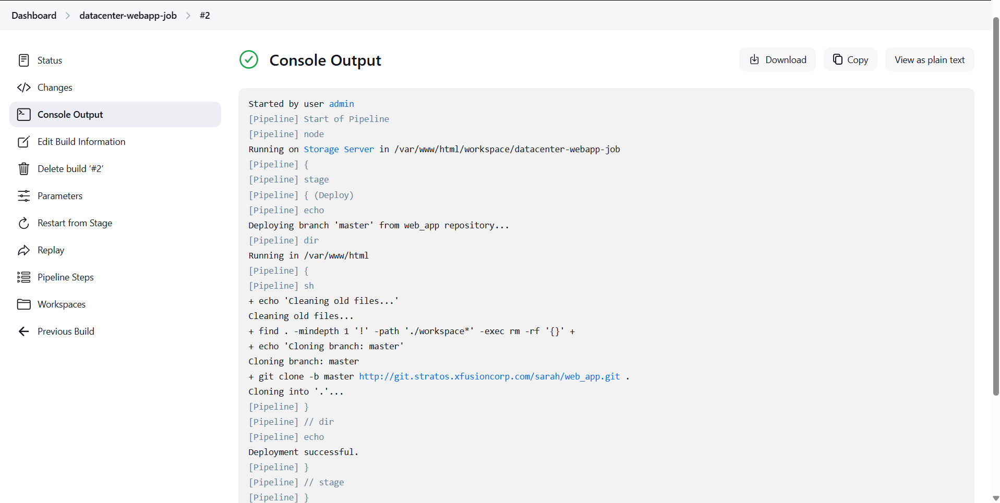

Click the App button on the top bar.
> Web-App can now be accessed with updated content. ✅

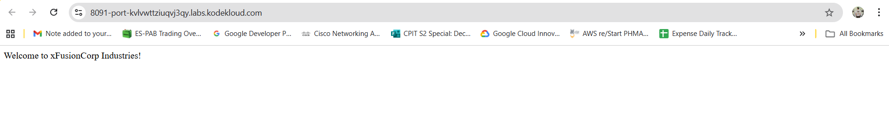

or 

Enter:
```bash
BRANCH = feature
```

Open Console Output
> The deployment is successful. ✅

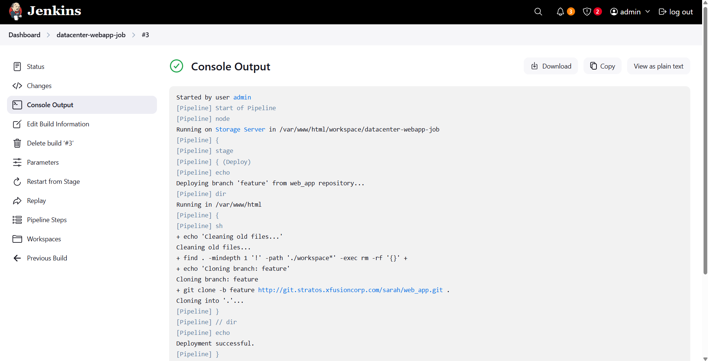

Click the App button on the top bar.
> Web-App can now be accessed with content "updated". ✅

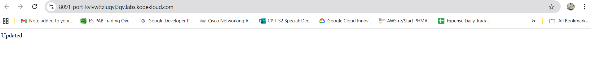

---

### 🗝️ Key Commands and Configs

| Command / Config             | Description                    |
| ---------------------------- | ------------------------------ |
| `agent { label 'ststor01' }` | Run pipeline on Storage Server |
| `parameters { string(...) }` | Add branch input parameter     |
| `git clone -b ${BRANCH}`     | Clone specific branch          |
| `/var/www/html`              | Deployment directory           |
| `stage('Deploy')`            | Single deployment stage        |

---

🎯 Task Completed

| ✅  | Item                                                                 |
| -- | -------------------------------------------------------------------- |
| ✔️ | Jenkins slave node **Storage Server** created and labeled `ststor01` |
| ✔️ | SSH credentials configured (`natasha`)                               |
| ✔️ | Pipeline job **datacenter-webapp-job** created                       |
| ✔️ | String parameter **BRANCH** added                                    |
| ✔️ | Conditional deployment logic working (`master` / `feature`)          |
| ✔️ | Website accessible via Load Balancer URL                             |
| ✔️ | Verified successful console output                                   |

