☸️ 100 Days of DevOps – Day 79
✅ Task: Jenkins Deployment Job

```text
The Nautilus development team had a meeting with the DevOps team where they discussed automating the deployment of one
of their apps using Jenkins (the one in Stratos Datacenter). They want to auto deploy the new changes in case any developer
pushes to the repository. As per the requirements mentioned below configure the required Jenkins job.

Click on the Jenkins button on the top bar to access the Jenkins UI. Login using username admin and Adm!n321 password.
Similarly, you can access the Gitea UI using Gitea button, username and password for Git is sarah and Sarah_pass123 respectively.
Under user sarah you will find a repository named web that is already cloned on the Storage server under sarah's home.
sarah is a developer who is working on this repository.

1. Install httpd (whatever version is available in the yum repo by default) and configure it to serve on port 8080 on All app servers.
You can make it part of your Jenkins job or you can do this step manually on all app servers.

2. Create a Jenkins job named nautilus-app-deployment and configure it in a way so that if anyone pushes any new change to the origin
repository in master branch, the job should auto build and deploy the latest code on the Storage server under /var/www/html directory.
Since /var/www/html on Storage server is shared among all apps.
Before deployment, ensure that the ownership of the /var/www/html directory is set to user sarah, so that Jenkins can successfully deploy
files to that directory.

3. SSH into Storage Server using sarah user credentials mentioned above. Under sarah user's home you will find a cloned Git repository
named web. Under this repository there is an index.html file, update its content to Welcome to the xFusionCorp Industries, then push the
changes to the origin into master branch. This push must trigger your Jenkins job and the latest changes must be deployed on the servers,
also make sure it deploys the entire repository content not only index.html file.

Click on the App button on the top bar to access the app, you should be able to see the latest changes you deployed. Please make sure the
required content is loading on the main URL https://<LBR-URL> i.e there should not be any sub-directory like https://<LBR-URL>/web etc.

Note:
1. You might need to install some plugins and restart Jenkins service. So, we recommend clicking on Restart Jenkins when installation is
complete and no jobs are running on plugin installation/update page i.e update centre. Also some times Jenkins UI gets stuck when Jenkins
service restarts in the back end so in such case please make sure to refresh the UI page.

2. Make sure Jenkins job passes even on repetitive runs as validation may try to build the job multiple times.

3. Deployment related tasks should be done by sudo user on the destination server to avoid any permission issues so make sure to configure your
Jenkins job accordingly.

4. For these kind of scenarios requiring changes to be done in a web UI, please take screenshots so that you can share it with us for review
in case your task is marked incomplete. You may also consider using a screen recording software such as loom.com to record and share your work.
```

---

📝 Task Summary

| # | Task                    | Description                                            |
| - | ----------------------- | ------------------------------------------------------ |
| 1 | Configure Apache        | Install and run HTTPD on port 8080 on all App Servers  |
| 2 | Create Jenkins Job      | Job name: `nautilus-app-deployment`                    |
| 3 | Automate Deployment     | Auto-trigger job on Git push (master branch)           |
| 4 | Set Directory Ownership | `/var/www/html` should belong to user `sarah`          |
| 5 | Test Auto-Trigger       | Push update to `index.html` → auto-deploy verified     |
| 6 | Verify Output           | Access via Load Balancer URL → Updated Welcome message |


---

### 🔁 Step 1: Access Jenkins & Gitea

Jenkins
- URL: Click the Jenkins button on top bar
- Login:
  ```makefile
  Username: admin
  Password: Adm!n321
  ```


Gitea
- URL: Click the Gitea button on top bar
- Login:
  ```makefile
  Username: sarah
  Password: Sarah_pass123
  ```


---

🔁 Step 2: Install HTTPD on All App Servers

1. Access each Server
2. Install httpd
```bash
sudo yum install httpd -y
sudo sed -i 's/Listen 80/Listen 8080/' /etc/httpd/conf/httpd.conf
sudo systemctl enable httpd
sudo systemctl start httpd
sudo systemctl status httpd
```

For Server 1: Tony

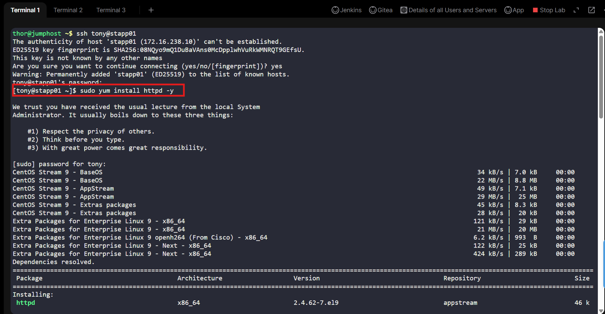
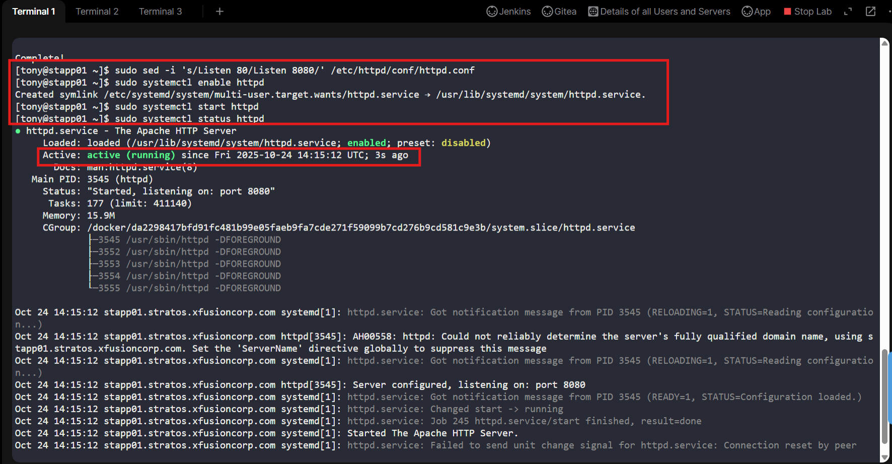

For Server 2: Steve

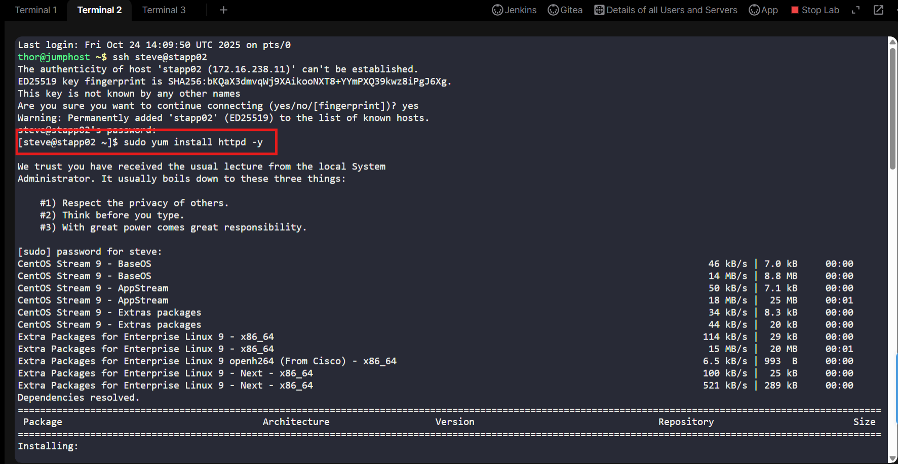
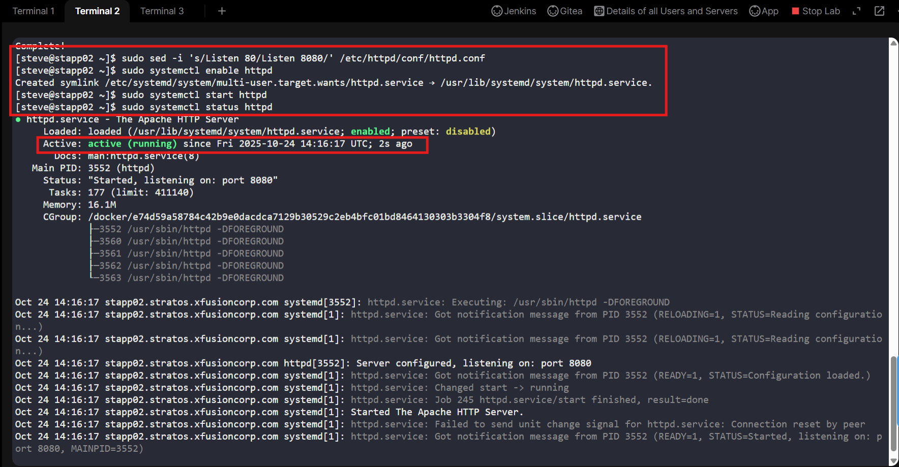

For Server 3: Banner

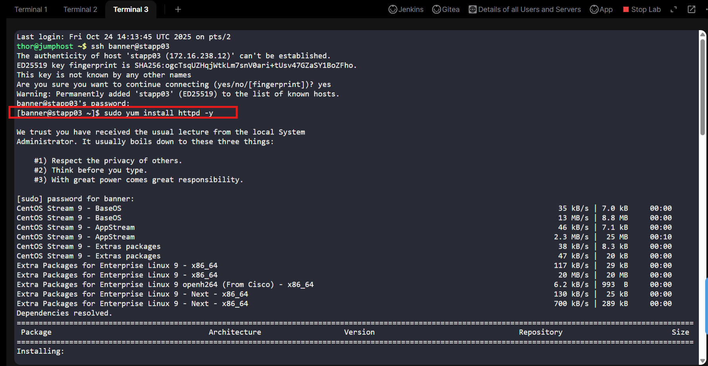
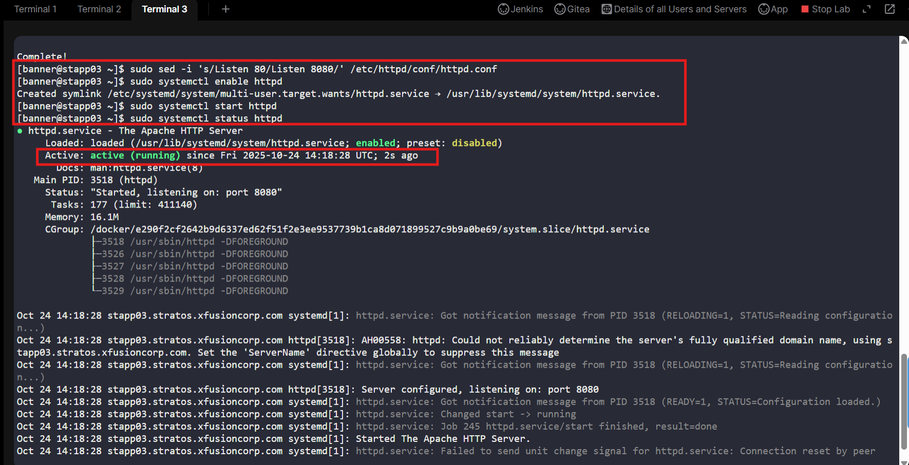

---

### 🔁 Step 3: Install Necessary Jenkins Plugins

1. In Jenkins, go to:
```go
Manage Jenkins → Plug-ins
```

2. Install the following:
- SSH
- SSH Credentials
- SSH Build Agents
- Git
- Credentials
- CloudBees
- Gitea
- Gitea check
- Java Framework, update the java as well

3. Restart Jenkins after installation

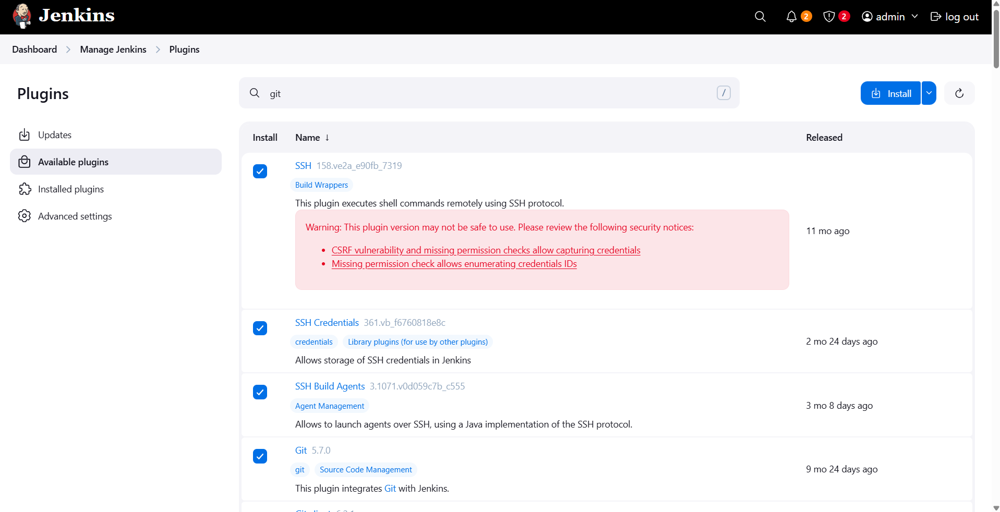

---

### 🔁 Step 4: Create Jenkins Job

1. From Dashboard → New Item

2. Name it:
```bash
nautilus-app-deployment
```

3. Select Freestyle project

then click ok

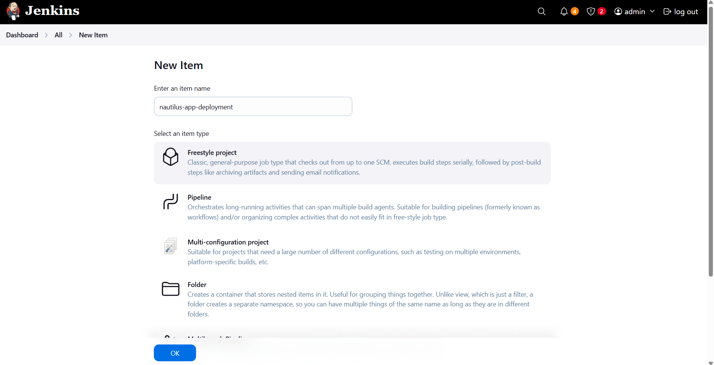

4. Under Source Code Management → Git:
```yaml
Repository URL: http://git.stratos.xfusioncorp.com/sarah/web.git
Credentials: (none, since it's HTTP access)
Branch: */master
```

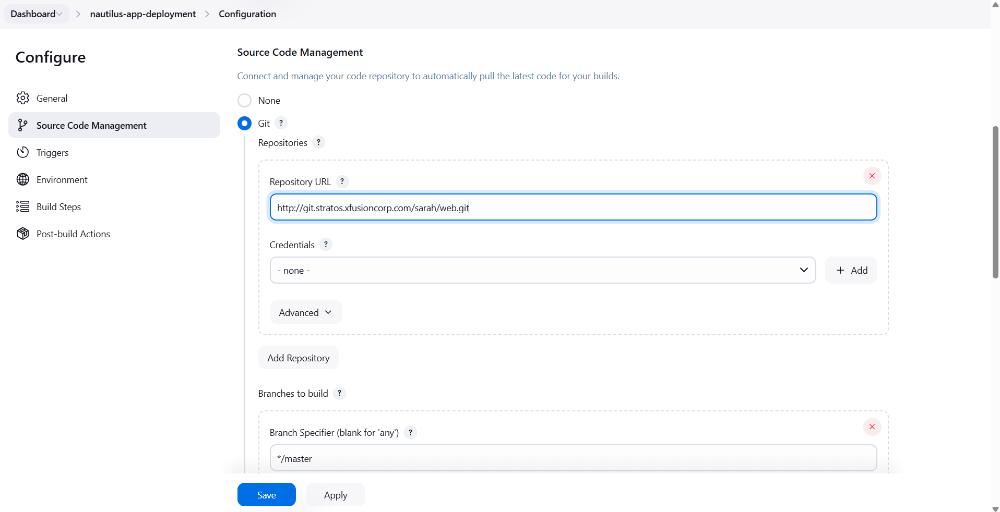

5. Under Build Triggers, check:
```vbnet
☑ Poll SCM
```

6. In the Schedule field, enter:
```bash
* * * * *
```
> That means Jenkins will check the repo every minute for new commits on master.

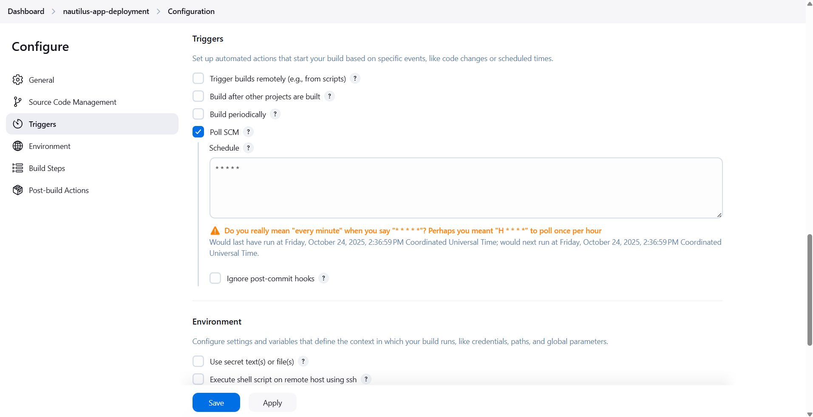

7. Click Save ✅

8. Then build

> nautilus-app-deployment built succesfully

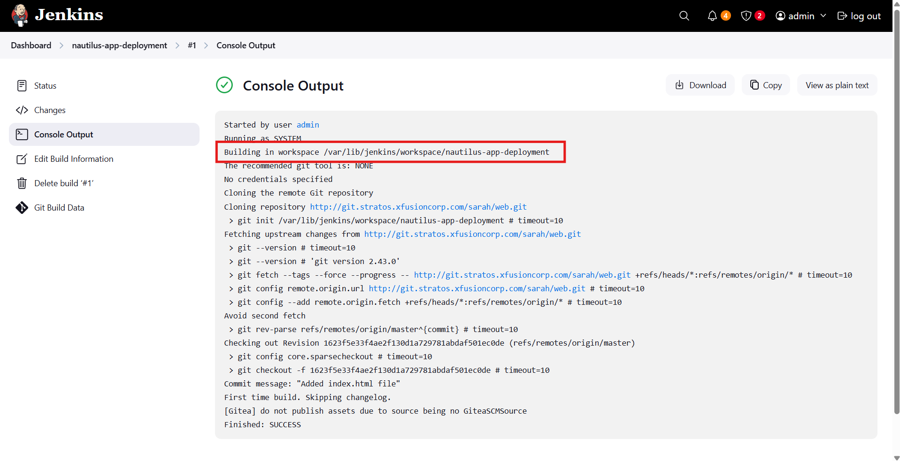

---

### 🔁 Step 5: Generate SSH Key for Jenkins → Storage Server

1. login to jenkinsusing CLI
```bash
ssh jenkins@jenkins
```
> pw: j@rv!s

2. Login as super user
```bash
sudo su
```

3. Generate key
```bash
ssh-keygen -t rsa
```
> just enter leave blank every prompt question after this

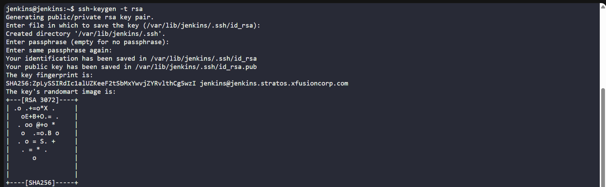

4. View and Copy the Public Key
```bash
cd .ssh/
cat id_rsa.pub
```

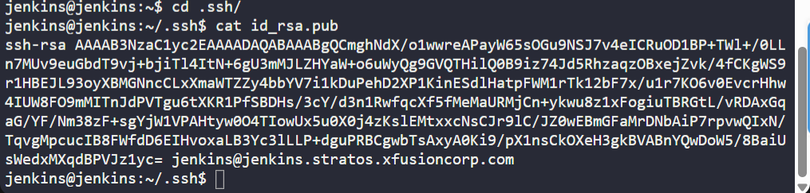

5. Open new terminal, then login as natasha
```bash
ssh natasha@ststor01
```
> pw: Bl@kW

Login as super user
```bash
sudo su
```
6. Make a directory for ssh
```bash
mkdir .ssh
```

then copy file to it
```bash
cat > .ssh/authorized_keys
```
press enter then paste the public key. 
> It will allow jenkins server to connect to natasha via ssh without prompting a password.

> no sample image available. Make sure to follow the steps

---

### 🔁 Step 6: Ownership for Deployment Directory

Go back to CLI where you login to natasha server, then enter this
```bash
cd /var/www/
chown natasha -R html/
```

then verify:
```bash
ls -l
```
- permission granted to natasha: `drwxr-xr-x 3 natasha root 4096 Aug 18 09:57 html`

> no sample image available. Make sure to follow the steps

---

### 🔁 Step 6: Rebuild the job

Now, under build steps choose:
```text
execute shell
```

then enter this:
```bash
scp * natasha@ststor01:/var/www/html
```

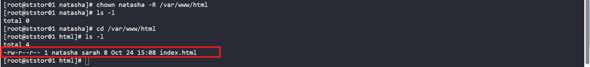

then build now
> Successfully built

---

### 🔁 Step 7: Clone and Update the Repository

login using sarah
```bash
ssh sarah@ststor01
```
> pw: Sarah_pass123

Check current directory:
```bash
pwd
```

clone the repo
```bash
git clone http://git.stratos.xfusioncorp.com/sarah/web.git
```
> issue there's already a text file name web

fix
```bash
ls #to check if there's a web.git file
rm -rf web #to remove the file
```

then enter again
```bash
git clone http://git.stratos.xfusioncorp.com/sarah/web.git
```

---

### 🔁 Step 8: Update the html file

verify if there's an index.html file
```bash
cd web/
ls
```
> there's an index.html file

check the content
```bash
cat index.html
```

now, update the index.html
```bash
cat > index.html
```
then enter:
```text
Welcome to xFusionCorp Industries
```

then ctrl+C to end.

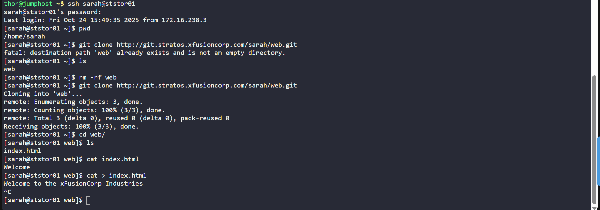

---

### 🔁 Step 9: Commit and Push Changes

in the same CLI using Sarah's login
```bash
git commit -am "Updated index.html"
```

then push to master branch
```bash
git push origin master
```

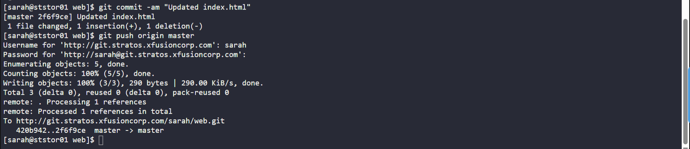

---

### 🔁 Step 10: Verify the Changes

Open Jenkins → Check Build History
> The job should run automatically and succeed.

Open the App button (Load Balancer URL):
✅ The website should now display:
```html
Welcome to xFusionCorp Industries
```

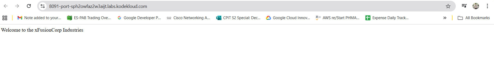

---

## 🗝️ Key Commands and Configs

| Command / Config                          | Description                           |
| ----------------------------------------- | ------------------------------------- |
| `scp -r * natasha@ststor01:/var/www/html` | Deploys latest code to Storage Server |
| `git push origin master`                  | Triggers Jenkins job automatically    |
| `/var/www/html`                           | Shared web root for all app servers   |
| `Poll SCM: * * * * *`                     | Checks for new commits every minute   |


---

## 🎯 Task Completed

| ✅  | Item                                            |
| -- | ----------------------------------------------- |
| ✔️ | HTTPD configured on all App Servers (port 8080) |
| ✔️ | Jenkins job **nautilus-app-deployment** created |
| ✔️ | Jenkins → Natasha SSH connection established    |
| ✔️ | `/var/www/html` owned by `sarah`                |
| ✔️ | Jenkins job auto-triggers on Git push           |
| ✔️ | Latest code successfully deployed               |
| ✔️ | Verified updated content via Load Balancer      |


