# ☸️ 100 Days of DevOps – Day 81
## ✅ Task: Jenkins Multistage Pipeline

```text
The development team of xFusionCorp Industries is working on to develop a new static website and they are planning to deploy the same
on Nautilus App Servers using Jenkins pipeline. They have shared their requirements with the DevOps team and accordingly we need to
create a Jenkins pipeline job. Please find below more details about the task:

Click on the Jenkins button on the top bar to access the Jenkins UI. Login using username admin and password Adm!n321.

Similarly, click on the Gitea button on the top bar to access the Gitea UI. Login using username sarah and password Sarah_pass123.

There is a repository named sarah/web in Gitea that is already cloned on Storage server under /var/www/html directory.

  1. Update the content of the file index.html under the same repository to Welcome to xFusionCorp Industries and push
  the changes to the origin into the master branch.

  2. Apache is already installed on all app Servers its running on port 8080.

  3. Create a Jenkins pipeline job named deploy-job (it must not be a Multibranch pipeline job) and pipeline should have
  two stages Deploy and Test ( names are case sensitive ). Configure these stages as per details mentioned below.

    a. The Deploy stage should deploy the code from web repository under /var/www/html on the Storage Server, as this location is already
    mounted to the document root /var/www/html of all app servers.

    b. The Test stage should just test if the app is working fine and website is accessible. Its up to you how you design this stage to test it out,
    you can simply add a curl command as well to run a curl against the LBR URL (http://stlb01:8091) to see if the website is working or not.
    Make sure this stage fails in case the website/app is not working or if the Deploy stage fails.

Click on the App button on the top bar to see the latest changes you deployed. Please make sure the required content is loading on the main
URL http://stlb01:8091 i.e there should not be a sub-directory like http://stlb01:8091/web etc.

Note:

1. You might need to install some plugins and restart Jenkins service. So, we recommend clicking on Restart Jenkins when installation is
complete and no jobs are running on plugin installation/update page i.e update centre. Also some times Jenkins UI gets stuck when Jenkins
service restarts in the back end so in such case please make sure to refresh the UI page.

2. Make sure Jenkins job passes even on repetitive runs as validation may try to build the job multiple times.

3. Deployment related tasks should be done by sudo user on the destination server to avoid any permission issues so make sure to configure
your Jenkins job accordingly.

4. For these kind of scenarios requiring changes to be done in a web UI, please take screenshots so that you can share it with us for review
in case your task is marked incomplete. You may also consider using a screen recording software such as loom.com to record and share your work.
```

---

📝 Task Summary

| # | Task                       | Description                                   |
| - | -------------------------- | --------------------------------------------- |
| 1 | Access Jenkins & Gitea     | Verify login and repositories                 |
| 2 | Install Jenkins Plugins    | Install pipeline-related and SSH plugins      |
| 3 | Enable Passwordless sudo   | Allow Jenkins deployment commands             |
| 4 | Create Jenkins Credentials | Add SSH credentials for servers               |
| 5 | Verify Jenkins Environment | Check `sshpass` and SSH setup                 |
| 6 | Update Repository          | Modify `index.html` and push to origin        |
| 7 | Create Pipeline Job        | Create `deploy-job` with Deploy & Test stages |
| 8 | Test Pipeline              | Verify site accessibility via Load Balancer   |

---


### 🔁 Step 1: Access Jenkins & Gitea
  
Jenkins
- URL: Click the Jenkins button on top bar
- Login:
  ```makefile
  Username: admin
  Password: Adm!n321
  ```

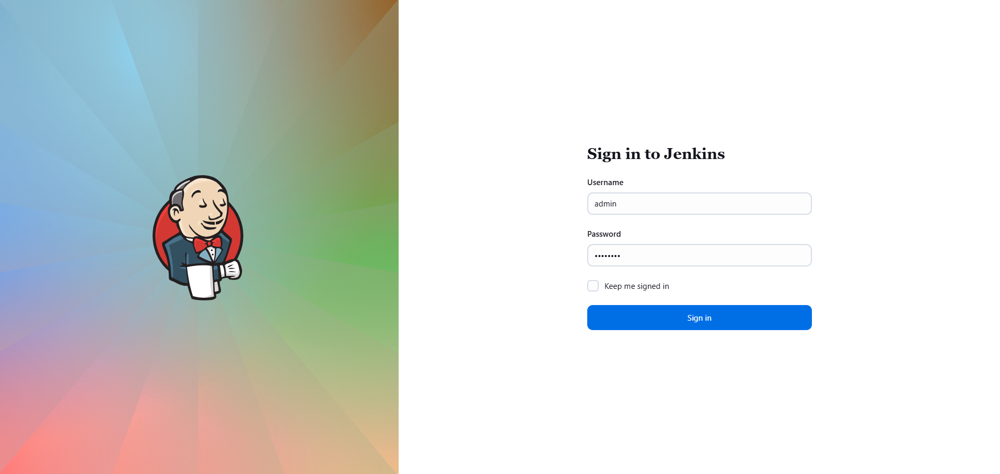

Gitea
- URL: Click the Gitea button on top bar
- Login:
  ```makefile
  Username: sarah
  Password: Sarah_pass123
  ```
- check if there's `web` repo

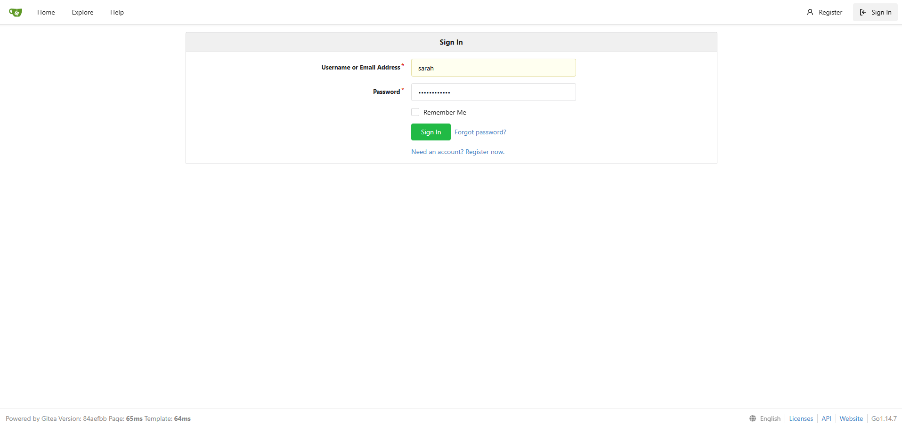

---

### 🔁 Step 2: Install Necessary Jenkins Plugins
  
1. In Jenkins, go to:
```go
Manage Jenkins → Plug-ins
```
 
2. Install the following:
- SSH
- SSH Credentials
- SSH Build Agents
- Git
- Credentials
- CloudBees
- Publish Over SSH
- Pipeline
- Pipeline Steps Plugin
  
3. Restart Jenkins after installation

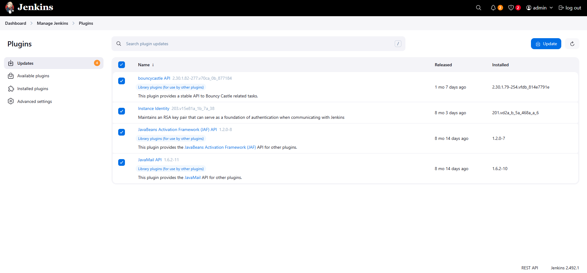
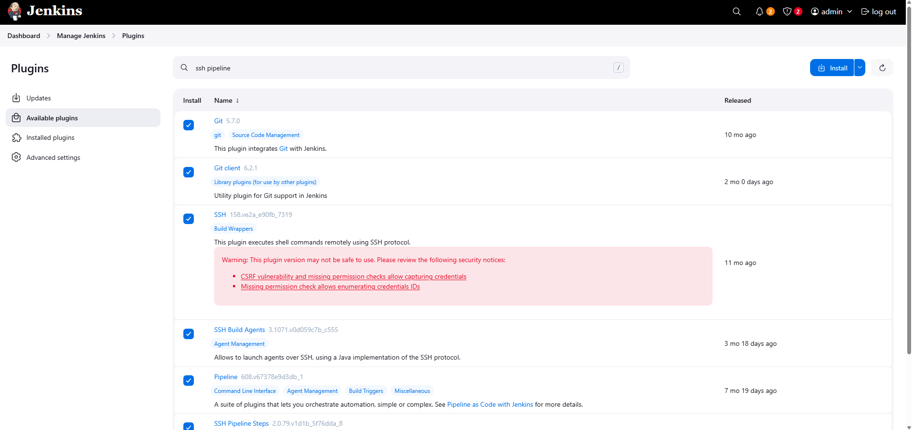

---

### 🔁 Step 4: Verify Jenkins Environment

1. Login to Jenkins
```bash
ssh jenkins@jenkins
```
pw: j@rv!s

2. Check if sshpass is installed
```bash
sshpass -V
```
> Installed already

if not,
```bash
sudo yum install sshpass -y
```

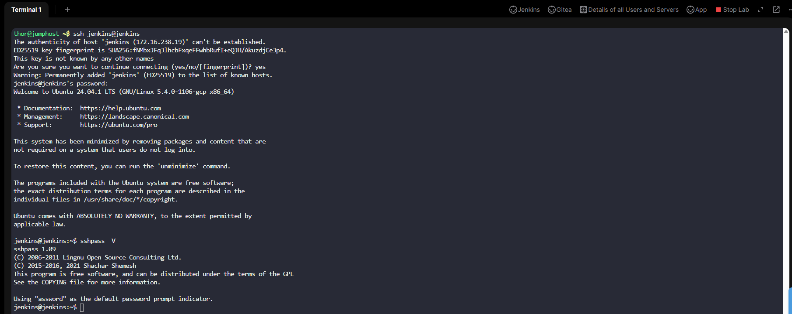

---

### 🔁 Step 5: Update Repo Content

#### Method 1 using Gitea UI

1. Go back to Gitea
2. Navigate to sarah/web repository
3. Click on index.html file
4. Click Edit button
5. Change content to: "Welcome to xFusionCorp Industries"
6. Commit changes with message: "Update welcome message"

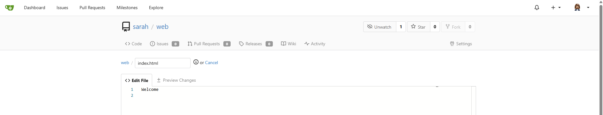
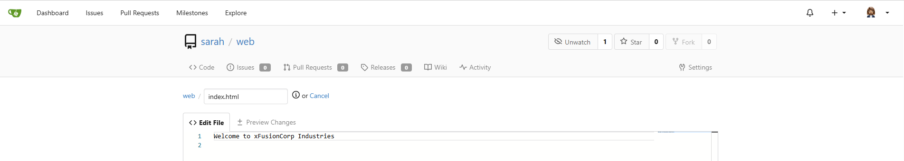

#### Method 2 using CLI (SSH to Storage Server Nataasha)

```bash
ssh natasha@ststor01
sudo chown natasha:natasha /var/www/html/index.html
sudo chmod 755 /var/www/html/index.html
cd /var/www/html
echo "Welcome to xFusionCorp Industries" | sudo tee index.html
sudo chown natasha:natasha index.html
sudo chmod 755 index.html
git add index.html
git commit -m "Update welcome message"
git push origin master
```

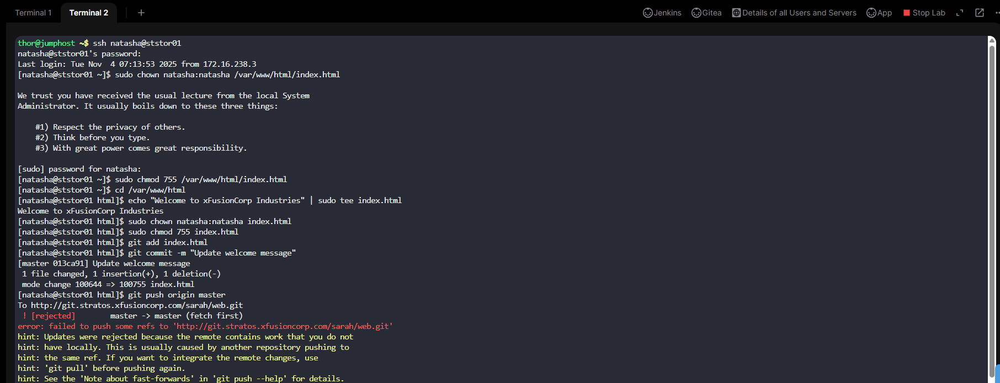

error: failed to push some refs to 'http://git.stratos.xfusioncorp.com/sarah/web.git'
> This error means that the remote repository has new commits that your local branch doesn’t have. To fix it safely, you need to pull the remote changes first, merge them, and then push again.

Step 1 (Fetch and merge the remote changes):
```bash
git pull origin master --rebase
```

Step 2 (Push your changes again):
```bash
git push origin master
```

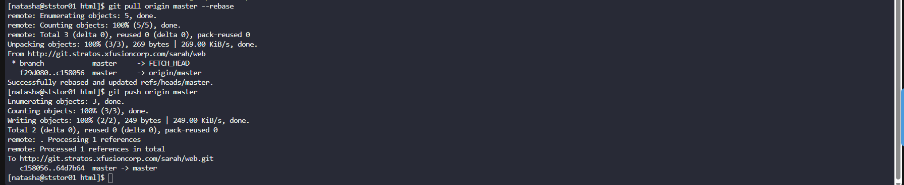

---

### 🔁 Step 6: Create a Pipeline Job

1. Go Jenkins: New Item → "deploy-job" → Pipeline → OK

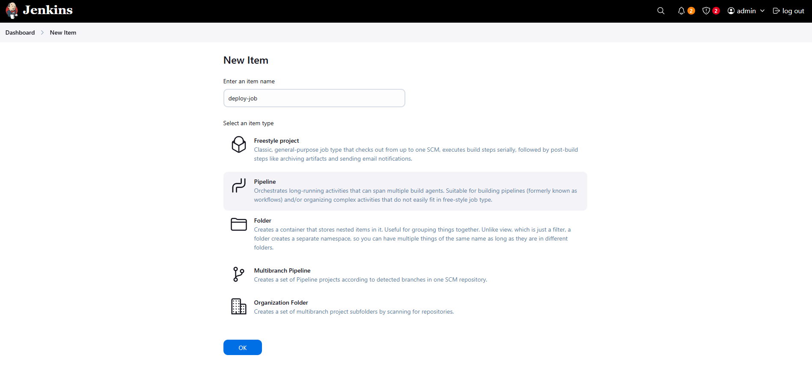

2. Under Definition: Pipeline script
3. Copy and paste the pipeline script below
```script
pipeline {
    agent any

    stages {
        stage('Deploy') {
            steps {
                echo 'Deploying...'
                
                // Clone the repository (no credentials needed for public repo)
                git url: 'http://git.stratos.xfusioncorp.com/sarah/web.git', branch: 'master'
                
                // Copy files to storage server using shell commands
                sh '''
                    echo "Deploying files to storage server..."
                    
                    # Method 1: If Jenkins can access shared storage directly
                    if [ -d "/var/www/html" ] && [ -w "/var/www/html" ]; then
                        echo "Direct access to shared storage"
                        cp -r * /var/www/html/
                        echo "Direct copy completed"
                    else
                        # Method 2: Using SCP 
                        echo "Using SCP to transfer files"
                        
                        # First, verify what content we have locally
                        echo "DEBUG: Local index.html content:"
                        cat index.html || echo "No index.html found locally"
                        
                        # Transfer files
                        sshpass -p "Bl@kW" scp -o StrictHostKeyChecking=no -r index.html natasha@ststor01:/var/www/html/
                        
                        # Verify content on remote server
                        echo "DEBUG: Remote index.html content:"
                        sshpass -p "Bl@kW" ssh -o StrictHostKeyChecking=no natasha@ststor01 "cat /var/www/html/index.html"
                        
                        # Fix permissions using echo to pass password to sudo
                        echo "Bl@kW" | sshpass -p "Bl@kW" ssh -o StrictHostKeyChecking=no natasha@ststor01 "sudo -S chown -R apache:apache /var/www/html 2>/dev/null || true"
                        echo "Bl@kW" | sshpass -p "Bl@kW" ssh -o StrictHostKeyChecking=no natasha@ststor01 "sudo -S chmod -R 755 /var/www/html 2>/dev/null || true"
                        
                        echo "SCP deployment completed"
                    fi
                    
                    echo "Deployment completed successfully"
                '''
            }
        }

        stage('Test') {
            steps {
                echo 'Testing deployment...'
                
                script {
                    def expectedContent = 'Welcome to xFusionCorp Industries'
                    
                    // Wait a moment for deployment to propagate
                    sleep(5)
                    
                    try {
                        // Test Load Balancer URL
                        def lbResponse = sh(script: 'curl -s http://stlb01:8091/', returnStdout: true).trim()
                        echo "DEBUG: Load balancer response: ${lbResponse}"
                        echo "DEBUG: Expected content: ${expectedContent}"
                        
                        if (!lbResponse.contains(expectedContent)) {
                            error("Load balancer test failed. Expected content '${expectedContent}' not found in response: '${lbResponse}'")
                        }
                        echo " Load balancer test passed"
                        
                        // Test individual app servers
                        ['stapp01:8080', 'stapp02:8080', 'stapp03:8080'].each { server ->
                            def response = sh(script: "curl -s http://${server}/", returnStdout: true).trim()
                            if (!response.contains(expectedContent)) {
                                error("App server ${server} test failed")
                            }
                            echo " ${server} test passed"
                        }
                        
                        echo 'All tests passed successfully!'
                        
                    } catch (Exception e) {
                        error("Test stage failed: ${e.getMessage()}")
                    }
                }
            }
        }
    }
    
    post {
        success {
            echo 'Pipeline completed successfully!'
        }
        failure {
            echo 'Pipeline failed. Check logs for details.'
        }
    }
}
```

4. Save the job

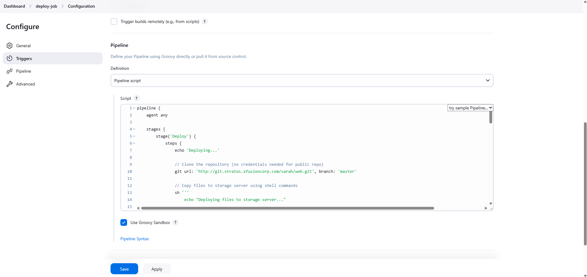

---

### 🔁 Step 7: Run and Verify Pipeline
1. Go to deploy-job
2. Click "Build Now"
3. Check Console Output

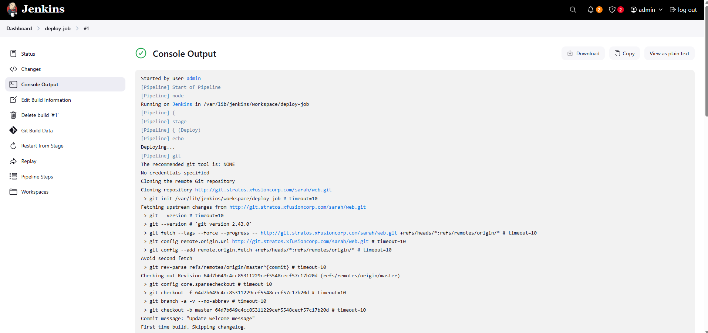
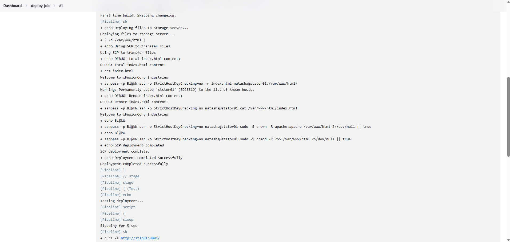
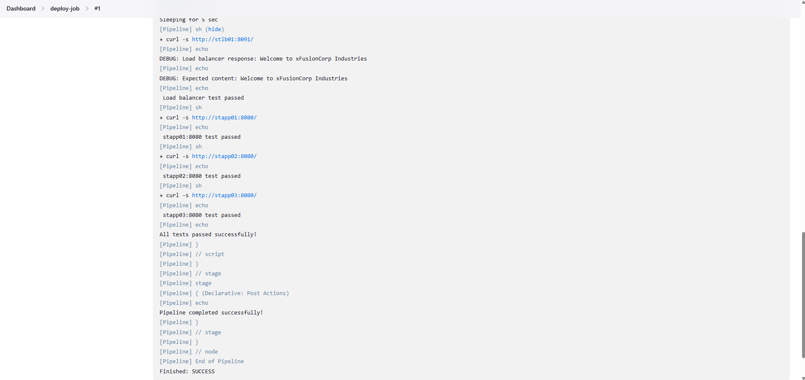

4. Check the App
5. Verify content shows "Welcome to xFusionCorp Industries"

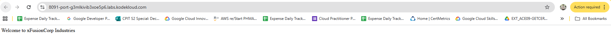

---

## 🎯 Task Completed

| ✅  | Item                                                    |
| -- | ------------------------------------------------------- |
| ✔️ | Passwordless sudo configured                            |
| ✔️ | Jenkins plugins installed                               |
| ✔️ | Credentials for natasha added                           |
| ✔️ | Repository updated successfully                         |
| ✔️ | Pipeline `deploy-job` created with Deploy & Test stages |
| ✔️ | Website deployed successfully                           |
| ✔️ | Verified content via Load Balancer URL                  |
